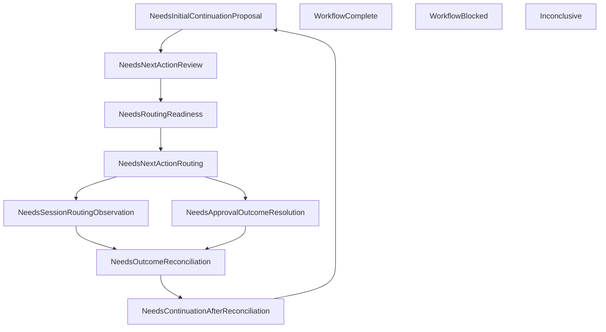

# Wave 34 — Multi-Step Workflow Loop Controller, Manual-Advance Only — LOCK

**Committed:** 6 commits
**Baseline:** 2522 tests (Wave 33 locked)
**Final:** ~2598 tests, zero failures

---

## What Shipped

### New Modules in `openwand-workflow`

| Module | Purpose |
|--------|---------|
| `workflow_loop_state.rs` | `WorkflowLoopState`, 12 `WorkflowDetectedLoopState` variants |
| `workflow_loop_recommendation.rs` | 9 `WorkflowManualOperationKind` variants, `command_hint` display-only |
| `workflow_loop_controller.rs` | Controller record, 21 predicates, state detection + recommendation engine |

### New Modules in `openwand-app`

| File | Purpose |
|------|---------|
| `workflow_loop_controller.rs` | Persistence under `workflow_loop_controller/` |
| `ui/workflow_loop_controller_state.rs` | UI view helpers + safety warning |
| `ui/workflow_loop_controller_components.rs` | Desktop-gated placeholder |
| `main.rs` additions | CLI: `workflow-loop recommend/show/latest` |

---

## Test Breakdown

| Area | Count |
|------|------:|
| DTO / Validation (incl. Patch 4+5) | 14 |
| State Detection (incl. Patch 2) | 15 |
| Recommendation Engine | 11 |
| Persistence / Idempotency (incl. Patch 3) | 14 |
| CLI | 6 |
| UI State (incl. Patch 5) | 7 |
| Guard / No-Mutation (incl. Patch 1) | 15 |
| **Total** | **82** |

---

## Central Invariant

```
The loop controller recommends.
It does not perform.
It does not advance.
It does not retry.
It does not schedule.
It does not route.
It does not approve.
It does not reconcile.
```

---

## Patch Compliance

| Patch | Status |
|-------|--------|
| 1. Workflow crate dep guard | ✅ `workflow_crate_dependency_guard_still_allows_only_6_deps` confirms exactly 6 |
| 2. Conflict precedence | ✅ `NoConflictingLatestRecords` predicate + `detects_blocked_on_conflicting_latest_records` + `does_not_recommend_operation_when_latest_records_conflict` |
| 3. Latest selection source | ✅ App loader uses existing indexes; `loop_controller_crate_does_not_scan_persistence_directly` guard test |
| 4. command_hint non-executable | ✅ 3 structural tests proving no command_args/shell/cwd/env/process/executable fields |
| 5. No-authority + no-schedule flags | ✅ 10 hardcoded-false flags; `schedules_work/starts_worker/queues_operation/retries_operation/resumes_workflow` |

---

## Detected Loop States



---

## Key Boundary

Wave 34 inspects evidence and recommends only. It does NOT:
- Route actions, resolve approvals, reconcile outcomes
- Execute tools, call PolicyEngine, SessionRunner, or LlmClient
- Append trace, mutate memory, or mutate workflow state
- Schedule, queue, retry, resume, or start workers
- Call shell/git/process

---

## Honest Caveats

- The controller recommends based on available evidence. If evidence is missing, it returns Inconclusive.
- Conflict detection runs before recommendation (Patch 2), but the workflow crate receives pre-resolved records. The app loader is responsible for detecting conflicting latest records.
- `command_hint` is display text only — never parsed, executed, or used as a command source.
- No automatic retry, resume, scheduling, worker, or queue.
- Default CI remains provider-free and network-free.
