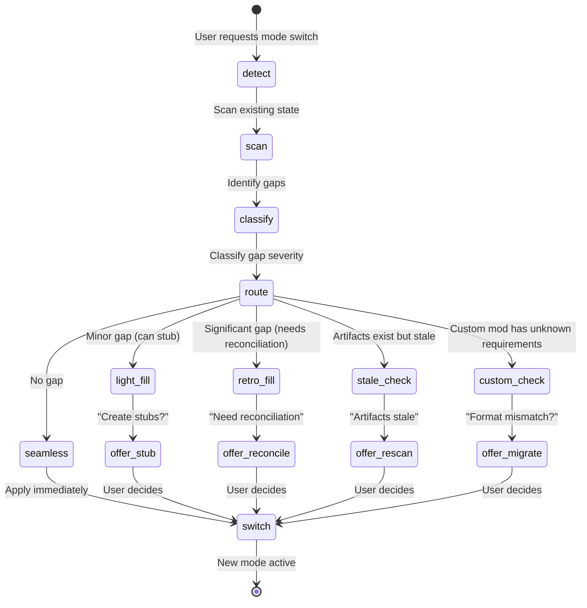
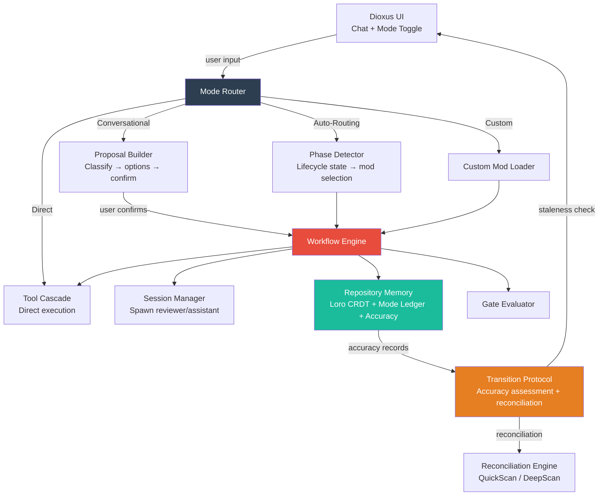

# OpenWand Interaction Modes — Unified Design

**Date:** 2026-05-26  
**Status:** Draft  
**Scope:** Four interaction modes, mode transition protocol, reconciliation engine  
**Companion docs:**  
- `plans/workflow-framework-design.md` — Execution mods (bootstrap, standard, accelerate, production, aiv)  
- `plans/lifecycle-frameworks-design.md` — Lifecycle mods (conception, discovery, architecture, roadmap, scaffolding, planning)

---

## 1. The Four Modes

### 1.1 Spectrum

```
Zero process ◄──────────────────────────────────────────► Full process

  DIRECT          CONVERSATIONAL         AUTO-ROUTING        CUSTOM
  "just do it"    "ask me first"         "you decide"        "my way"
  ──────────────────────────────────────────────────────────────────
  No workflow     Propose → confirm      Detect → route      User-defined
  No spawning     User-chosen mod        System-chosen mod    Custom mod
  No gates        User-controlled gates  System-controlled    Custom gates
  Lowest cost     Medium cost            Highest cost         Varies
```

### 1.2 Definitions

#### DIRECT

Like Craft Agents. Zero process overhead. The agent receives a request and executes it directly using the tool cascade. No workflows, no spawned sessions, no artifacts, no gates.

```
User:  "Add a hello function to main.rs"
Agent: *writes the function*
Agent: "Done. Added fn hello() → String to main.rs line 42."
```

**Behavior:**
- Single agent, single session — no spawning
- Executes directly via 3-tier tool cascade
- No workflow state machine engaged
- No blueprints, reports, sign-offs, or artifacts
- Background memory updates only (agent remembers what happened, no documents about it)
- No reviewer, no assistant — the agent IS the assistant

**Resource profile:**
- Sessions spawned: 0 (runs in the current session)
- LLM tokens: 1× the task itself
- Artifacts produced: 0

**When the user picks this:**
- They know exactly what they want
- The task is small or well-understood
- They don't want process, they want output
- They're prototyping or experimenting

---

#### CONVERSATIONAL

The agent listens, classifies the request, proposes options, and waits for confirmation. The user controls every escalation point.

```
User:  "Add MCP support to OpenWand"
Agent: "That's a medium feature — probably 5-8 files across mcp-pool/ and session/.

        I'd suggest:
        [Quick] Just build it (bootstrap — ~20 min)
        [Plan]  Blueprint first, then build (standard — ~1 hr)
        [Full]  Full planning with review (production — ~2 hr)

        Or tell me how you want to approach it."

User:  "Plan"
Agent: *creates blueprint*
Agent: "Blueprint ready. 4 tasks, estimated 45 min.

        [Looks good — start] [Let me review it first] [Change something]"

User:  "Start"
Agent: *executes via selected workflow mod*
```

**Behavior:**
- Classifies request (scope, complexity, risk)
- Proposes approach options with tradeoffs
- Waits for explicit user selection
- Runs the selected workflow mod
- Pauses at decision points for user input (task failures, scope questions, unexpected findings)
- Never auto-starts any workflow
- Never spends tokens on process without user awareness

**Resource profile:**
- Sessions spawned: depends on selected mod (0-3)
- LLM tokens: task + proposal overhead (small)
- Artifacts produced: depends on selected mod (0-7)

**When the user picks this:**
- They want help thinking through approach
- The task is significant enough to warrant planning
- They want control over process intensity
- They're collaborating with the agent, not delegating to it

---

#### AUTO-ROUTING

The system detects context, selects the appropriate lifecycle or execution mod, and runs it with minimal confirmation. The user trusts the system to make good decisions.

```
User:  "Add MCP support to OpenWand"
Agent: *detects: existing project, medium feature, artifacts exist*
       *routes to: lifecycle-planning → exec-standard*
Agent: "Planning batch 'MCP Integration'... Starting execution."
       *spawns reviewer, reviews, spawns assistant, executes*
Agent: "Batch complete. MCP support added. 4 tasks, 23 tests, all passing."
```

**Behavior:**
- Detects lifecycle phase from existing artifacts
- Classifies request scope and complexity
- Selects appropriate workflow mod automatically
- Runs the full state machine
- Only pauses for blocking issues (failed gates, genuinely ambiguous scope)
- Reports results, not process
- Uses PROJECT.md quality attributes to calibrate rigor

**Resource profile:**
- Sessions spawned: 1-3 per batch
- LLM tokens: task + process overhead (significant)
- Artifacts produced: 3-12 per batch

**When the user picks this:**
- They trust the system's judgment
- They want full process power without managing it
- The project is mature enough to benefit from rigor
- They're focused on outcomes, not methodology

---

#### CUSTOM

The user defines their own interaction model. This loads a user-defined mod that specifies exactly how the agent behaves — what workflows to use, when to spawn sessions, what to ask, what to skip.

```
User:  "Add MCP support to OpenWand"
Agent: *loads custom mod: "team-velocity-v2"*
       *follows the custom workflow*
Agent: *behaves exactly as the custom mod specifies*
```

**Behavior:**
- Loads a user-defined mod from `.openwand/workflows/custom/`
- The mod defines: state machine, roles, gates, artifacts, interaction points
- Can combine elements from any built-in mode
- Can define entirely new workflows
- Can specify when to ask the user and when to act autonomously

**Resource profile:**
- User-defined

**When the user picks this:**
- They have a specific methodology (AIV, Scrum, custom)
- Their team has established process requirements
- They've refined their workflow through experience
- Built-in modes don't match their needs

---

## 2. MODE ROUTING

### 2.1 The Router

The mode router is the entry point for every user message. It doesn't replace the workflow engine — it sits in front of it.

```rust
// crates/workflow/src/engine/router.rs

pub enum InteractionMode {
    Direct,
    Conversational,
    AutoRouting,
    Custom { mod_id: ModId },
}

pub struct ModeRouter {
    current_mode: InteractionMode,
    workflow_engine: WorkflowEngine,
    classifier: RequestClassifier,
    memory: MemoryStore,
}

impl ModeRouter {
    pub async fn handle_input(&mut self, input: UserInput) -> Result<AgentResponse> {
        // Check for mode switch commands
        if let Some(new_mode) = self.parse_mode_command(&input) {
            return self.transition_mode(new_mode).await;
        }

        match self.current_mode {
            InteractionMode::Direct => {
                // Execute directly, no workflow
                self.execute_direct(input).await
            }

            InteractionMode::Conversational => {
                // Classify → propose → wait for confirmation
                self.execute_conversational(input).await
            }

            InteractionMode::AutoRouting => {
                // Detect → route → execute
                self.execute_auto(input).await
            }

            InteractionMode::Custom { ref mod_id } => {
                // Load custom mod → execute per its rules
                self.execute_custom(mod_id, input).await
            }
        }
    }
}
```

### 2.2 Direct Execution Path

```rust
impl ModeRouter {
    async fn execute_direct(&mut self, input: UserInput) -> Result<AgentResponse> {
        // No workflow engine. No spawning. Just execute.
        let result = self.tool_cascade.execute(input.intent()).await?;

        // Background memory update — non-blocking, no artifacts
        self.memory.append_interaction(InteractionRecord {
            input: input.text,
            result_summary: result.summary(),
            files_changed: result.files_changed(),
            timestamp: chrono::Utc::now(),
        }).await?;

        Ok(AgentResponse::direct(result))
    }
}
```

### 2.3 Conversational Execution Path

```rust
impl ModeRouter {
    async fn execute_conversational(&mut self, input: UserInput) -> Result<AgentResponse> {
        let classification = self.classifier.classify(&input, &self.memory).await?;

        // Build proposal
        let proposal = Proposal {
            summary: classification.summary(),
            options: self.build_options(&classification),
            detected_scope: classification.scope,
            estimated_cost: classification.estimated_tokens(),
        };

        // Return proposal — wait for user choice
        Ok(AgentResponse::propose(proposal))
    }

    async fn confirm_conversational(
        &mut self,
        selected: SelectedOption,
    ) -> Result<AgentResponse> {
        match selected {
            SelectedOption::Direct => {
                self.execute_direct(/* original input */).await
            }
            SelectedOption::Workflow(mod_id) => {
                // Load and run the selected workflow mod
                let mod_def = self.mod_loader.load(&mod_id)?;
                self.workflow_engine.load_mod(mod_def)?;
                self.workflow_engine.start(/* ... */).await?;
                self.run_workflow_with_checkpoints().await
            }
            SelectedOption::CustomResponse(text) => {
                // User typed a freeform response — re-classify
                self.execute_conversational(UserInput::new(text)).await
            }
        }
    }
}
```

### 2.4 Auto-Routing Execution Path

```rust
impl ModeRouter {
    async fn execute_auto(&mut self, input: UserInput) -> Result<AgentResponse> {
        // Step 1: Detect lifecycle phase
        let phase = self.detect_lifecycle_phase();

        // Step 2: If lifecycle incomplete, route to lifecycle mod
        if !phase.is_complete() {
            let lifecycle_mod = phase.recommended_mod();
            return self.run_mod(&lifecycle_mod, input).await;
        }

        // Step 3: Project complete — classify the request
        let classification = self.classifier.classify(&input, &self.memory).await?;

        // Step 4: Select execution mod
        let exec_mod = classification.recommended_exec_mod();

        // Step 5: Run it
        self.run_mod(&exec_mod, input).await
    }

    fn detect_lifecycle_phase(&self) -> LifecyclePhase {
        // Check which artifacts exist in memory
        let has_charter = self.memory.artifact_exists(&ArtifactKind("charter"));
        let has_requirements = self.memory.artifact_exists(&ArtifactKind("requirements"));
        let has_architecture = self.memory.artifact_exists(&ArtifactKind("architecture"));
        let has_roadmap = self.memory.artifact_exists(&ArtifactKind("roadmap"));
        let has_skeleton = self.codebase_compiles();

        match (has_charter, has_requirements, has_architecture, has_roadmap, has_skeleton) {
            (false, _, _, _, _) => LifecyclePhase::NeedsConception,
            (true, false, _, _, _) => LifecyclePhase::NeedsDiscovery,
            (true, true, false, _, _) => LifecyclePhase::NeedsArchitecture,
            (true, true, true, false, _) => LifecyclePhase::NeedsRoadmap,
            (true, true, true, true, false) => LifecyclePhase::NeedsScaffolding,
            (true, true, true, true, true) => LifecyclePhase::ReadyForExecution,
        }
    }
}
```

---

## 3. REPOSITORY MEMORY — MODE LEDGER & ARTIFACT ACCURACY

### 3.1 The Problem

Existence ≠ accuracy. A project that ran Auto-Routing (fresh artifacts), then switched to Direct (artifacts stopped updating), then switches back to Auto will have artifacts that **exist but are wrong**. The old transition logic checked "do artifacts exist?" but not "are those artifacts still true?"

```
Auto (artifacts fresh) → Direct (artifacts stop updating) → Auto again
                                                              ↓
                                                        Old: "Seamless" ✅ WRONG
                                                        New: "StaleCheck" ✅ CORRECT
```

### 3.2 Repository Memory Structure

Every repository has its own memory store containing: the project artifacts, a chronological mode ledger, and per-artifact accuracy records.

```rust
// crates/memory/src/repository.rs

pub struct RepositoryMemory {
    /// The project artifacts (CHARTER, ARCHITECTURE, STATE, etc.)
    artifacts: HashMap<ArtifactKind, Artifact>,

    /// The chronological mode history — every mode period is recorded
    mode_ledger: Vec<LedgerEntry>,

    /// Per-artifact accuracy — when each was last verified against the actual codebase
    artifact_accuracy: HashMap<ArtifactKind, AccuracyRecord>,
}

/// A single period of mode usage within a repository.
pub struct LedgerEntry {
    /// Which mode was active
    mode: InteractionMode,

    /// When this mode period started
    started_at: chrono::DateTime<chrono::Utc>,

    /// When it ended (None = currently active)
    ended_at: Option<chrono::DateTime<chrono::Utc>>,

    /// Cumulative changes made during this period
    changes: ChangeSummary,
}

pub struct ChangeSummary {
    pub commits: usize,
    pub files_created: usize,
    pub files_modified: usize,
    pub files_deleted: usize,
    pub lines_added: usize,
    pub lines_removed: usize,
}
```

### 3.3 Artifact Accuracy Records

Each artifact tracks **when it was last verified** and **how many relevant changes happened since**.

```rust
/// Tracks whether an artifact still describes reality.
pub struct AccuracyRecord {
    /// The git commit hash at which this artifact was last verified
    last_verified_commit: git2::Oid,

    /// Timestamp of that verification
    last_verified_at: chrono::DateTime<chrono::Utc>,

    /// The mode that was active at verification time
    verified_during_mode: InteractionMode,

    /// Whether the active mode maintains this artifact automatically
    /// (Auto updates STATE.md on every batch close; Direct never touches it)
    maintained_by_mode: bool,

    /// How many commits have touched files relevant to this artifact since verification
    relevant_commits_since: usize,
}
```

### 3.4 Per-Artifact File Coverage

Not all artifacts go stale at the same rate. Each artifact declares which files it covers, so staleness is **precise** — not a blanket count.

```rust
/// Each artifact type declares which files are relevant to its accuracy.
pub trait ArtifactCoverage {
    /// File globs that this artifact describes. Commits touching these files
    /// increment the staleness counter.
    fn relevant_paths(&self) -> &[glob::Pattern];

    /// How sensitive this artifact is to drift. Controls how quickly
    /// the staleness level escalates.
    fn sensitivity(&self) -> ArtifactSensitivity;
}

pub enum ArtifactSensitivity {
    /// Rarely goes stale — project identity, hard constraints
    Stable,
    /// Goes stale when features change
    Moderate,
    /// Goes stale on any structural change
    Structural,
    /// Goes stale on any code change at all
    High,
}
```

| Artifact | Covers (file globs) | Sensitivity | Staleness trigger |
|---|---|---|---|
| CHARTER.md | `README.md`, `Cargo.toml` (root) | Stable | Project pivots, rename |
| REQUIREMENTS.md | `src/**/*.rs`, `crates/**/*.rs` | Moderate | Feature additions/changes |
| ARCHITECTURE.md | `**/Cargo.toml`, `crates/*/src/lib.rs` | Structural | Crate additions/removals, dependency changes |
| ROADMAP.md | `.openwand/batches/**` | Moderate | Batch completions |
| STATE.md | `crates/**/*.rs` | High | Any code change |

So a commit that modifies `crates/session/src/lib.rs` increments the staleness counter for STATE.md and REQUIREMENTS.md, but NOT for CHARTER.md. This gives precise signals instead of blanket warnings.

### 3.5 The Mode Ledger in Practice

```
Repository: OpenWand
═══════════════════════════════════════════════════════════

MODE LEDGER:
───────────────────────────────────────────────────────────
  #  Mode            Period                   Changes
───────────────────────────────────────────────────────────
  1  Auto-Routing    May 1–May 14             47 commits, 120 files, 8.2K LOC
     └ Artifacts maintained: ✅ (all updated on batch close)

  2  Direct          May 14–May 26            23 commits, 34 files, 2.1K LOC
     └ Artifacts maintained: ❌ (Direct doesn't update artifacts)

  3  Auto-Routing    May 26–present           (switching now)
     └ Staleness assessment needed before activating

ARTIFACT ACCURACY:
───────────────────────────────────────────────────────────
  CHARTER.md       Last verified: May 14 (Auto)   23 commits behind   🔴 Rotten
  REQUIREMENTS.md  Last verified: May 14 (Auto)   23 commits behind   🟠 Stale
  ARCHITECTURE.md  Last verified: May 14 (Auto)   23 commits behind   🟠 Stale
  STATE.md         Last verified: May 14 (Auto)   23 commits behind   🔴 Rotten
```

### 3.6 How Accuracy Is Maintained Per Mode

| Mode | Updates artifacts? | Updates accuracy records? |
|---|---|---|
| **Direct** | ❌ Never | ❌ Never — change counter increments silently |
| **Conversational** | ✅ When workflow runs | ✅ After each workflow completion |
| **Auto-Routing** | ✅ On every batch close | ✅ On every batch close |
| **Custom** | Per custom mod definition | Per custom mod definition |

During artifact-maintaining modes (Conversational, Auto), every batch close updates both the artifact AND its accuracy record. During Direct mode, the change counter increments (via git hooks or post-action scan) but accuracy records stay untouched — the ledger entry records that this was a non-maintaining period.

---

## 4. MODE TRANSITION PROTOCOL

### 3.1 Overview

Mode switching is a **feature**, not an escape hatch. Users should feel free to start in Direct and switch to Conversational when the project gets complex. The transition cost must be proportional to the gap — not a binary "start over or don't switch."

### 4.2 Transition Flow



### 4.3 Transition Types

```rust
// crates/workflow/src/engine/transition.rs

pub struct ModeTransition {
    pub from: InteractionMode,
    pub to: InteractionMode,
}

pub enum TransitionVerdict {
    /// Switch immediately — no action needed
    Seamless,

    /// Minor gap — offer to create lightweight stubs from codebase
    LightFill {
        missing_artifacts: Vec<ArtifactKind>,
        can_stub: bool,
    },

    /// Significant gap — offer full reconciliation
    RetroFill {
        missing_artifacts: Vec<ArtifactKind>,
        reconciliation_available: bool,
    },

    /// Artifacts exist but are stale — accuracy records show drift
    StaleCheck {
        stale_artifacts: Vec<ArtifactFreshness>,
    },

    /// Custom mod has unknown requirements — manual check needed
    CustomCheck {
        custom_mod_id: ModId,
        expected_artifacts: Vec<ArtifactKind>,
        existing_artifacts: Vec<ArtifactKind>,
    },
}

pub struct ArtifactFreshness {
    pub artifact: ArtifactKind,
    pub last_verified_at: chrono::DateTime<chrono::Utc>,
    pub verified_during_mode: InteractionMode,
    pub relevant_commits_since: usize,
    pub files_changed_since: usize,
    pub staleness: StalenessLevel,
    /// Whether the artifact was maintained by the mode it was verified during
    pub maintained: bool,
}

pub enum StalenessLevel {
    Fresh,       // 0-4 relevant commits since verification
    Aging,       // 5-20 relevant commits
    Stale,       // 21-50 relevant commits
    Rotten,      // >50 relevant commits
}
```

### 4.4 Assessment Logic

The corrected transition assessment checks **artifact accuracy**, not just artifact existence. Every upgrade to an artifact-using mode queries the accuracy records from the repository memory.

```rust
impl ModeTransition {
    pub fn assess(
        &self,
        repo_memory: &RepositoryMemory,
        mod_loader: &ModLoader,
    ) -> TransitionVerdict {
        let target = self.to;
        let needs_artifacts = target.uses_artifacts();

        if !needs_artifacts {
            // Downgrade to Direct — always seamless
            return TransitionVerdict::Seamless;
        }

        // Target mode needs artifacts. Check existence.
        let expected = target.required_artifacts(mod_loader);
        let existing = repo_memory.list_artifacts();
        let missing: Vec<_> = expected.iter()
            .filter(|k| !existing.contains(k))
            .cloned()
            .collect();

        if !missing.is_empty() {
            // Artifacts don't exist at all
            return if Self::can_stub_from_codebase(&missing) {
                TransitionVerdict::LightFill { missing_artifacts: missing, can_stub: true }
            } else {
                TransitionVerdict::RetroFill { missing_artifacts: missing, reconciliation_available: true }
            };
        }

        // Artifacts exist. NOW check if they're accurate.
        // This is the critical fix — existence alone is not enough.
        // Uses per-artifact file coverage for precise staleness.
        let stale = Self::check_artifact_accuracy(repo_memory);

        if stale.is_empty() {
            TransitionVerdict::Seamless
        } else {
            TransitionVerdict::StaleCheck { stale_artifacts: stale }
        }
    }

    /// Check accuracy using per-artifact file coverage, not blanket commit count.
    fn check_artifact_accuracy(
        repo_memory: &RepositoryMemory,
    ) -> Vec<ArtifactFreshness> {
        let mut results = Vec::new();

        for (kind, accuracy) in repo_memory.artifact_accuracy() {
            // Count only commits that touched files relevant to this artifact
            let relevant_commits = repo_memory.count_relevant_commits(
                kind,
                accuracy.last_verified_commit,
            );

            let staleness = match relevant_commits {
                0..=4 => StalenessLevel::Fresh,
                5..=20 => StalenessLevel::Aging,
                21..=50 => StalenessLevel::Stale,
                _ => StalenessLevel::Rotten,
            };

            if !matches!(staleness, StalenessLevel::Fresh) {
                results.push(ArtifactFreshness {
                    artifact: kind.clone(),
                    last_verified_at: accuracy.last_verified_at,
                    verified_during_mode: accuracy.verified_during_mode,
                    relevant_commits_since: relevant_commits,
                    files_changed_since: repo_memory.files_changed_since(
                        kind, accuracy.last_verified_commit,
                    ),
                    staleness,
                    maintained: accuracy.maintained_by_mode,
                });
            }
        }

        results
    }

    fn can_stub_from_codebase(missing: &[ArtifactKind]) -> bool {
        // Artifacts that can be extracted from codebase structure:
        // - CHARTER (inferred from code purpose)
        // - ARCHITECTURE (extracted from Cargo.toml + file tree)
        // - STATE (extracted from file tree + git log)
        //
        // Artifacts that CANNOT be stubbed:
        // - REQUIREMENTS (requires domain analysis)
        // - ROADMAP (requires design decisions)
        missing.iter().all(|k| matches!(
            k,
            ArtifactKind(ref name) if
                name == "charter" ||
                name == "architecture" ||
                name == "state"
        ))
    }
}
```

### 4.5 The Transition Matrix (Corrected)

Every upgrade to an artifact-using mode checks artifact **accuracy**, not just existence.

| From → To | Verdict | Action |
|---|---|---|
| Direct → Direct | Seamless | None |
| Direct → Conversational | LightFill or StaleCheck | If artifacts missing: stub from codebase. If artifacts exist: check accuracy |
| Direct → Auto | RetroFill or StaleCheck | If artifacts missing: reconcile. If artifacts exist: check accuracy |
| Direct → Custom | CustomCheck | Check custom mod requirements |
| Conversational → Direct | Seamless | Artifacts stay in memory, accuracy starts decaying |
| Conversational → Auto | **StaleCheck** | Artifacts exist but may be stale if any Direct period occurred since last verification |
| Conversational → Custom | CustomCheck | Check schema compatibility |
| Auto → Direct | Seamless | Artifacts stay, accuracy starts decaying |
| Auto → Conversational | **StaleCheck** | Same — artifacts may have decayed since last Auto session |
| Auto → Auto | **StaleCheck** | Even returning to Auto checks accuracy (e.g., if Direct was used in between) |
| Custom → Direct | Seamless | Custom artifacts stay, accuracy starts decaying |
| Custom → Conversational | CustomCheck | Check if custom artifacts match expected schema |
| Custom → Auto | CustomCheck | Check if custom artifacts match expected schema |
| Custom → Custom | CustomCheck | Depends on both custom mods |

**The pattern:** Downgrade to Direct is always seamless. Every other transition checks accuracy. Custom always checks schema.

---

## 5. RECONCILIATION ENGINE

### 5.1 Purpose

When transitioning from a low-process mode to a high-process mode, the reconciliation engine produces lifecycle artifacts from the existing codebase. This is **extraction**, not creation — the project already exists, we're reading it and writing down what we found.

### 5.2 Reconciliation Levels

```rust
pub enum ReconciliationLevel {
    /// Fast single-pass — extract structure from file tree
    QuickScan,

    /// Deeper analysis — read source files, trace dependencies
    DeepScan,

    /// Full reconstruction — as if running lifecycle phases
    FullReconstruction,
}
```

| Level | What it does | Time | Accuracy |
|---|---|---|---|
| QuickScan | Read Cargo.toml, file tree, git log | <1 min | Structural only — correct shape, inferred intent |
| DeepScan | + Read key source files, trace imports, catalog public APIs | 2-5 min | Structural + behavioral — correct interfaces, inferred requirements |
| FullReconstruction | + Run lifecycle phases retroactively with user input | 10-30 min | Full — real requirements, real decisions, real roadmap |

### 5.3 QuickScan Implementation

```rust
pub struct ReconciliationEngine {
    codebase: CodebaseScan,
    memory: MemoryStore,
}

impl ReconciliationEngine {
    pub async fn quick_scan(&self) -> Result<ReconciliationOutput> {
        let mut output = ReconciliationOutput::new();

        // 1. CHARTER.md — infer from codebase purpose
        let charter = Charter {
            project_name: self.codebase.workspace_name(),
            problem_statement: self.infer_problem(),
            user_persona: self.infer_user(),
            hard_constraints: self.infer_constraints(),
            success_definition: self.infer_success(),
            generated: true,
            confidence: Confidence::Inferred,
        };
        output.add(ArtifactKind("charter"), charter);

        // 2. ARCHITECTURE.md — extract from structure
        let architecture = Architecture {
            components: self.extract_components(),
            dependency_graph: self.extract_dependency_dag(),
            key_types: self.extract_public_apis(),
            persistence: self.infer_persistence(),
        };
        output.add(ArtifactKind("architecture"), architecture);

        // 3. STATE.md — populate from actual state
        let state = State {
            module_map: self.build_module_map(),
            test_baseline: self.count_tests(),
            generated: true,
        };
        output.add(ArtifactKind("state"), state);

        Ok(output)
    }

    fn extract_components(&self) -> Vec<ComponentDef> {
        // Read workspace Cargo.toml → list member crates
        // For each crate: read lib.rs → infer responsibility from module names + doc comments
        // For each crate: read Cargo.toml dependencies → infer coupling
        self.codebase.workspace_members()
            .map(|member| {
                ComponentDef {
                    name: member.name(),
                    responsibility: member.infer_responsibility(),
                    public_api: member.public_items(),
                    dependencies: member.dependencies(),
                }
            })
            .collect()
    }

    fn infer_problem(&self) -> String {
        // Heuristics:
        // - README.md first paragraph
        // - Root doc comments
        // - Crate name semantics
        // - Most-imported external crate category (web → "web app", db → "data tool", etc.)
        let readme = self.codebase.read_readme();
        let first_paragraph = readme.lines().next()
            .unwrap_or("Unknown project purpose");

        format!("(Auto-inferred from codebase) {}", first_paragraph)
    }
}
```

### 5.4 Auto-Generated Artifact Marking

All reconciled artifacts carry a header that distinguishes them from user-authored ones:

```markdown
# PROJECT CHARTER

> ⚠ AUTO-GENERATED during mode transition (Direct → Auto-Routing)
> Confidence: INFERRED — extracted from codebase structure, not design intent.
> Review and correct before trusting for workflow decisions.
> Generated: 2026-05-26T04:30:00Z

───────────────────────────────────────────────────────────
THE PROBLEM
───────────────────────────────────────────────────────────
(Auto-inferred from README.md and crate names) ...
```

### 5.5 Artifact-less Auto-Routing

When the user declines reconciliation, Auto-Routing falls back to execution-only mode:

```rust
pub enum AutoRoutingStrategy {
    /// Full lifecycle detection + execution routing
    FullLifecycle,

    /// Execution-only — classify by scope/keywords, skip lifecycle phases
    ExecutionOnly {
        default_exec_mod: ModId,
    },
}
```

In ExecutionOnly mode:
- No lifecycle phase detection
- Requests classified by scope (small → bootstrap, medium → standard, large → production)
- Lifecycle mods available on explicit request only
- CHARTER hard constraints are NOT enforced (they don't exist)
- Only runtime gates are used (lint, tests, boundaries)

---

## 6. STALENESS DETECTION

### 6.1 Purpose

When artifacts exist but haven't been updated, they drift from reality. Staleness detection uses the per-artifact accuracy records from RepositoryMemory to warn the user when switching to a mode that relies on those artifacts. Accuracy is checked via per-artifact file coverage (§3.4) — not blanket commit counts.

### 6.2 Staleness Thresholds

Thresholds apply to **relevant commits** — commits that touched files the artifact covers (§3.4), not all commits.

| Level | Relevant commits since verification | Action |
|---|---|---|
| Fresh | 0-4 | No action |
| Aging | 5-20 | Warn: "Artifacts are aging" |
| Stale | 21-50 | Recommend: "Consider re-scan before proceeding" |
| Rotten | >50 | Block (in Auto mode): "Artifacts too stale for reliable routing" |

### 6.3 Per-Artifact Sensitivity

Not all artifacts go stale at the same rate. This is tracked by the per-artifact file coverage (§3.4) and sensitivity levels:

| Artifact | Covers | Sensitivity | Impact of staleness |
|---|---|---|---|
| CHARTER.md | README.md, root Cargo.toml | Stable | Low — hard constraints rarely change |
| REQUIREMENTS.md | All source files | Moderate | Medium — new FRs may be missed |
| ARCHITECTURE.md | **/Cargo.toml, crates/*/src/lib.rs | Structural | High — wrong component map = wrong routing |
| ROADMAP.md | .openwand/batches/** | Moderate | Medium — stale batches listed as pending |
| STATE.md | All source files | High | High — wrong module map = wrong scope detection |

### 6.4 Staleness Recovery

```rust
impl ReconciliationEngine {
    pub async fn refresh_stale(
        &self,
        stale: &[ArtifactFreshness],
        level: ReconciliationLevel,
    ) -> Result<Vec<ArtifactFreshness>> {
        let mut refreshed = Vec::new();

        for artifact in stale {
            match artifact.staleness {
                StalenessLevel::Aging => {
                    // Quick delta: scan only changed files since last update
                    let delta = self.codebase.changes_since(artifact.last_updated);
                    self.memory.patch_artifact(&artifact.artifact, &delta).await?;
                }
                StalenessLevel::Stale | StalenessLevel::Rotten => {
                    // Full re-scan of this artifact
                    match level {
                        ReconciliationLevel::QuickScan => {
                            let output = self.quick_scan_for(&artifact.artifact).await?;
                            self.memory.update_artifact(&artifact.artifact, output).await?;
                        }
                        ReconciliationLevel::DeepScan => {
                            let output = self.deep_scan_for(&artifact.artifact).await?;
                            self.memory.update_artifact(&artifact.artifact, output).await?;
                        }
                        ReconciliationLevel::FullReconstruction => {
                            // Would require running a lifecycle mod — offer instead of auto-run
                            return Err(anyhow::anyhow!(
                                "Full reconstruction requires user input. Offer lifecycle mod instead."
                            ));
                        }
                    }
                }
                StalenessLevel::Fresh => {}
            }

            refreshed.push(ArtifactFreshness {
                staleness: StalenessLevel::Fresh,
                ..artifact.clone()
            });
        }

        Ok(refreshed)
    }
}
```

---

## 7. USER INTERFACE

### 7.1 Mode Toggle

Persistent control in the OpenWand UI — the user sees and can change their mode at any time.

```
┌──────────────────────────────────────────────────────────┐
│  OpenWand                              [⚙ Settings] [？] │
│                                                          │
│  ┌────────────────────────────────────────────────────┐  │
│  │ Mode:                                               │  │
│  │                                                     │  │
│  │  ◉ Direct          Just do it — no process          │  │
│  │  ○ Conversational   Ask me before acting            │  │
│  │  ○ Auto-Routing     System decides the workflow     │  │
│  │  ○ Custom           [team-velocity-v2 ▼]            │  │
│  │                                                     │  │
│  │  [Apply]                          [Cancel]          │  │
│  └────────────────────────────────────────────────────┘  │
└──────────────────────────────────────────────────────────┘
```

### 7.2 Transition Dialog

When switching modes triggers a gap:

```
┌──────────────────────────────────────────────────────────┐
│  Switch Mode: Direct → Auto-Routing                      │
│                                                          │
│  Your project has code but no lifecycle artifacts.       │
│  Auto-Routing uses these to decide which workflow fits   │
│  your request.                                           │
│                                                          │
│  Choose how to proceed:                                  │
│                                                          │
│  ┌────────────────────────────────────────────────────┐  │
│  │                                                     │  │
│  │  ◉ Quick scan (recommended)                        │  │
│  │    Scan your codebase and generate artifacts from   │  │
│  │    the actual code. ~1-2 minutes.                   │  │
│  │    Artifacts will be marked AUTO-GENERATED.         │  │
│  │                                                     │  │
│  │  ○ Deep scan                                       │  │
│  │    Read source files + trace dependencies.          │  │
│  │    ~5 minutes. More accurate.                       │  │
│  │                                                     │  │
│  │  ○ Run without artifacts                            │  │
│  │    Auto-Routing will use scope/keyword detection    │  │
│  │    only. Lifecycle phases won't auto-trigger.       │  │
│  │                                                     │  │
│  │  ○ Cancel switch                                   │  │
│  │                                                     │  │
│  └────────────────────────────────────────────────────┘  │
│                                                          │
│  What will be generated:                                 │
│  ✓ CHARTER.md — inferred from codebase purpose           │
│  ✓ ARCHITECTURE.md — extracted from crate structure       │
│  ✓ STATE.md — populated from actual file tree             │
│                                                          │
│                               [Confirm]  [Cancel]        │
└──────────────────────────────────────────────────────────┘
```

### 7.3 Staleness Warning

When switching to a mode that uses artifacts, and accuracy records show drift:

```
┌──────────────────────────────────────────────────────────┐
│  Artifact Staleness Warning                               │
│                                                          │
│  Artifacts haven't been verified since Direct mode ended: │
│                                                          │
│  ARCHITECTURE.md  🟡 Aging — 12 relevant commits behind  │
│     Last verified: May 14 (Auto mode)                    │
│     Covers: crate structure, dependencies                │
│                                                          │
│  STATE.md         🟠 Stale — 34 relevant commits behind  │
│     Last verified: May 14 (Auto mode)                    │
│     Covers: all source files                             │
│                                                          │
│  CHARTER.md       🟢 Fresh — 0 relevant commits behind   │
│     Covers: project identity (stable)                    │
│                                                          │
│  Mode history: Auto (May 1-14) → Direct (May 14-26)      │
│  23 commits during Direct (non-maintaining period)        │
│                                                          │
│  [Re-scan stale artifacts] [Continue with stale] [Cancel] │
└──────────────────────────────────────────────────────────┘
```

### 7.4 In-Conversation Mode Override

Users can override the current mode for a single request without changing the global setting:

```
User:  /direct fix the typo in main.rs
Agent: *executes this one task in Direct mode*

User:  /auto add MCP support
Agent: *routes this through Auto-Routing*

User:  add a login function
Agent: *uses the current default mode (Conversational)*
```

---

## 8. INTEGRATION WITH THE WORKFLOW ENGINE

### 8.1 Architecture



### 8.2 Crate Responsibilities

| Crate | Mode-related responsibility |
|---|---|
| `openwand-workflow` | Mode router, transition protocol, reconciliation engine |
| `openwand-core` | Shared types: `InteractionMode`, `TransitionVerdict`, `ArtifactFreshness` |
| `openwand-session` | Spawn reviewer/assistant sessions (used by Auto, Conversational, Custom) |
| `openwand-memory` | Repository memory: artifact storage (Loro CRDT), mode ledger, artifact accuracy records, per-artifact file coverage, interaction log |
| `openwand-skills` | Mod loading (lifecycle + execution + custom mods) |
| `openwand-tools` | 3-tier cascade (used by all modes, especially Direct) |
| `openwand-policy` | Gate definitions, boundary enforcement |
| `openwand-goals` | Lifecycle artifact schemas (CHARTER, REQUIREMENTS, etc.) |
| `openwand-content` | Artifact rendering, reconciliation output formatting |
| `openwand-app` | Mode toggle UI, transition dialogs, staleness warnings |

---

## 9. DEFAULT BEHAVIOR

### 9.1 First Launch

On first launch, OpenWand has no project context. The default mode is **Conversational**:

```
Agent: "Welcome to OpenWand. What would you like to build?"

User:  "I want to build a CLI tool that..."
Agent: "Sounds like a new project. I can walk you through a structured
        conception process, or we can just start building.

        [Structure] Plan it properly (recommended for new projects)
        [Just build] Skip to coding

        Or tell me what feels right."
```

### 9.2 User Preference Persistence

The selected mode persists across sessions:

```rust
// Stored in memory (Loro CRDT) and synced across devices
pub struct UserPreferences {
    pub default_mode: InteractionMode,
    pub custom_mod: Option<ModId>,
    pub transition_level: ReconciliationLevel,
    pub staleness_threshold: StalenessLevel,
}
```

### 9.3 Mode Recommendation

When the user hasn't explicitly chosen, the system can suggest based on usage patterns:

```
After 20 Direct sessions on a growing project:
  "Your project is getting complex. You might benefit from
   Conversational mode — I'll help you plan before executing.
   [Switch] [Keep Direct] [Don't suggest again]"
```

---

## 10. SUMMARY

### The Four Modes at a Glance

| | Direct | Conversational | Auto-Routing | Custom |
|---|---|---|---|---|
| **Process** | None | User-controlled | System-controlled | User-defined |
| **Sessions** | 1 (self) | 1-3 | 1-3 | User-defined |
| **Artifacts** | 0 | User-chosen | Full lifecycle | User-defined |
| **Token cost** | 1× | 1-3× | 2-5× | Varies |
| **User control** | Maximum | High | Low | User-defined |
| **Best for** | Quick tasks, prototyping | Most work | Mature projects, trusted process | Specific methodologies |
| **Default?** | No | **Yes** | No | No |

### The Transition Guarantee

**Switching modes never loses work.** Code, tests, and memory persist across modes. The mode ledger records every mode period with its change summary. Per-artifact accuracy records track exactly how stale each artifact is — using per-artifact file coverage for precision. The user can switch freely, and the transition cost is proportional to the accuracy gap — never a reset.

### File Layout

```
.openwand/
├── memory/
│   ├── ledger.loro              ← Mode history (Loro CRDT)
│   ├── accuracy.loro            ← Artifact accuracy records (Loro CRDT)
│   ├── CHARTER.md
│   ├── REQUIREMENTS.md
│   ├── ARCHITECTURE.md
│   ├── ROADMAP.md
│   └── STATE.md
├── workflows/
│   ├── lifecycle/
│   ├── execution/
│   └── custom/
└── config.yaml                  ← Includes default mode preference
```

The ledger and accuracy records live in Loro CRDT alongside the artifacts themselves. They are part of the project's persistent per-repository memory — not session state.
