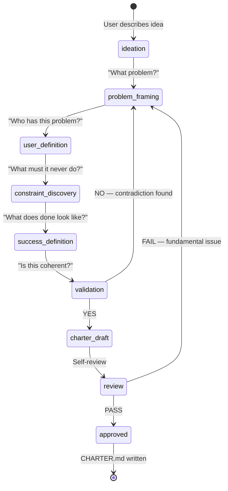
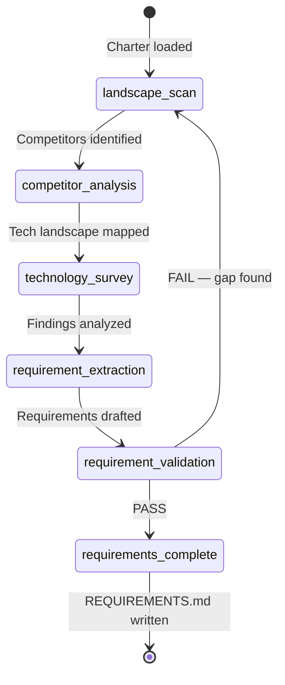
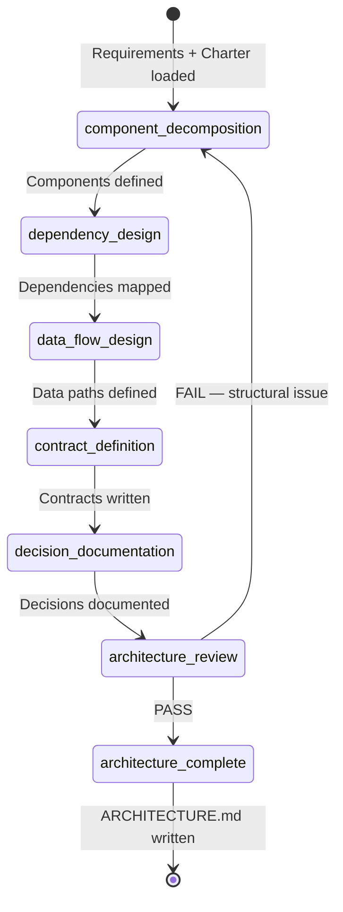
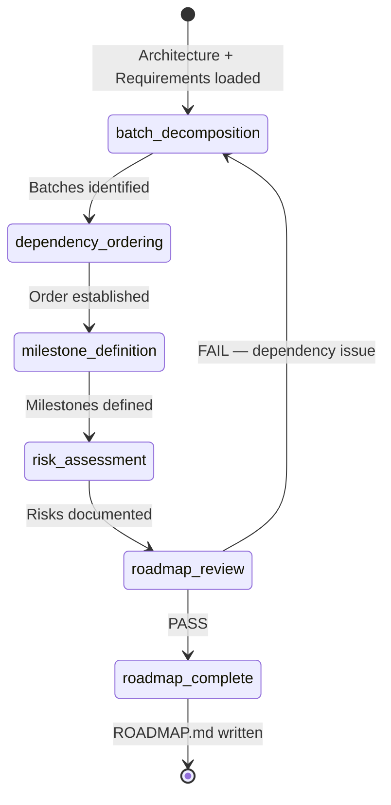
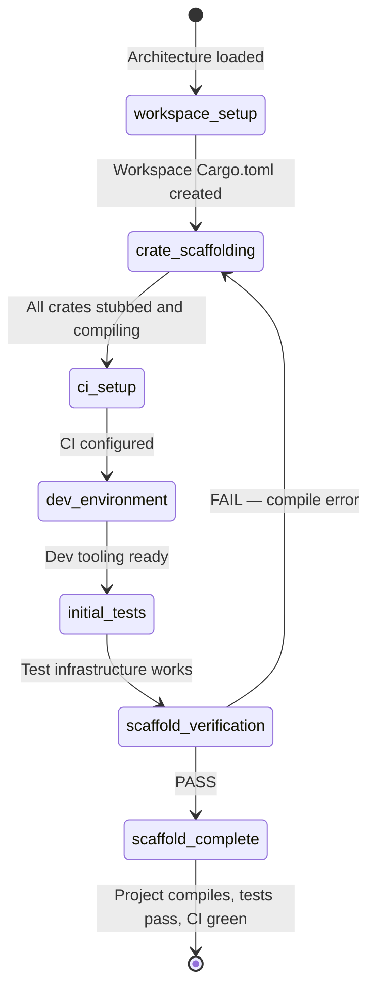
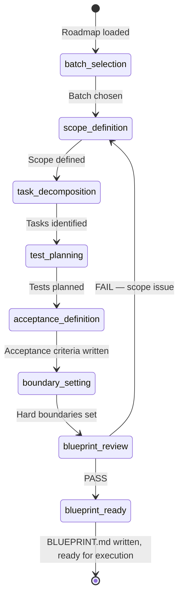
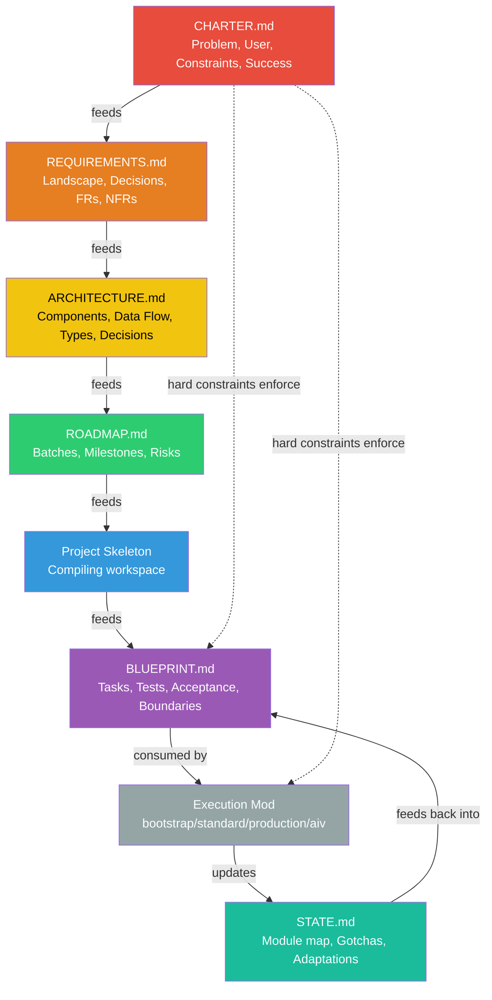

# OpenWand Lifecycle Frameworks — Design Document

**Date:** 2026-05-26  
**Status:** Draft  
**Scope:** Six frameworks covering the full project lifecycle from idea to execution

---

## 0. The Two Axes

OpenWand's workflow system operates on two independent axes:

```
Axis 1 — PROJECT LIFECYCLE PHASE (what you're deciding)
  Conception → Discovery → Architecture → Roadmap → Scaffolding → Planning → Execution

Axis 2 — EXECUTION RIGOR (how strictly you enforce process)
  bootstrap → standard → accelerate → production → aiv
```

The lifecycle frameworks (Axis 1) produce the artifacts that execution mods (Axis 2) consume. A project at the Conception phase doesn't need production-level execution rigor — but it might if it's a critical system.

**Every lifecycle phase IS a workflow mod.** They use the same engine, the same state machine, the same gate system. The difference is what they're FOR.

---

## Overview — The Six Frameworks

| # | Framework | Purpose | Key Output | Duration |
|---|---|---|---|---|
| 1 | **Conception** | Define WHAT and WHY | `CHARTER.md` | 1-3 sessions |
| 2 | **Discovery & Requirements** | Research the landscape, define requirements | `REQUIREMENTS.md` | 2-5 sessions |
| 3 | **Architecture & Technical Design** | Decide HOW to build it | `ARCHITECTURE.md` | 2-5 sessions |
| 4 | **Roadmap Construction** | Break it into batches | `ROADMAP.md` | 1-2 sessions |
| 5 | **Project Scaffolding** | Set up the workspace | Working project skeleton | 1-2 sessions |
| 6 | **Planning & Acceptance** | Define the first batch with acceptance criteria | `BLUEPRINT.md` | 1 session |

---

## 1. CONCEPTION FRAMEWORK

### 1.1 Purpose

Transform a vague idea into a falsifiable project definition. The output is a `CHARTER.md` — the project's founding document. Everything else derives from it.

### 1.2 State Machine



### 1.3 Phases

#### Phase C-1: Ideation → Problem Framing

**Input:** User's raw description (can be 1 sentence or 50)

**Prompt sequence (Lead → User):**

```
1. "In your own words, what problem does this solve?"
   — Extract: pain_point, current_state, desired_state

2. "Who specifically has this problem? Describe a real person, not a demographic."
   — Extract: persona, context, frequency (how often they hit this problem)

3. "What are they doing today to work around this problem?"
   — Extract: workarounds, cost_of_status_quo
```

**Gate:** Can you state the problem in one sentence that a stranger would understand?
- YES → proceed
- NO → ask more questions

#### Phase C-2: User Definition

**Input:** Problem framing output

**Prompt sequence:**

```
4. "Describe the moment this person reaches for your product. What were they doing
    right before? What are they trying to accomplish right after?"
   — Extract: trigger_moment, desired_outcome, emotional_state

5. "What does failure look like for this user? Not 'the app crashes' — what does
    it mean in THEIR life if this tool lets them down?"
   — Extract: failure_impact, trust_requirements

6. "Who is NOT your user? Who should this tool explicitly NOT serve?"
   — Extract: anti_personas, scope_boundaries
```

**Gate:** Can you describe this user's critical workflow in 5 steps?
- YES → proceed
- NO → user definition is too vague, refine

#### Phase C-3: Constraint Discovery

**Input:** Problem + user definition

**Prompt sequence:**

```
7. "What must this system NEVER do? Not 'it would be nice if' — what would make
    this project a failure even if everything else worked perfectly?"
   — Extract: hard_constraints (falsifiable)

8. "What external forces constrain this project? (Legal, regulatory, platform,
    resource, timeline, philosophical)"
   — Extract: external_constraints, compliance_requirements

9. "What are you willing to sacrifice? (Speed for quality? Features for simplicity?
    Generality for performance?)"
   — Extract: tradeoff_priorities
```

**Gate:** Is every hard constraint falsifiable? (Can you test "the system did NOT do X"?)
- YES → proceed
- NO → rewrite until falsifiable

#### Phase C-4: Success Definition

**Input:** Problem + user + constraints

**Prompt sequence:**

```
10. "When this project is complete — truly done, not just v1 shipped — what is
     different in the world? What can the user do that they couldn't before?"
    — Extract: success_state, measurable_outcomes

11. "What does 'minimum viable' look like? If you could only build ONE feature,
     what is the single thing that proves this concept?"
    — Extract: mvp_definition, proof_of_concept

12. "What would make you abandon this project? What outcome would tell you
     'this isn't worth building'?"
    — Extract: kill_conditions
```

**Gate:** Can you distinguish "done" from "not done" using only the success definition?
- YES → proceed to validation
- NO → success criteria are subjective, rewrite

#### Phase C-5: Validation

**Checks performed by the Lead on the complete framing:**

```
COHERENCE CHECKS:
  [ ] Problem and user are aligned (this user actually has this problem)
  [ ] Constraints don't contradict the success definition
  [ ] Success definition doesn't contradict the user's critical workflow
  [ ] Kill conditions are plausible (not trivially true or impossible)
  [ ] MVP scope is achievable within the stated constraints
  [ ] Anti-personas don't exclude the primary persona
  [ ] No two hard constraints contradict each other

COMPLETENESS CHECKS:
  [ ] Problem stated in one sentence
  [ ] User persona with context, trigger, desired outcome
  [ ] At least 3 hard constraints, all falsifiable
  [ ] Success definition with measurable outcomes
  [ ] MVP definition
  [ ] Kill conditions
  [ ] Tradeoff priorities
```

### 1.4 Output: CHARTER.md

```markdown
# PROJECT CHARTER

**Project:** [Name]
**Date:** [YYYY-MM-DD]
**Status:** [DRAFT / RATIFIED]

───────────────────────────────────────────────────────────
THE PROBLEM
───────────────────────────────────────────────────────────
[One sentence.]

[Expanded context: current state, pain point, cost of status quo.]

───────────────────────────────────────────────────────────
THE USER
───────────────────────────────────────────────────────────
Persona:           [Name and description]
Context:           [When/where they encounter the problem]
Trigger:           [What they were doing right before reaching for this tool]
Desired outcome:   [What they're trying to accomplish]
Failure impact:    [What it means in their life if this tool lets them down]

Anti-personas:
  - [Who this is NOT for, and why]

───────────────────────────────────────────────────────────
HARD CONSTRAINTS
───────────────────────────────────────────────────────────
Each constraint is falsifiable — there exists a test that proves violation.

  HC-01: [The system MUST NOT ...]
  HC-02: [The system MUST NOT ...]
  HC-03: [The system MUST ...]
  ...

External constraints:
  - [Legal/regulatory/platform/philosophical]

Tradeoff priorities (ranked):
  1. [e.g. Simplicity over features]
  2. [e.g. Local-first over collaborative]
  3. [e.g. Privacy over convenience]

───────────────────────────────────────────────────────────
SUCCESS DEFINITION
───────────────────────────────────────────────────────────
"Done" means:
  - [Measurable outcome 1]
  - [Measurable outcome 2]
  - [Measurable outcome 3]

Minimum viable (proof of concept):
  - [The single feature that proves this concept]

Kill conditions (abandon if):
  - [Condition that would prove this isn't worth building]
  - [Condition]

═══════════════════════════════════════════════════════════
```

### 1.5 Engine Representation

```yaml
id: lifecycle-conception
name: "Conception"
stage: Conception
description: "Transform a vague idea into a falsifiable project charter."

machine:
  initial_state: ideation
  terminal_states: [charter_complete, abandoned]
  
  states:
    - id: ideation
      name: "Raw Idea"
      active_role: lead
      description: "User describes the idea. Lead extracts problem framing."
    
    - id: problem_framing
      name: "Problem Framing"
      active_role: lead
      description: "Define what problem is being solved."
    
    - id: user_definition
      name: "User Definition"
      active_role: lead
      description: "Define who has this problem and how they experience it."
    
    - id: constraint_discovery
      name: "Constraint Discovery"
      active_role: lead
      description: "Discover hard constraints, tradeoffs, and kill conditions."
    
    - id: success_definition
      name: "Success Definition"
      active_role: lead
      description: "Define what done looks like."
    
    - id: validation
      name: "Coherence Validation"
      active_role: lead
      description: "Cross-check all sections for contradictions and gaps."
    
    - id: charter_complete
      name: "Charter Written"
      active_role: system
      description: "CHARTER.md written to shared memory."
    
    - id: abandoned
      name: "Abandoned"
      active_role: system
  
  transitions:
    - id: frame_problem
      from: ideation
      to: problem_framing
      gates: []
      triggered_by: lead
    
    - id: define_user
      from: problem_framing
      to: user_definition
      gates: [problem_one_sentence]
      triggered_by: lead
    
    - id: discover_constraints
      from: user_definition
      to: constraint_discovery
      gates: [user_workflow_defined]
      triggered_by: lead
    
    - id: define_success
      from: constraint_discovery
      to: success_definition
      gates: [constraints_falsifiable]
      triggered_by: lead
    
    - id: validate
      from: success_definition
      to: validation
      gates: [success_measurable]
      triggered_by: lead
    
    - id: approve
      from: validation
      to: charter_complete
      gates: [coherence_pass, completeness_pass]
      triggered_by: lead
      produces: [charter]
    
    - id: revise
      from: validation
      to: problem_framing
      gates: []
      triggered_by: lead

gates:
  - id: problem_one_sentence
    condition:
      type: Custom
      evaluator: "field_non_empty"
      params: { field: "problem_statement", min_words: 5 }
    severity: blocking
  
  - id: user_workflow_defined
    condition:
      type: Custom
      evaluator: "user_workflow_check"
      params: {}
    severity: blocking
  
  - id: constraints_falsifiable
    condition:
      type: Custom
      evaluator: "all_constraints_falsifiable"
      params: { min_count: 3 }
    severity: blocking
  
  - id: success_measurable
    condition:
      type: Custom
      evaluator: "success_criteria_measurable"
      params: { min_count: 2 }
    severity: blocking
  
  - id: coherence_pass
    condition:
      type: Custom
      evaluator: "charter_coherence"
      params: {}
    severity: blocking
  
  - id: completeness_pass
    condition:
      type: Custom
      evaluator: "charter_completeness"
      params: {}
    severity: blocking

roles:
  - id: lead
    filled_by: LeadAgent
    model_requirements:
      min_tier: medium
    tool_access: All

artifacts:
  - kind: charter
    name: "CHARTER.md"
    format: markdown
    required: true

defaults:
  max_sessions: 1
  auto_trigger_keywords: ["new project", "idea for", "I want to build", "what if"]
```

---

## 2. DISCOVERY & REQUIREMENTS FRAMEWORK

### 2.1 Purpose

Research the landscape. Study competitors, existing solutions, relevant technologies. Translate findings into concrete requirements. The output is `REQUIREMENTS.md`.

### 2.2 State Machine



### 2.3 Phases

#### Phase D-1: Landscape Scan

**Input:** CHARTER.md  
**Goal:** Map the problem domain — who else solves this? What approaches exist?

**Activities:**
- Web search for existing solutions, competitors, related projects
- Survey open-source repositories for relevant code/libraries
- Identify industry standards, protocols, formats relevant to the domain
- Catalog approaches: what patterns do existing solutions use?

**Output section in REQUIREMENTS.md:**
```
LANDSCAPE:
  Competitors:
    - [Name]: [Approach, strengths, weaknesses, what we learn from them]
  Open-source references:
    - [Project]: [What it does, what we'd reuse, what we'd do differently]
  Standards/protocols:
    - [Standard]: [Why relevant, what it constrains]
  Unresolved questions:
    - [Question that needs further research]
```

#### Phase D-2: Competitor Analysis

**Input:** Landscape scan results

**For each competitor/reference:**

```
ANALYSIS DIMENSIONS:
  1. Architecture: How is it structured? Monolith/modular/microservice?
  2. Tech stack: Language, framework, key dependencies
  3. Strengths: What does it do well that we should learn from?
  4. Weaknesses: What does it get wrong that we should avoid?
  5. Missing: What gap exists that we could fill?
  6. Patterns to steal: Specific implementation patterns worth adopting
  7. Anti-patterns to avoid: Specific mistakes to learn from
```

#### Phase D-3: Technology Survey

**Input:** Landscape + competitor analysis

**For each technical decision point:**
- List candidate technologies/approaches
- Evaluate against hard constraints from CHARTER.md
- Evaluate against tradeoff priorities from CHARTER.md
- Make a provisional selection with rationale
- Document what would change your mind

**Output section in REQUIREMENTS.md:**
```
TECHNOLOGY DECISIONS:
  Decision-01: [Area — e.g. "UI Framework"]
    Candidates: [A, B, C]
    Selected: [X]
    Rationale: [Why, referencing hard constraints and tradeoffs]
    Would change if: [What new information would reverse this decision]
  
  Decision-02: ...
```

#### Phase D-4: Requirement Extraction

**Input:** All discovery findings

**Transform findings into requirements:**

```
REQUIREMENT CATEGORIES:
  
  Functional Requirements (what the system does):
    FR-01: [The system SHALL ...]
    FR-02: ...
  
  Non-Functional Requirements (how the system performs):
    NFR-01: [Performance: ...]
    NFR-02: [Security: ...]
    NFR-03: [Reliability: ...]
    NFR-04: [Usability: ...]
  
  Constraint Requirements (derived from CHARTER hard constraints):
    CR-01: [From HC-01: ...]
    CR-02: [From HC-02: ...]
  
  Out of Scope (explicitly excluded):
    OOS-01: [What we're NOT building, and why]
```

#### Phase D-5: Validation

**Cross-check:**
```
  [ ] Every requirement traces to at least one CHARTER element
      (problem, user, constraint, or success criterion)
  [ ] No requirement contradicts a hard constraint
  [ ] No two functional requirements contradict each other
  [ ] Every technology decision references a specific requirement
  [ ] Out-of-scope items don't conflict with the user's critical workflow
  [ ] No requirement is unverifiable (each can be tested)
```

### 2.4 Output: REQUIREMENTS.md

```markdown
# REQUIREMENTS

**Project:** [Name]
**Based on:** CHARTER.md (dated [date])
**Date:** [YYYY-MM-DD]

───────────────────────────────────────────────────────────
LANDSCAPE
───────────────────────────────────────────────────────────
[Competitors, references, standards, unresolved questions]

───────────────────────────────────────────────────────────
COMPETITOR ANALYSIS
───────────────────────────────────────────────────────────
[Per-competitor: architecture, strengths, weaknesses, patterns, anti-patterns]

───────────────────────────────────────────────────────────
TECHNOLOGY DECISIONS
───────────────────────────────────────────────────────────
[Per decision: candidates, selected, rationale, reversal condition]

───────────────────────────────────────────────────────────
FUNCTIONAL REQUIREMENTS
───────────────────────────────────────────────────────────
  FR-01: ...
  FR-02: ...

───────────────────────────────────────────────────────────
NON-FUNCTIONAL REQUIREMENTS
───────────────────────────────────────────────────────────
  NFR-01: ...

───────────────────────────────────────────────────────────
CONSTRAINT REQUIREMENTS (from CHARTER)
───────────────────────────────────────────────────────────
  CR-01: ...
  CR-02: ...

───────────────────────────────────────────────────────────
OUT OF SCOPE
───────────────────────────────────────────────────────────
  OOS-01: ...

───────────────────────────────────────────────────────────
TRACEABILITY MATRIX
───────────────────────────────────────────────────────────
| Requirement | Source (CHARTER element) | Technology Decision |
|:------------|:-------------------------|:--------------------|
| FR-01       | User's critical workflow | Decision-02         |
| CR-01       | HC-01                    | Decision-01         |

═══════════════════════════════════════════════════════════
```

### 2.5 Engine Representation

```yaml
id: lifecycle-discovery
name: "Discovery & Requirements"
stage: Conception
description: "Research the landscape, analyze competitors, extract concrete requirements."

machine:
  initial_state: landscape_scan
  terminal_states: [requirements_complete, abandoned]
  
  states:
    - id: landscape_scan
      name: "Landscape Scan"
      active_role: lead
      description: "Map the problem domain."
    
    - id: competitor_analysis
      name: "Competitor Analysis"
      active_role: assistant
      description: "Deep-dive into each competitor/reference."
    
    - id: technology_survey
      name: "Technology Survey"
      active_role: assistant
      description: "Evaluate technology candidates against constraints."
    
    - id: requirement_extraction
      name: "Requirement Extraction"
      active_role: lead
      description: "Transform findings into verifiable requirements."
    
    - id: requirement_validation
      name: "Validation"
      active_role: lead
      description: "Cross-check requirements against CHARTER."
    
    - id: requirements_complete
      name: "Complete"
      active_role: system
    
    - id: abandoned
      active_role: system
  
  transitions:
    - id: analyze_competitors
      from: landscape_scan
      to: competitor_analysis
      gates: [competitors_identified]
      triggered_by: lead
    
    - id: survey_tech
      from: competitor_analysis
      to: technology_survey
      gates: [analysis_complete]
      triggered_by: lead
    
    - id: extract_requirements
      from: technology_survey
      to: requirement_extraction
      gates: [tech_decisions_made]
      triggered_by: lead
    
    - id: validate
      from: requirement_extraction
      to: requirement_validation
      gates: [requirements_verifiable]
      triggered_by: lead
    
    - id: approve
      from: requirement_validation
      to: requirements_complete
      gates: [traceability_complete, no_contradictions]
      triggered_by: lead
      produces: [requirements]
    
    - id: revisit
      from: requirement_validation
      to: landscape_scan
      gates: []
      triggered_by: lead

roles:
  - id: lead
    filled_by: LeadAgent
    model_requirements: { min_tier: medium }
    tool_access: All
  
  - id: assistant
    filled_by: AssistantSession
    model_requirements: { min_tier: medium }
    tool_access: All

artifacts:
  - kind: requirements
    name: "REQUIREMENTS.md"
    format: markdown
    required: true

gates:
  - id: competitors_identified
    condition: { type: Custom, evaluator: "min_count", params: { field: "competitors", min: 2 } }
    severity: blocking
  
  - id: analysis_complete
    condition: { type: Custom, evaluator: "all_analyzed", params: {} }
    severity: blocking
  
  - id: tech_decisions_made
    condition: { type: Custom, evaluator: "tech_decisions_rationale", params: {} }
    severity: blocking
  
  - id: requirements_verifiable
    condition: { type: Custom, evaluator: "all_requirements_testable", params: {} }
    severity: blocking
  
  - id: traceability_complete
    condition: { type: Custom, evaluator: "traceability_matrix_complete", params: {} }
    severity: blocking
  
  - id: no_contradictions
    condition: { type: Custom, evaluator: "no_requirement_contradictions", params: {} }
    severity: blocking

defaults:
  max_sessions: 2
  auto_trigger_keywords: ["research", "discover", "what exists", "competitors"]
```

---

## 3. ARCHITECTURE & TECHNICAL DESIGN FRAMEWORK

### 3.1 Purpose

Decide HOW to build it. Define crate/module boundaries, data flow, key types, dependency graph, and the contracts between components. The output is `ARCHITECTURE.md`.

### 3.2 State Machine



### 3.3 Phases

#### Phase A-1: Component Decomposition

**Input:** REQUIREMENTS.md, CHARTER.md, technology decisions

**Activities:**
- Identify logical domains from functional requirements
- Group requirements into cohesive modules
- For each module: define single responsibility, public API surface, ownership
- Identify cross-cutting concerns (logging, error handling, config, auth)

**Output:**
```
COMPONENT MAP:
  [component-name]:
    Responsibility: [one sentence]
    Public API: [key types/traits/functions]
    Owns: [what data/state this component owns]
    Depends on: [other components]
    Implements: [which FRs/NFRs]
```

#### Phase A-2: Dependency Design

**Input:** Component map

**Activities:**
- Draw the dependency graph (must be a DAG — no cycles)
- Identify the "spine" — the critical path from user input to output
- Flag any component with >5 dependents (coupling risk)
- Flag any component with >5 dependencies (fragility risk)
- Decide: trait-based abstraction points for testability

**Output:**
```
DEPENDENCY GRAPH:
  [Mermaid diagram or adjacency list]
  
COUPLING FLAGS:
  - [Component]: [N dependents] — [mitigation or accepted]
  - [Component]: [N dependencies] — [mitigation or accepted]
  
ABSTRACTION POINTS (trait boundaries for testing/swapping):
  - [Component] exposes [TraitName] — allows [testability/swap] reason
```

#### Phase A-3: Data Flow Design

**Input:** Components + dependencies

**Activities:**
- Trace the primary user workflow through components
- Identify where state lives, where it transforms, where it persists
- Define the event/message contracts between components
- Identify synchronous vs asynchronous boundaries

**Output:**
```
PRIMARY DATA FLOW:
  [User action] → [Component A] → [event/command] → [Component B] → ...

STATE OWNERSHIP:
  [Data type]: owned by [Component], persisted in [mechanism], 
    accessed by [other components] via [contract type]

EVENT CONTRACTS:
  [Event name]:
    Producer: [Component]
    Consumer(s): [Component(s)]
    Payload: [type definition]
    Guarantee: [at-most-once / at-least-once / exactly-once]
```

#### Phase A-4: Contract Definition

**Input:** Components + dependencies + data flow

**Activities:**
- Define the Rust types (trait definitions, structs, enums) for each public API
- Define error types per component
- Define the persistence schema (tables, files, formats)
- Define configuration structure

**Output:**
```
KEY TYPE DEFINITIONS:
  [Component]:
    pub trait [Name] {
        fn method(&self, ...) -> Result<Output, [ErrorType]>;
    }
    
    pub struct [Name] { ... }
    pub enum [ErrorType] { ... }

PERSISTENCE SCHEMA:
  [Store type]: [schema — tables/collections/file format]

CONFIGURATION:
  [Config struct]: [fields and defaults]
```

#### Phase A-5: Decision Documentation

**Input:** All design decisions made

For each significant decision, record:
```
DECISION:
  Choice: [What we decided]
  Alternatives considered: [What else we evaluated]
  Rationale: [Why this choice, referencing CHARTER constraints and REQUIREMENTS]
  Reversal cost: [How expensive to change later]
  Reversal trigger: [What would make us change this]
```

#### Phase A-6: Architecture Review

**Checks:**
```
  [ ] DAG check — no circular dependencies
  [ ] Every FR maps to at least one component
  [ ] Every component maps to at least one FR (no dead components)
  [ ] Coupling flags have mitigations or accepted rationale
  [ ] State ownership is unambiguous (no shared mutable state across components)
  [ ] Error types cover all failure modes identified in requirements
  [ ] Persistence schema supports all data flow requirements
  [ ] No single component has >3 responsibilities
  [ ] Configuration has sensible defaults
  [ ] Traceability: every component → requirement → CHARTER element
```

### 3.4 Output: ARCHITECTURE.md

```markdown
# ARCHITECTURE

**Project:** [Name]
**Based on:** CHARTER.md + REQUIREMENTS.md
**Date:** [YYYY-MM-DD]

───────────────────────────────────────────────────────────
COMPONENT MAP
───────────────────────────────────────────────────────────
[Per component: responsibility, public API, ownership, dependencies, requirements covered]

───────────────────────────────────────────────────────────
DEPENDENCY GRAPH
───────────────────────────────────────────────────────────
[DAG diagram]
[Coupling flags and mitigations]
[Abstraction points]

───────────────────────────────────────────────────────────
DATA FLOW
───────────────────────────────────────────────────────────
[Primary workflow trace]
[State ownership]
[Event contracts]

───────────────────────────────────────────────────────────
KEY TYPES
───────────────────────────────────────────────────────────
[Rust type definitions per component]

───────────────────────────────────────────────────────────
PERSISTENCE
───────────────────────────────────────────────────────────
[Schema per store]

───────────────────────────────────────────────────────────
CONFIGURATION
───────────────────────────────────────────────────────────
[Config structures and defaults]

───────────────────────────────────────────────────────────
DESIGN DECISIONS
───────────────────────────────────────────────────────────
[Per decision: choice, alternatives, rationale, reversal cost/trigger]

───────────────────────────────────────────────────────────
TRACEABILITY
───────────────────────────────────────────────────────────
| Component | Requirements | CHARTER elements |
|:----------|:-------------|:-----------------|
| ...       | FR-01, FR-02 | User workflow    |

═══════════════════════════════════════════════════════════
```

### 3.5 Engine Representation

```yaml
id: lifecycle-architecture
name: "Architecture & Technical Design"
stage: Conception
description: "Define component boundaries, data flow, contracts, and design decisions."

machine:
  initial_state: component_decomposition
  terminal_states: [architecture_complete, abandoned]
  
  states:
    - id: component_decomposition
      active_role: lead
    - id: dependency_design
      active_role: lead
    - id: data_flow_design
      active_role: lead
    - id: contract_definition
      active_role: assistant
    - id: decision_documentation
      active_role: lead
    - id: architecture_review
      active_role: reviewer
    - id: architecture_complete
      active_role: system
    - id: abandoned
      active_role: system
  
  transitions:
    - id: design_dependencies
      from: component_decomposition
      to: dependency_design
      gates: [components_defined]
      triggered_by: lead
    
    - id: design_data_flow
      from: dependency_design
      to: data_flow_design
      gates: [dag_verified]
      triggered_by: lead
    
    - id: define_contracts
      from: data_flow_design
      to: contract_definition
      gates: [state_ownership_clear]
      triggered_by: lead
    
    - id: document_decisions
      from: contract_definition
      to: decision_documentation
      gates: [types_defined]
      triggered_by: assistant
    
    - id: review
      from: decision_documentation
      to: architecture_review
      gates: [decisions_documented]
      triggered_by: lead
    
    - id: approve
      from: architecture_review
      to: architecture_complete
      gates: [review_pass]
      triggered_by: lead
      produces: [architecture]
    
    - id: revise
      from: architecture_review
      to: component_decomposition
      gates: []
      triggered_by: lead

roles:
  - id: lead
    filled_by: LeadAgent
    model_requirements: { min_tier: heavy }
    tool_access: All
  - id: assistant
    filled_by: AssistantSession
    model_requirements: { min_tier: medium }
    tool_access: All
  - id: reviewer
    filled_by: ReviewerSession
    model_requirements: { min_tier: light }
    tool_access: ReadOnly

artifacts:
  - kind: architecture
    name: "ARCHITECTURE.md"
    format: markdown
    required: true

gates:
  - id: components_defined
    condition: { type: Custom, evaluator: "components_have_responsibility", params: {} }
    severity: blocking
  - id: dag_verified
    condition: { type: Custom, evaluator: "dependency_dag_check", params: {} }
    severity: blocking
  - id: state_ownership_clear
    condition: { type: Custom, evaluator: "no_ambiguous_state", params: {} }
    severity: blocking
  - id: types_defined
    condition: { type: Custom, evaluator: "contracts_have_types", params: {} }
    severity: blocking
  - id: decisions_documented
    condition: { type: Custom, evaluator: "decisions_have_rationale", params: {} }
    severity: blocking
  - id: review_pass
    condition: { type: Custom, evaluator: "architecture_review_pass", params: {} }
    severity: blocking

defaults:
  max_sessions: 2
  auto_trigger_keywords: ["architecture", "design", "how to structure", "crate layout"]
```

---

## 4. ROADMAP CONSTRUCTION FRAMEWORK

### 4.1 Purpose

Break the architecture into ordered batches. Each batch is a self-contained increment that produces something functional. The output is `ROADMAP.md`.

### 4.2 State Machine



### 4.3 Phases

#### Phase R-1: Batch Decomposition

**Input:** ARCHITECTURE.md, REQUIREMENTS.md

**Activities:**
- Group components into batches by dependency order
- Each batch must produce a testable, deployable increment
- Identify the "spine batch" — the minimum set that proves the architecture works
- Flag any batch that depends on >3 other batches

**Batch sizing heuristic:**
```
TARGET: 3-8 tasks per batch
TARGET: Each batch completable in 1-3 focused sessions
HARD LIMIT: No batch exceeds 12 tasks
HARD LIMIT: No batch touches >10 files for the first time
```

#### Phase R-2: Dependency Ordering

**Input:** Batches from decomposition

**Activities:**
- Build batch dependency graph (must be a DAG)
- Identify parallelizable batches (can run simultaneously)
- Identify the critical path (longest dependency chain)
- Flag any batch on the critical path that's also high-risk

#### Phase R-3: Milestone Definition

**Input:** Ordered batches

For each batch, define:
```
BATCH-[NN]: [Name]
  Goal: [Single clear outcome]
  Components: [Which architecture components this batch creates/modifies]
  Requirements covered: [FRs/NFRs]
  Depends on: [Previous batches]
  Enables: [Next batches that can start after this one]
  Success test: [How to verify this batch works — the "demo"]
  Risk level: [Low / Medium / High]
  
MILESTONE-[N]: [Name — e.g. "First Chat", "MCP Connected", "Memory Online"]
  Batches: [BATCH-NN, BATCH-NN+1]
  User-visible change: [What the user can do now that they couldn't before]
  Demo script: [Step-by-step to show it works]
```

#### Phase R-4: Risk Assessment

For each high-risk batch:
```
RISK:
  Batch: [BATCH-NN]
  Risk: [What could go wrong]
  Probability: [Low / Medium / High]
  Impact: [What happens if it fails]
  Mitigation: [How to reduce the risk]
  Contingency: [What to do if mitigation fails]
  Early warning: [What signal tells you this is going wrong BEFORE it fails]
```

### 4.4 Output: ROADMAP.md

```markdown
# ROADMAP

**Project:** [Name]
**Based on:** ARCHITECTURE.md + REQUIREMENTS.md
**Date:** [YYYY-MM-DD]

───────────────────────────────────────────────────────────
BATCH DEPENDENCY GRAPH
───────────────────────────────────────────────────────────
[Mermaid diagram showing batch dependencies]

───────────────────────────────────────────────────────────
MILESTONES
───────────────────────────────────────────────────────────
[Per milestone: batches included, user-visible change, demo script]

───────────────────────────────────────────────────────────
BATCH DEFINITIONS
───────────────────────────────────────────────────────────
[Per batch: goal, components, requirements, dependencies, success test, risk]

───────────────────────────────────────────────────────────
CRITICAL PATH
───────────────────────────────────────────────────────────
[Ordered list of batches on the critical path]
[Estimated total sessions]

───────────────────────────────────────────────────────────
RISK REGISTER
───────────────────────────────────────────────────────────
[Per risk: batch, probability, impact, mitigation, contingency, early warning]

───────────────────────────────────────────────────────────
TRACEABILITY
───────────────────────────────────────────────────────────
| Batch | Components | Requirements | Milestone |
|:------|:-----------|:-------------|:----------|

═══════════════════════════════════════════════════════════
```

### 4.5 Engine Representation

```yaml
id: lifecycle-roadmap
name: "Roadmap Construction"
stage: Conception
description: "Break architecture into ordered batches with milestones and risk assessment."

machine:
  initial_state: batch_decomposition
  terminal_states: [roadmap_complete, abandoned]
  
  states:
    - id: batch_decomposition
      active_role: lead
    - id: dependency_ordering
      active_role: lead
    - id: milestone_definition
      active_role: lead
    - id: risk_assessment
      active_role: lead
    - id: roadmap_review
      active_role: reviewer
    - id: roadmap_complete
      active_role: system
    - id: abandoned
      active_role: system
  
  transitions:
    - id: order_batches
      from: batch_decomposition
      to: dependency_ordering
      gates: [batches_sized]
      triggered_by: lead
    - id: define_milestones
      from: dependency_ordering
      to: milestone_definition
      gates: [batch_dag_valid]
      triggered_by: lead
    - id: assess_risks
      from: milestone_definition
      to: risk_assessment
      gates: [milestones_have_demos]
      triggered_by: lead
    - id: review_roadmap
      from: risk_assessment
      to: roadmap_review
      gates: [high_risks_mitigated]
      triggered_by: lead
    - id: approve
      from: roadmap_review
      to: roadmap_complete
      gates: [roadmap_coherent]
      triggered_by: lead
      produces: [roadmap]
    - id: revise
      from: roadmap_review
      to: batch_decomposition
      gates: []
      triggered_by: lead

roles:
  - id: lead
    filled_by: LeadAgent
    model_requirements: { min_tier: medium }
    tool_access: All
  - id: reviewer
    filled_by: ReviewerSession
    model_requirements: { min_tier: light }
    tool_access: ReadOnly

artifacts:
  - kind: roadmap
    name: "ROADMAP.md"
    format: markdown
    required: true

gates:
  - id: batches_sized
    condition: { type: Custom, evaluator: "batch_size_check", params: { max_tasks: 12 } }
    severity: blocking
  - id: batch_dag_valid
    condition: { type: Custom, evaluator: "batch_dag_check", params: {} }
    severity: blocking
  - id: milestones_have_demos
    condition: { type: Custom, evaluator: "milestone_demo_check", params: {} }
    severity: blocking
  - id: high_risks_mitigated
    condition: { type: Custom, evaluator: "high_risks_have_mitigation", params: {} }
    severity: blocking
  - id: roadmap_coherent
    condition: { type: Custom, evaluator: "roadmap_coverage", params: {} }
    severity: blocking

defaults:
  max_sessions: 2
  auto_trigger_keywords: ["roadmap", "plan batches", "break into phases", "milestones"]
```

---

## 5. PROJECT SCAFFOLDING FRAMEWORK

### 5.1 Purpose

Create the working project from the architecture definition. Workspace structure, CI configuration, linting, testing infrastructure, initial module stubs. The output is a **compiling project skeleton**.

### 5.2 State Machine



### 5.3 Phases

#### Phase S-1: Workspace Setup

**Input:** ARCHITECTURE.md component map

**Activities:**
- Create root `Cargo.toml` with workspace members
- Create `[workspace.dependencies]` with shared versions
- Create root `.gitignore`, `CLAUDE.md`/`AGENTS.md`
- Initialize git repository

#### Phase S-2: Crate Scaffolding

**Input:** Component map + dependency graph

**For each component:**
- Create `crates/[name]/Cargo.toml` with correct dependencies
- Create `crates/[name]/src/lib.rs` with module structure stubs
- Create `crates/[name]/src/` with placeholder files for each declared module
- Add key type stubs (traits, structs, enums) from ARCHITECTURE.md contracts
- Ensure the crate compiles

#### Phase S-3: CI Setup

**Input:** Technology decisions from REQUIREMENTS.md

**Activities:**
- Create CI pipeline (GitHub Actions / equivalent)
- Configure: `cargo build --workspace`, `cargo test --workspace`, `cargo clippy`
- Configure: rustfmt check
- Configure: dependency audit if applicable

#### Phase S-4: Dev Environment

**Activities:**
- Add `cargo xtask` or equivalent for project-specific commands
- Add development profile optimizations (from Lapce "fastdev", Ruff selective codegen-units)
- Add `.editorconfig` or equivalent
- Document: how to build, how to test, how to run

#### Phase S-5: Initial Tests

**Activities:**
- Create integration test harness
- Create one smoke test per crate (verifies the crate loads and its public types exist)
- Verify all tests pass

#### Phase S-6: Verification

**Checks:**
```
  [ ] cargo build --workspace — zero errors
  [ ] cargo test --workspace — all pass (smoke tests)
  [ ] cargo clippy --workspace — zero warnings
  [ ] cargo fmt --check — passes
  [ ] CI pipeline runs green
  [ ] Every crate from ARCHITECTURE exists
  [ ] Every dependency from ARCHITECTURE is declared
  [ ] Key types from ARCHITECTURE are present (at least as stubs)
```

### 5.4 Engine Representation

```yaml
id: lifecycle-scaffolding
name: "Project Scaffolding"
stage: Conception
description: "Create compiling project skeleton from architecture definition."

machine:
  initial_state: workspace_setup
  terminal_states: [scaffold_complete, abandoned]
  
  states:
    - id: workspace_setup
      active_role: assistant
    - id: crate_scaffolding
      active_role: assistant
    - id: ci_setup
      active_role: assistant
    - id: dev_environment
      active_role: assistant
    - id: initial_tests
      active_role: assistant
    - id: scaffold_verification
      active_role: system
    - id: scaffold_complete
      active_role: system
    - id: abandoned
      active_role: system
  
  transitions:
    - id: scaffold_crates
      from: workspace_setup
      to: crate_scaffolding
      gates: [workspace_toml_exists]
      triggered_by: lead
    - id: setup_ci
      from: crate_scaffolding
      to: ci_setup
      gates: [all_crates_compile]
      triggered_by: lead
    - id: setup_dev
      from: ci_setup
      to: dev_environment
      gates: [ci_passes]
      triggered_by: lead
    - id: write_tests
      from: dev_environment
      to: initial_tests
      gates: [dev_tooling_ready]
      triggered_by: lead
    - id: verify
      from: initial_tests
      to: scaffold_verification
      gates: [tests_pass]
      triggered_by: system
    - id: complete
      from: scaffold_verification
      to: scaffold_complete
      gates: [full_verification]
      triggered_by: lead
    - id: fix_compile
      from: scaffold_verification
      to: crate_scaffolding
      gates: []
      triggered_by: system

roles:
  - id: lead
    filled_by: LeadAgent
    model_requirements: { min_tier: medium }
    tool_access: All
  - id: assistant
    filled_by: AssistantSession
    model_requirements: { min_tier: medium }
    tool_access: All

artifacts:
  - kind: project_skeleton
    name: "Compiling project"
    format: filesystem
    required: true

gates:
  - id: workspace_toml_exists
    condition: { type: Custom, evaluator: "file_exists", params: { path: "Cargo.toml" } }
    severity: blocking
  - id: all_crates_compile
    condition: { type: LintPasses, command: "cargo build --workspace" }
    severity: blocking
  - id: ci_passes
    condition: { type: Custom, evaluator: "ci_green", params: {} }
    severity: advisory
  - id: dev_tooling_ready
    condition: { type: Custom, evaluator: "dev_commands_work", params: {} }
    severity: blocking
  - id: tests_pass
    condition: { type: TestsPass, coverage_threshold: null, include_deferred: false }
    severity: blocking
  - id: full_verification
    condition:
      type: All
      conditions:
        - type: LintPasses
          command: "cargo clippy --workspace -- -D warnings"
        - type: TestsPass
          coverage_threshold: null
          include_deferred: false
        - type: Custom
          evaluator: "architecture_crates_exist"
          params: {}
    severity: blocking

defaults:
  max_sessions: 2
  auto_trigger_keywords: ["scaffold", "set up project", "create workspace", "initialize"]
```

---

## 6. PLANNING & ACCEPTANCE FRAMEWORK

### 6.1 Purpose

Take the first batch from the roadmap and define it with surgical precision: exact files, exact tests, exact acceptance criteria, hard boundaries. This is the bridge between "here's what we're building" and "go build it." The output is a `BLUEPRINT.md` ready for execution by any execution mod.

### 6.2 State Machine



### 6.3 Phases

#### Phase P-1: Batch Selection

**Input:** ROADMAP.md, current project state

**Activities:**
- Identify the next batch from the roadmap (respecting dependency order)
- Verify all prerequisite batches are complete
- Confirm the batch goal still makes sense given current state
- If the project has evolved, adjust the batch scope to match reality

#### Phase P-2: Scope Definition

**Input:** Selected batch from roadmap

**Activities:**
- Define exact MUST DO / MUST NOT DO for this batch
- List every file that will be created or modified
- List every file that must NOT be touched
- Define the "demo" — how to verify this batch works end-to-end

#### Phase P-3: Task Decomposition

**Input:** Batch scope

**Activities:**
- Break the batch into ordered tasks (3-8 tasks per batch)
- Each task: one logical concern, clear input → output
- Declare dependencies between tasks
- Assign priority (Critical / High / Medium / Low)
- Estimate LOC per task (flag if >500)

#### Phase P-4: Test Planning

**Input:** Tasks

**For each task, define tests:**
```
For each test:
  Test ID:          [standard format]
  Type:             [unit / integration / e2e / manual]
  Behavior Verified: [what specific behavior this tests — not generic]
  Failure Mode:      [what would go wrong if this behavior were broken]
  Falsified By:      [what code change would make this test fail]
  Pass Criteria:     [specific assertion — not "works correctly"]
```

Ensure:
- At least 1 happy-path test per task
- At least 1 error-path test per task that handles input
- Boundary condition tests where applicable
- Regression tests if modifying existing code

#### Phase P-5: Acceptance Definition

**Input:** Tasks + tests

**For each task:**
```
Acceptance Criteria:
  AC-NN-01: [Specific, verifiable condition]
  AC-NN-02: [Specific, verifiable condition]

Traceability:
  AC-NN-01 → TEST-NN-NN-01
  AC-NN-02 → TEST-NN-NN-02, TEST-NN-NN-03
```

**Batch-level acceptance criteria:**
```
BAC-01: [What must be true for the entire batch to be considered done]
BAC-02: [...]
BAC-03: CHANGELOG.md updated
BAC-04: All documents archived
```

#### Phase P-6: Boundary Setting

**Input:** Scope + charter constraints

**Define hard boundaries:**
```
HB-01: [The system MUST NOT ... — falsifiable]
HB-02: [The system MUST NOT ... — falsifiable]
HB-03: [No file outside declared scope shall be modified]
```

Cross-check against CHARTER.md hard constraints — every HC that's relevant to this batch should have a corresponding HB.

### 6.4 Output: BLUEPRINT.md

This is the standard blueprint format from the execution mods (see workflow-framework-design.md), populated with the first batch's details. The planning framework produces it. The execution framework consumes it.

### 6.5 Engine Representation

```yaml
id: lifecycle-planning
name: "Planning & Acceptance"
stage: Conception
description: "Define the first batch with surgical precision: files, tests, acceptance criteria, boundaries."

machine:
  initial_state: batch_selection
  terminal_states: [blueprint_ready, abandoned]
  
  states:
    - id: batch_selection
      active_role: lead
    - id: scope_definition
      active_role: lead
    - id: task_decomposition
      active_role: lead
    - id: test_planning
      active_role: lead
    - id: acceptance_definition
      active_role: lead
    - id: boundary_setting
      active_role: lead
    - id: blueprint_review
      active_role: reviewer
    - id: blueprint_ready
      active_role: system
    - id: abandoned
      active_role: system
  
  transitions:
    - id: select_batch
      from: batch_selection
      to: scope_definition
      gates: [prerequisites_met]
      triggered_by: lead
    - id: define_scope
      from: scope_definition
      to: task_decomposition
      gates: [scope_has_must_and_must_not]
      triggered_by: lead
    - id: decompose_tasks
      from: task_decomposition
      to: test_planning
      gates: [tasks_sized, dependencies_valid]
      triggered_by: lead
    - id: plan_tests
      from: test_decomposition
      to: acceptance_definition
      gates: [all_tests_falsifiable]
      triggered_by: lead
    - id: define_acceptance
      from: acceptance_definition
      to: boundary_setting
      gates: [all_acs_have_tests]
      triggered_by: lead
    - id: set_boundaries
      from: boundary_setting
      to: blueprint_review
      gates: [boundaries_falsifiable, charter_aligned]
      triggered_by: lead
    - id: approve
      from: blueprint_review
      to: blueprint_ready
      gates: [review_pass]
      triggered_by: lead
      produces: [blueprint]
    - id: revise
      from: blueprint_review
      to: scope_definition
      gates: []
      triggered_by: lead

roles:
  - id: lead
    filled_by: LeadAgent
    model_requirements: { min_tier: heavy }
    tool_access: All
  - id: reviewer
    filled_by: ReviewerSession
    model_requirements: { min_tier: light }
    tool_access: ReadOnly

artifacts:
  - kind: blueprint
    name: "BLUEPRINT.md"
    format: markdown
    required: true

gates:
  - id: prerequisites_met
    condition: { type: Custom, evaluator: "batch_prerequisites", params: {} }
    severity: blocking
  - id: scope_has_must_and_must_not
    condition: { type: Custom, evaluator: "scope_complete", params: {} }
    severity: blocking
  - id: tasks_sized
    condition: { type: Custom, evaluator: "task_count_check", params: { min: 3, max: 12 } }
    severity: blocking
  - id: dependencies_valid
    condition: { type: Custom, evaluator: "task_dag_check", params: {} }
    severity: blocking
  - id: all_tests_falsifiable
    condition: { type: Custom, evaluator: "tests_falsifiable", params: {} }
    severity: blocking
  - id: all_acs_have_tests
    condition: { type: Custom, evaluator: "ac_test_traceability", params: {} }
    severity: blocking
  - id: boundaries_falsifiable
    condition: { type: Custom, evaluator: "boundaries_falsifiable", params: {} }
    severity: blocking
  - id: charter_aligned
    condition: { type: Custom, evaluator: "charter_constraint_alignment", params: {} }
    severity: blocking
  - id: review_pass
    condition: { type: Custom, evaluator: "blueprint_review", params: {} }
    severity: blocking

defaults:
  max_sessions: 2
  auto_trigger_keywords: ["plan batch", "blueprint", "acceptance criteria", "start batch"]
```

---

## 7. THE FULL LIFECYCLE — ARTIFACT FLOW



### Artifact Dependency Rules

| Artifact | Must exist before | Persists across |
|---|---|---|
| CHARTER.md | REQUIREMENTS.md | Entire project lifecycle |
| REQUIREMENTS.md | ARCHITECTURE.md | Updated when landscape shifts |
| ARCHITECTURE.md | ROADMAP.md | Updated when structural decisions change |
| ROADMAP.md | Scaffolding + each BLUEPRINT | Updated at each milestone |
| Project skeleton | First BLUEPRINT | Grows with each batch |
| BLUEPRINT.md | Execution | Per-batch — archived after close |
| STATE.md | First execution batch | Updated at every batch close |

### Traceability Chain

Every line of code traces backward:

```
Code → Test → Acceptance Criterion → Task → Batch → Milestone → 
  Requirement → CHARTER element (problem, user, constraint, or success criterion)
```

A reviewer at any level can follow this chain in either direction.

---

## 8. THE COMPLETE MOD LIBRARY

### 8.1 All Mods — Lifecycle + Execution

| Category | Mod ID | Name | States | Roles | Artifacts |
|---|---|---|---|---|---|
| **Lifecycle** | `lifecycle-conception` | Conception | 8 | 1 (lead) | CHARTER.md |
| **Lifecycle** | `lifecycle-discovery` | Discovery & Requirements | 7 | 2 (lead, assistant) | REQUIREMENTS.md |
| **Lifecycle** | `lifecycle-architecture` | Architecture & Design | 8 | 3 (lead, assistant, reviewer) | ARCHITECTURE.md |
| **Lifecycle** | `lifecycle-roadmap` | Roadmap Construction | 7 | 2 (lead, reviewer) | ROADMAP.md |
| **Lifecycle** | `lifecycle-scaffolding` | Project Scaffolding | 8 | 2 (lead, assistant) | Project skeleton |
| **Lifecycle** | `lifecycle-planning` | Planning & Acceptance | 9 | 2 (lead, reviewer) | BLUEPRINT.md |
| **Execution** | `exec-bootstrap` | Bootstrap | 4 | 2 (lead, assistant) | Plan note |
| **Execution** | `exec-standard` | Standard | 6 | 3 (lead, assistant, reviewer) | 4 artifacts |
| **Execution** | `exec-accelerate` | Accelerate | 6 | 3 (lead, assistant, reviewer) | 4 artifacts |
| **Execution** | `exec-production` | Production | 8 | 3 (lead, assistant, reviewer) | 7 artifacts |
| **Execution** | `exec-aiv` | AIV v5.4 | 12+ | 3 (lead, assistant, reviewer) | 3+2N+1 artifacts |

### 8.2 Mod Selection — The Full Logic

```rust
pub fn select_mod(context: &SelectionContext) -> ModSelection {
    // 1. Check lifecycle phase
    //    - No CHARTER.md? → lifecycle-conception
    //    - CHARTER but no REQUIREMENTS? → lifecycle-discovery
    //    - REQUIREMENTS but no ARCHITECTURE? → lifecycle-architecture
    //    - ARCHITECTURE but no ROADMAP? → lifecycle-roadmap
    //    - ROADMAP but no project skeleton? → lifecycle-scaffolding
    //    - Skeleton but no current BLUEPRINT? → lifecycle-planning
    //    - Current BLUEPRINT exists? → execution mod selection
    
    // 2. Execution mod selection (only when blueprint exists)
    //    - Check explicit user request ([bootstrap], [aiv], etc.)
    //    - Check auto-trigger thresholds
    //    - Fall back to user's configured default
}
```

The engine automatically detects which lifecycle phase the project is in by checking which artifacts exist in shared memory. The user never has to think "which framework should I use?" — OpenWand knows.

---

## 9. FILE STRUCTURE

```
.openwand/
├── workflows/
│   ├── lifecycle/
│   │   ├── conception.yaml
│   │   ├── discovery.yaml
│   │   ├── architecture.yaml
│   │   ├── roadmap.yaml
│   │   ├── scaffolding.yaml
│   │   └── planning.yaml
│   ├── execution/
│   │   ├── bootstrap.yaml
│   │   ├── standard.yaml
│   │   ├── accelerate.yaml
│   │   ├── production.yaml
│   │   └── aiv.yaml
│   └── custom/
│       └── [user-defined workflows]
├── memory/
│   ├── CHARTER.md
│   ├── REQUIREMENTS.md
│   ├── ARCHITECTURE.md
│   ├── ROADMAP.md
│   ├── STATE.md
│   └── PROJECT.md          ← v5.4's PROJECT.md, generalized
├── batches/
│   ├── batch-001/
│   │   ├── BLUEPRINT.md
│   │   ├── REVIEW-REPORT.md
│   │   └── ...
│   └── ...
└── config.yaml
```

All lifecycle artifacts live in shared memory (Loro CRDT), not just on disk. They're living documents — any session can read them, the lead can update them, and changes propagate instantly to all active sessions.
