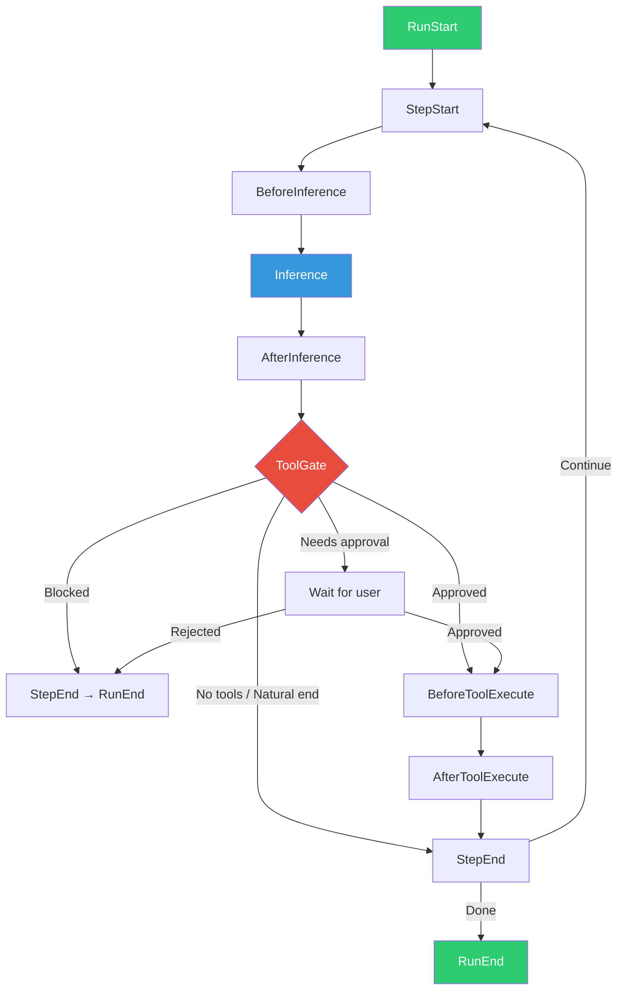

# OpenWand Session Crate Design

**Date:** 2026-05-26  
**Status:** Design — corrected  
**Crate:** `openwand-session`  
**Depends on:** `openwand-core`, `openwand-trace`, `openwand-llm`, `openwand-tools`, `openwand-policy`, `openwand-memory`, `loro`  
**Blocks:** Agent loop implementation, Batch 1

---

## Invariants

These three rules are locked into the crate before any implementation code. They are not guidelines — they are invariants.

```
1. SessionRunner is the only writer.
2. Trace append precedes every durable state mutation.
3. Loro is rebuildable projection, never authority.
```

The execution model for every agent step:

```
LLM proposes
Policy gates
Tools execute
Trace records
Loro projects
Memory derives
UI observes
```

---

## Core Principle

> The session is a coordinator that runs a 10-phase agent loop. Every durable mutation goes through the trace log first. Loro is a fast, branchable, reactive projection of session state. AgentEvent is a transient UI transport. Memory derives knowledge from trace-backed episodes.

The authority hierarchy:

| Layer | Durable? | Authoritative? | Purpose |
|---|---|---|---|
| `TraceEntry<OpenWandTraceEvent>` | Yes | **Yes** | Audit, replay, causality, source of truth |
| `LoroDoc` | Yes, as projection snapshot | No | Live session state, branchable UI model |
| `AgentEvent` stream | Usually no | No | Streaming UI transport |
| Memory store | Yes | No, derived | Retrieval and knowledge projection |

---

## 1. What the Session Crate Owns

The session crate owns the **agent loop** — the core orchestration that:

1. Receives user input
2. Assembles context (session history + memory retrieval + mode prompt)
3. Calls the LLM
4. Parses the response (text, tool calls, reasoning)
5. Routes tool calls through the policy gate
6. Executes tools
7. Records everything as trace entries
8. Projects state into Loro
9. Loops until natural end or user stop

It does **not** own:
- LLM inference (owned by `openwand-llm`)
- Tool execution (owned by `openwand-tools`)
- Policy evaluation (owned by `openwand-policy`)
- Memory storage/retrieval (owned by `openwand-memory`)
- Trace storage (owned by `openwand-trace` via `openwand-store`)

It **coordinates** all of these.

---

## 2. Session State: Loro CRDT Document

Each session has one `LoroDoc` as its **live, reactive projection**. Loro is not the source of truth — the trace log is. Loro is rebuilt from trace if it gets corrupted.

### 2.1 Document Structure

```text
LoroDoc "session:{session_id}"
├── map "metadata"
│   ├── "id"           → string (SessionId)
│   ├── "created_at"   → i64 (unix ms)
│   ├── "updated_at"   → i64 (unix ms)
│   ├── "mode"         → string ("direct" | "conversational" | "auto" | "custom:{name}")
│   ├── "model"        → string
│   ├── "provider"     → string
│   ├── "working_dir"  → string
│   ├── "name"         → string
│   └── "status"       → string ("active" | "paused" | "done" | "archived")
│
├── list "messages"
│   ├── [0] → map { role, content, timestamp, trace_id }
│   └── ...
│
├── map "token_usage"
│   ├── "input"        → i64
│   ├── "output"       → i64
│   ├── "reasoning"    → i64
│   └── "cost_usd"     → i64 (cents × 10000 to avoid float)
│
├── map "loop_state"
│   ├── "current_step"       → i64
│   ├── "current_phase"      → string
│   ├── "lifecycle"          → string (RunLifecycle serialized)
│   ├── "stop_reason"        → string?
│   ├── "waiting_approval"   → map? (see §6.5 Durable Approval)
│   └── ...
│
└── map "extensions"
    └── (session-specific data: skills state, goal progress, etc.)
```

### 2.2 Typed Access Rule

> `loro_state.rs` is the **only module** allowed to read/write raw Loro containers. Everything else uses typed methods.

```rust
// ✅ Correct — typed methods
session_state.set_lifecycle(RunLifecycle::Running)?;
session_state.increment_input_tokens(usage.input)?;
session_state.append_message(message, trace_id)?;

// ❌ Wrong — raw Loro access from outside loro_state.rs
doc.get_map("loop_state").insert("lifecycle", "running")?;
```

Lifecycle, mode, status, and phase round-trip through typed enums. Token counts are integers, never floats. No other module touches raw Loro strings.

### 2.3 Why Loro

| Need | Loro feature |
|---|---|
| Undo/redo for user actions | `UndoManager` |
| Branch session (fork at message N) | `doc.fork_at(&frontiers)` |
| Time travel (view session at any point) | `doc.checkout(&frontiers)` |
| Reactive UI updates | `doc.subscribe_root()` |
| Persistent snapshots | `doc.export(ExportMode::Snapshot)` |
| Compact storage | `doc.export(ExportMode::ShallowSnapshot)` |

Note: Loro supports CRDT merging, but **session branches are not automatically merged**. The supported operations are: fork, compare, copy selected artifacts, promote, archive. "Merge branches" does not imply automatic semantic reconciliation. Each branch creates a trace relation: `DerivedFrom` linking to the origin session's fork point.

### 2.4 Session Persistence

```text
~/.openwand/
  sessions/
    {session_id}/
      session.loro       # Loro snapshot (projected from trace)
      session.json       # Metadata cache (for fast list views)
```

- On save: `doc.export(ExportMode::Snapshot) → write to session.loro`
- On load: `LoroDoc::from_snapshot(bytes)`
- On compact (after 1000+ messages): `doc.export(ExportMode::ShallowSnapshot) → replace session.loro`
- On corruption: delete `session.loro`, rebuild from trace log

### 2.5 Subscription for UI

The UI subscribes to the Loro document and gets reactive updates:

```rust
let doc = session.loro_doc();
let _sub = doc.subscribe_root(Arc::new(|event| {
    for container_diff in &event.events {
        match container_diff.container_id() {
            "messages" => ui.refresh_message_list(),
            "loop_state" => ui.refresh_status_bar(),
            _ => {}
        }
    }
}));
```

The agent loop writes to Loro containers (via `loro_state.rs` typed methods), the UI automatically updates. No separate UI signaling layer needed.

---

## 3. The 10-Phase Agent Loop

### 3.1 Phase Definitions

```rust
#[derive(Debug, Clone, Copy, PartialEq, Eq, Hash, Serialize, Deserialize)]
pub enum Phase {
    /// Once per run: initialize session, load context
    RunStart,

    /// Per step: prepare context, apply throttling
    StepStart,

    /// Per step: inject system prompt, filter tools, start streaming
    BeforeInference,

    /// Per step: LLM generates response (streaming)
    Inference,

    /// Per step: parse response, extract tool calls, record episode
    AfterInference,

    /// Per step: policy check on tool calls (the trust gate)
    ToolGate,

    /// Per step: route to MCP or local tool, prepare execution
    BeforeToolExecute,

    /// Per step: run tool, collect result
    AfterToolExecute,

    /// Per step: commit state, check termination
    StepEnd,

    /// Once per run: finalize, cleanup, last memory ingestion
    RunEnd,
}
```

`Inference` is an explicit phase because it streams, fails, consumes budget, triggers retries, and produces tool calls. It deserves its own lifecycle handling.

### 3.2 Phase Flow



### 3.3 Phase Context

Each phase has access to a shared context:

```rust
pub struct StepContext {
    /// The Loro document for this session (read access via loro_state.rs)
    pub doc: LoroDoc,

    /// Current step number (0-indexed)
    pub step: u64,

    /// Current phase
    pub phase: Phase,

    /// Session metadata
    pub session_id: SessionId,

    /// Interaction mode
    pub mode: InteractionMode,

    /// Messages accumulated so far (read from Loro "messages" list)
    pub messages: Vec<Message>,

    /// Tool calls pending execution this step
    pub pending_tool_calls: Vec<ToolCall>,

    /// Tool results from this step
    pub tool_results: Vec<ToolResult>,

    /// Token usage accumulator for this run
    pub token_usage: TokenUsageAccumulator,

    /// Cancellation token
    pub cancellation: CancellationToken,

    /// Trace store reference (for appending events)
    pub trace: Arc<dyn TraceStore<OpenWandTraceEvent>>,

    /// LLM client reference
    pub llm: Arc<dyn LlmClient>,

    /// Tool executor reference
    pub tools: Arc<dyn ToolExecutor>,

    /// Policy engine reference
    pub policy: Arc<dyn PolicyEngine>,

    /// Memory read store reference (for retrieval only)
    pub memory: Arc<dyn MemoryReadStore>,

    /// Memory ingestion queue (enqueues trace IDs, not raw data)
    pub memory_ingester: Arc<MemoryIngester>,
}
```

---

## 4. Core Types

### 4.1 Message

```rust
#[derive(Debug, Clone, Serialize, Deserialize)]
pub struct Message {
    pub id: MessageId,
    pub role: MessageRole,
    pub content: MessageContent,
    pub timestamp: DateTime<Utc>,
    pub trace_id: TraceId,       // Every message has a trace_id — no Option
    pub metadata: Option<serde_json::Value>,
}

#[derive(Debug, Clone, Serialize, Deserialize)]
pub enum MessageRole {
    User,
    Assistant,
    System,
    Tool,
}

#[derive(Debug, Clone, Serialize, Deserialize)]
pub enum MessageContent {
    Text(String),
    ToolCall {
        tool_call_id: ToolCallId,
        tool_name: String,
        arguments: serde_json::Value,
    },
    ToolResult {
        tool_call_id: ToolCallId,
        tool_name: String,
        result: String,
        is_error: bool,
    },
    Multi(Vec<MessageContent>),
}

#[derive(Debug, Clone, Serialize, Deserialize, PartialEq, Eq, Hash)]
pub struct MessageId(pub String);
```

### 4.2 ToolCall

```rust
#[derive(Debug, Clone, Serialize, Deserialize)]
pub struct ToolCall {
    pub id: ToolCallId,
    pub name: String,
    pub arguments: serde_json::Value,
}

#[derive(Debug, Clone, Serialize, Deserialize)]
pub struct ToolResult {
    pub tool_call_id: ToolCallId,
    pub tool_name: String,
    pub output: String,
    pub is_error: bool,
    pub duration_ms: u64,
}
```

### 4.3 AgentEvent

The transient event stream emitted by the agent loop. UI subscribes to this. **Non-authoritative** — the trace log is the source of truth, not this stream.

```rust
#[derive(Debug, Clone, Serialize, Deserialize)]
pub enum AgentEvent {
    /// Run started
    RunStarted { session_id: SessionId, mode: InteractionMode },

    /// Step started
    StepStarted { step: u64 },

    /// Streaming text delta from LLM
    TextDelta { delta: String },

    /// Streaming reasoning/thinking delta
    ReasoningDelta { delta: String },

    /// LLM requested a tool call
    ToolCallStart { id: ToolCallId, name: String, arguments: serde_json::Value },

    /// Tool execution completed
    ToolCallResult {
        id: ToolCallId,
        name: String,
        result: Result<String, String>,
    },

    /// Tool call was blocked by policy
    ToolCallBlocked { id: ToolCallId, name: String, reason: String },

    /// Tool call needs user approval (Conversational mode)
    ToolCallPendingApproval { id: ToolCallId, name: String, risk_level: RiskLevelSnapshot },

    /// User message was injected mid-run
    UserMessageInjected { text: String },

    /// Step completed
    StepCompleted { step: u64, stop_reason: StepStopReason },

    /// Run completed
    RunCompleted {
        session_id: SessionId,
        total_steps: u64,
        total_tokens: TokenUsageSnapshot,
        stop_reason: RunStopReason,
    },

    /// Error during run
    Error { message: String, recoverable: bool },
}

#[derive(Debug, Clone, Serialize, Deserialize)]
pub enum StepStopReason {
    NaturalEnd,         // LLM returned text, no tool calls
    ToolCallsPending,   // Tool calls need execution, continue loop
    Blocked,            // Tool gate blocked a call
    MaxStepsReached,    // Hit step limit
    TokenBudgetExhausted,
}

#[derive(Debug, Clone, Serialize, Deserialize)]
pub enum RunStopReason {
    Natural,
    UserStopped,
    MaxStepsReached,
    TokenBudgetExhausted,
    Error,
    Cancelled,
}
```

### 4.4 RunConfig

```rust
#[derive(Debug, Clone)]
pub struct RunConfig {
    /// Maximum steps per run (default: 50)
    pub max_steps: u64,

    /// Maximum tokens for this run (default: from settings)
    pub max_tokens: Option<u64>,

    /// Interaction mode (default: Conversational)
    pub mode: InteractionMode,

    /// Thinking budget (from CC Switch patterns)
    pub thinking_budget: Option<ThinkingBudget>,

    /// System prompt override
    pub system_prompt: Option<String>,

    /// Working directory for tool execution
    pub working_directory: String,

    /// Whether to enable memory ingestion during the run
    pub enable_memory: bool,
}

#[derive(Debug, Clone)]
pub enum ThinkingBudget {
    Off,
    Low,
    Medium,
    High,
    Max,
    Tokens(u32),
}

impl Default for RunConfig {
    fn default() -> Self {
        Self {
            max_steps: 50,
            max_tokens: None,
            mode: InteractionMode::Conversational,
            thinking_budget: None,
            system_prompt: None,
            working_directory: ".".into(),
            enable_memory: true,
        }
    }
}
```

### 4.5 RunLifecycle

The lifecycle is stored in Loro (projected from trace) and used for crash recovery:

```rust
#[derive(Debug, Clone, Serialize, Deserialize)]
pub enum RunLifecycle {
    Idle,
    Running { step: u64 },
    Stepping { step: u64 },
    WaitingApproval {
        step: u64,
        tool_call_id: ToolCallId,
        approval_request_id: ApprovalRequestId,
        risk_level: RiskLevelSnapshot,
        requested_action_summary_hash: String,   // blake3 of action description
        rollback_plan_hash: Option<String>,       // blake3 of rollback plan
    },
    Done { reason: RunStopReason },
}

#[derive(Debug, Clone, Serialize, Deserialize, PartialEq, Eq, Hash)]
pub struct ApprovalRequestId(pub String);
```

On restart, if the Loro document shows `WaitingApproval`, the app reads the trace log to reconstruct the full context and re-present the approval request to the user. The hashes verify the UI shows the same action that was originally suspended.

### 4.6 PromptAssemblySnapshot

For context reproducibility — enough metadata to reconstruct why the LLM saw what it saw:

```rust
#[derive(Debug, Clone, Serialize, Deserialize)]
pub struct PromptAssemblySnapshot {
    pub system_prompt_hash: String,
    pub message_window_hash: String,
    pub memory_hit_ids: Vec<String>,
    pub memory_context_hash: Option<String>,
    pub tool_manifest_hash: String,
    pub policy_filter_hash: String,
    pub mode: InteractionMode,
    pub working_directory: String,
}
```

This is stored in `InferenceEvent::Called` so that later you can explain what evidence and tools the LLM was shown.

---

## 5. The Mutation Path

### 5.1 Single Mutation Path

Every durable state mutation follows one path:

```rust
async fn apply_session_mutation(
    &self,
    event: OpenWandTraceEvent,
    relations: Vec<TraceRelationDraft>,
    idempotency_key: Option<IdempotencyKey>,
) -> Result<TraceId> {
    // 1. Append to trace (source of truth) — MUST succeed
    let trace_id = self.trace.append(AppendTraceEntry {
        actor: self.current_actor(),
        event,
        relations,
        stream_id: self.trace_stream_id(),
        idempotency_key,
    }).await?;  // ? = hard stop on failure

    // 2. Project to Loro (live state) — failure is non-fatal
    if let Err(e) = self.loro_projector.apply(trace_id, &event) {
        tracing::warn!("Loro projection failed: {e}, trace_id={trace_id:?}");
        // Mark projection as stale. Continue. Rebuild from trace on next load.
    }

    // 3. Emit AgentEvent (transient UI transport) — fire and forget
    let _ = self.agent_event_tx.send(event.to_agent_event());

    // 4. Schedule memory ingestion (async, trace-backed)
    self.memory_ingester.enqueue(trace_id);

    Ok(trace_id)
}
```

### 5.2 Failure Taxonomy

| Failure | Behavior | Rationale |
|---|---|---|
| **Trace append fails** | **Hard stop.** Return error. Do not mutate Loro or any projection. | Trace is source of truth. If it can't record, nothing else proceeds. |
| **Loro projection fails** | Log warning. Mark projection as stale. Continue loop. | Trace remains authoritative. Loro rebuilds from trace on next load. |
| **Memory ingestion fails** | Continue session. Mark memory pipeline as degraded. Retry later. | Memory is derived. Session doesn't depend on it for correctness. |
| **Snapshot save fails** | Warn user. Trace + Loro are still in memory. Retry on next save interval. | Annoying but not catastrophic. Trace survives. |
| **Tool execution fails** | Record `ToolEvent::Failed` in trace. Feed error back to loop as tool result. | Normal — tools fail. The loop handles it. |
| **Policy evaluation fails** | **Fail closed.** Block the tool call. Record gate failure. Continue session. | Never execute a tool when policy can't be evaluated. Session continues; the tool doesn't. |
| **LLM inference fails** | Retry within budget (circuit breaker). If exhausted, emit recoverable error. | Different from trace failure — the loop can continue or end gracefully. |

**The rule: trace failure is the only hard stop for the run. Policy failure is a hard stop for the tool call, not the session.**

---

## 6. The Agent Loop in Detail

### 6.1 Public API

```rust
pub struct Session {
    doc: LoroDoc,
    session_id: SessionId,
    config: RunConfig,
    trace: Arc<dyn TraceStore<OpenWandTraceEvent>>,
    llm: Arc<dyn LlmClient>,
    tools: Arc<dyn ToolExecutor>,
    policy: Arc<dyn PolicyEngine>,
    memory: Arc<dyn MemoryReadStore>,
    memory_ingester: Arc<MemoryIngester>,
    cancellation: CancellationToken,
    injection_queue: Arc<Mutex<VecDeque<String>>>,
    // Single-writer enforcement:
    command_rx: mpsc::Receiver<SessionCommand>,
}
```

### 6.2 Concurrency: Single-Writer Session Actor

> The agent loop itself has a single operational writer per active session.

Commands go through a queue. The `SessionRunner` processes them sequentially:

```
UI / API commands → SessionCommand queue → SessionRunner (single writer) → trace + Loro + AgentEvent
```

- Can two `run_turn()` calls execute on the same session at once? **No.** The second is rejected.
- Can `set_mode()` happen during inference? **Yes**, via the injection queue — applied at the next safe point.
- Can `fork_at_message()` happen while Loro is being mutated? **No.** Forks are processed between steps.
- Can `push_injection()` happen anytime? **Yes.** It appends to a lock-free queue.

Loro's CRDT merging is for branching and offline edits, not for concurrent loop mutations within one session.

### 6.3 The Loop Implementation (Pseudocode)

```rust
fn run_turn_inner(self: Arc<Self>, user_content: Vec<MessageContent>) -> impl Stream<Item = AgentEvent> {
    async_stream::stream! {
        let mut ctx = match self.prepare_run(&user_content).await {
            Ok(ctx) => ctx,
            Err(e) => {
                yield AgentEvent::Error { message: e.to_string(), recoverable: false };
                return;
            }
        };

        // ── Phase: RunStart ──
        let run_trace_id = match self.apply_mutation(
            SessionEvent::Started {
                session_id: self.session_id.clone(),
                mode: self.config.mode.clone(),
            },
            vec![/* CausedBy user message */],
            None,
        ).await {
            Ok(id) => id,
            Err(e) => {
                yield AgentEvent::Error { message: format!("trace append failed: {e}"), recoverable: false };
                return;
            }
        };
        yield AgentEvent::RunStarted { session_id: self.session_id.clone(), mode: self.config.mode.clone() };
        self.loro_state().set_lifecycle(RunLifecycle::Running { step: 0 });

        let mut stop_reason = RunStopReason::Natural;
        let mut step = 0u64;

        loop {
            if ctx.cancellation.is_cancelled() {
                stop_reason = RunStopReason::Cancelled;
                break;
            }

            // ── Phase: StepStart ──
            step += 1;
            yield AgentEvent::StepStarted { step };
            self.apply_mutation(SessionEvent::StepStarted { step }, vec![], None).await.ok();
            self.loro_state().set_current_step(step);

            // Context assembly
            let assembly = self.assemble_context(&ctx).await;
            let system_prompt = self.build_system_prompt(&assembly);
            let prompt_snapshot = PromptAssemblySnapshot {
                system_prompt_hash: blake3::hash(system_prompt.as_bytes()).to_hex().to_string(),
                message_window_hash: blake3::hash(&serde_json::to_vec(&assembly.history).unwrap()).to_hex().to_string(),
                memory_hit_ids: assembly.memory_hit_ids(),
                memory_context_hash: assembly.memory_context_hash(),
                tool_manifest_hash: blake3::hash(&serde_json::to_vec(&assembly.tool_defs).unwrap()).to_hex().to_string(),
                policy_filter_hash: blake3::hash(&serde_json::to_vec(&assembly.filtered_tools).unwrap()).to_hex().to_string(),
                mode: self.config.mode.clone(),
                working_directory: self.config.working_directory.clone(),
            };

            // ── Phase: BeforeInference ──
            // (hook point: inject dynamic context, filter tools)

            // ── Phase: Inference ──
            self.apply_mutation(
                InferenceEvent::Called {
                    model: self.config.model(),
                    provider: self.config.provider(),
                    prompt_hash: prompt_snapshot.system_prompt_hash.clone(),
                    thinking_budget: self.config.thinking_budget.as_token_count(),
                    prompt_assembly: prompt_snapshot,
                },
                vec![TraceRelationDraft { to: run_trace_id, kind: CausedBy }],
                None,
            ).await.ok();

            let inference_result = match self.call_llm(&ctx, &system_prompt, &assembly).await {
                Ok(result) => result,
                Err(e) => {
                    self.apply_mutation(InferenceEvent::Failed {
                        model: self.config.model(),
                        error: e.to_string(),
                        retry_count: 0,
                    }, vec![], None).await.ok();
                    yield AgentEvent::Error { message: e.to_string(), recoverable: true };
                    break;
                }
            };

            // Stream deltas to UI
            for delta in inference_result.deltas {
                yield delta;
            }

            // ── Phase: AfterInference ──
            let inference_trace_id = self.apply_mutation(
                InferenceEvent::Completed { ... },
                vec![TraceRelationDraft { to: run_trace_id, kind: CausedBy }],
                None,
            ).await.ok();

            // Record episode via trace (NOT direct to memory pipeline)
            self.record_episode_trace(
                "assistant_message",
                &inference_result.text_content(),
                inference_trace_id,
            ).await;

            // Project assistant message to Loro
            self.loro_state().append_message(Message {
                role: MessageRole::Assistant,
                content: inference_result.content,
                trace_id: inference_trace_id.unwrap_or_default(),
                ..
            });

            ctx.token_usage.accumulate(&inference_result.tokens);
            self.loro_state().add_token_usage(&inference_result.tokens);

            if self.token_budget_exhausted(&ctx) {
                stop_reason = RunStopReason::TokenBudgetExhausted;
                break;
            }

            if inference_result.tool_calls.is_empty() {
                yield AgentEvent::StepCompleted { step, stop_reason: StepStopReason::NaturalEnd };
                break;
            }

            // ── Phase: ToolGate ──
            let gate_results = self.evaluate_tool_gates(&ctx, &inference_result.tool_calls).await;

            let mut approved_calls = Vec::new();
            let mut blocked = false;

            for (call, gate) in inference_result.tool_calls.iter().zip(&gate_results) {
                match gate {
                    GateDecision::AutoApproved => {
                        approved_calls.push(call.clone());
                    }
                    GateDecision::NeedsApproval { risk } => {
                        // Set durable WaitingApproval state
                        let approval_id = ApprovalRequestId(Ulid::new().to_string());
                        self.apply_mutation(
                            ToolEvent::Suspended { tool_call_id: call.id.clone(), tool_name: call.name.clone(), reason: "needs_approval" },
                            vec![TraceRelationDraft { to: inference_trace_id.unwrap(), kind: CausedBy }],
                            None,
                        ).await.ok();
                        self.loro_state().set_lifecycle(RunLifecycle::WaitingApproval {
                            step,
                            tool_call_id: call.id.clone(),
                            approval_request_id: approval_id,
                            risk_level: risk.clone(),
                            requested_action_summary_hash: blake3::hash(call.arguments.to_string().as_bytes()).to_hex().to_string(),
                            rollback_plan_hash: None,
                        });

                        yield AgentEvent::ToolCallPendingApproval {
                            id: call.id.clone(), name: call.name.clone(), risk_level: risk.clone(),
                        };

                        match self.wait_for_durable_approval(&approval_id).await {
                            true => {
                                self.loro_state().set_lifecycle(RunLifecycle::Running { step });
                                approved_calls.push(call.clone());
                            }
                            false => {
                                self.apply_mutation(
                                    ToolEvent::Denied { tool_call_id: call.id.clone(), tool_name: call.name.clone() },
                                    vec![], None,
                                ).await.ok();
                                yield AgentEvent::ToolCallBlocked { id: call.id.clone(), name: call.name.clone(), reason: "User rejected".into() };
                                blocked = true;
                            }
                        }
                    }
                    GateDecision::Blocked { reason } => {
                        yield AgentEvent::ToolCallBlocked { id: call.id.clone(), name: call.name.clone(), reason: reason.clone() };
                        blocked = true;
                    }
                    GateDecision::Escalate { risk, rollback_plan } => {
                        // Same as NeedsApproval but with rollback plan
                        // ... (durable suspension with rollback_plan_hash populated)
                    }
                }
            }

            if blocked && approved_calls.is_empty() {
                stop_reason = RunStopReason::Natural;
                break;
            }

            // ── Phase: BeforeToolExecute ──
            // (hook point)

            // ── Phase: Execute Tools ──
            let mut tool_results = Vec::new();
            for call in &approved_calls {
                self.apply_mutation(
                    ToolEvent::Called { tool_call_id: call.id.clone(), tool_name: call.name.clone(), args_hash: blake3::hash(call.arguments.to_string().as_bytes()).to_hex().to_string(), invoker: ToolInvoker::Llm },
                    vec![TraceRelationDraft { to: inference_trace_id.unwrap(), kind: CausedBy }],
                    None,
                ).await.ok();

                let result = self.execute_tool(&ctx, call).await;

                self.apply_mutation(
                    match result.is_error {
                        false => ToolEvent::Completed { tool_call_id: result.tool_call_id.clone(), tool_name: result.tool_name.clone(), status: ToolResultStatus::Success, result_summary: result.output.chars().take(200).collect(), duration_ms: result.duration_ms },
                        true => ToolEvent::Failed { tool_call_id: result.tool_call_id.clone(), tool_name: result.tool_name.clone(), error: result.output.chars().take(200).collect() },
                    },
                    vec![],
                    None,
                ).await.ok();

                yield AgentEvent::ToolCallResult { id: call.id.clone(), name: call.name.clone(), result: if result.is_error { Err(result.output.clone()) } else { Ok(result.output.clone()) } };
                tool_results.push(result);
            }

            // ── Phase: AfterToolExecute ──
            for result in &tool_results {
                self.record_episode_trace("tool_result", &result.output, inference_trace_id).await;
                self.loro_state().append_tool_message(result);
            }

            // Drain injections
            for text in self.drain_injections() {
                yield AgentEvent::UserMessageInjected { text: text.clone() };
                // User injection goes through the mutation path too
                self.apply_mutation(SessionEvent::UserMessageInjected { text: text.clone() }, vec![], None).await.ok();
            }

            // ── Phase: StepEnd ──
            yield AgentEvent::StepCompleted { step, stop_reason: StepStopReason::ToolCallsPending };
            if step >= self.config.max_steps {
                stop_reason = RunStopReason::MaxStepsReached;
                break;
            }
        }

        // ── Phase: RunEnd ──
        self.loro_state().set_lifecycle(RunLifecycle::Done { reason: stop_reason.clone() });
        let total_tokens = ctx.token_usage.snapshot();
        yield AgentEvent::RunCompleted { session_id: self.session_id.clone(), total_steps: step, total_tokens: total_tokens.clone(), stop_reason: stop_reason.clone() };
        self.apply_mutation(
            SessionEvent::Ended { session_id: self.session_id.clone(), reason: stop_reason, total_steps: step, total_tokens },
            vec![TraceRelationDraft { to: run_trace_id, kind: CausedBy }],
            None,
        ).await.ok();

        // Flush memory ingester (non-blocking, trace-backed)
        if self.config.enable_memory {
            if let Err(e) = self.memory_ingester.flush().await {
                tracing::warn!("Memory ingestion flush failed: {e}");
                // Session is done. Memory is degraded. No data loss — trace has everything.
            }
        }

        // Save Loro snapshot (non-fatal on failure)
        if let Err(e) = self.save_snapshot() {
            tracing::warn!("Snapshot save failed: {e}");
        }
    }
}
```

### 6.4 Episode Recording Through Trace

Session never hands raw `EpisodeInput` to the memory pipeline. It appends a trace event and enqueues the trace ID:

```rust
async fn record_episode_trace(
    &self,
    episode_kind: &str,
    text: &str,
    cause_trace_id: Option<TraceId>,
) {
    let episode_id = EpisodeId(Ulid::new().to_string());
    let trace_id = self.apply_mutation(
        OpenWandTraceEvent::Memory(MemoryEvent::EpisodeRecorded {
            episode_id: episode_id.clone(),
            episode_kind: episode_kind.into(),
            text_hash: blake3::hash(text.as_bytes()).to_hex().to_string(),
        }),
        cause_trace_id.map(|id| vec![TraceRelationDraft { to: id, kind: CausedBy }]).unwrap_or_default(),
        None,
    ).await.ok();

    // Enqueue trace ID for memory pipeline to consume
    if let Some(tid) = trace_id {
        self.memory_ingester.enqueue(tid);
    }
}
```

The memory pipeline reads episodes from the trace log, extracts facts/entities/decisions, and writes claims. Session is never aware of memory internals beyond retrieval.

---

## 7. Key Behaviors

### 7.1 Context Assembly

```rust
async fn assemble_context(&self, ctx: &StepContext) -> ContextAssembly {
    let history = self.loro_state().read_messages();

    let (memory_context, memory_hit_ids) = if self.config.enable_memory {
        match self.memory.search_hybrid(HybridQuery {
            text: self.last_user_message(&history),
            limit: 10,
            filters: QueryFilters { min_confidence: Some(0.6), ..Default::default() },
            ..Default::default()
        }).await {
            Ok(results) => {
                let ids: Vec<String> = results.hits.iter().map(|h| h.id.clone()).collect();
                (Some(results), Some(ids))
            }
            Err(_) => (None, None),
        }
    } else {
        (None, None)
    };

    let all_tools = self.tools.available_tools();
    let filtered_tools = self.policy.filter_tools(all_tools, &self.config.mode).await;

    ContextAssembly { history, memory_context, memory_hit_ids, tool_defs: all_tools, filtered_tools }
}
```

### 7.2 System Prompt Construction

```rust
fn build_system_prompt(&self, assembly: &ContextAssembly) -> String {
    let mut parts = vec![self.base_system_prompt()];

    match &self.config.mode {
        InteractionMode::Direct => {
            // Direct mode: proceed without conversational planning for low-risk
            // actions that pass policy. Medium/high/critical actions STILL require
            // the policy engine's required confirmation level.
            parts.push(
                "Direct mode: proceed without conversational planning for low-risk actions \
                 that pass policy gates. Medium, high, and critical actions still require \
                 the policy engine's required confirmation level. You never have authority \
                 to bypass policy.".into(),
            );
        }
        InteractionMode::Conversational => {
            parts.push(
                "Conversational mode: propose actions before executing. \
                 Wait for user confirmation on significant changes.".into(),
            );
        }
        InteractionMode::AutoRouting => {
            parts.push(
                "Auto-routing mode: the system assesses risk automatically. \
                 Low-risk actions proceed, high-risk actions require approval.".into(),
            );
        }
        InteractionMode::Custom { name } => {
            parts.push(format!("Running in custom mode: {name}."));
        }
    }

    if let Some(mem) = &assembly.memory_context {
        parts.push(format!("\n## Relevant Context\n{}", mem.to_prompt_text()));
    }

    if let Some(budget) = &self.config.thinking_budget {
        parts.push(format!("\n## Thinking Budget\n{:?}", budget));
    }

    parts.join("\n\n")
}
```

### 7.3 Injection Queue

```rust
pub fn push_injection(&self, text: String) {
    let mut queue = self.injection_queue.lock().unwrap();
    queue.push_back(text);
}

fn drain_injections(&self) -> Vec<String> {
    let mut queue = self.injection_queue.lock().unwrap();
    queue.drain(..).collect()
}
```

### 7.4 Cancellation

```rust
pub fn cancel(&self) {
    self.cancellation.cancel();
}
```

Checked at: top of each step loop, before each inference call, before each tool execution, during streaming.

### 7.5 Branching (Session Fork)

```rust
pub fn fork_at_message(&self, message_id: &MessageId) -> Result<Self> {
    let frontiers = self.frontiers_at_message(message_id)?;
    let forked_doc = self.doc.fork_at(&frontiers);

    let mut new_session = self.clone_with_doc(forked_doc);
    new_session.session_id = SessionId(Ulid::new().to_string());

    // Create trace relation linking branch to origin
    // (applied on the new session's first run)

    Ok(new_session)
}
```

Supported operations: **fork, compare, copy selected artifacts, promote, archive.** Not automatic semantic merge.

---

## 8. Trace Integration

### 8.1 What Gets Traced

| Phase | Trace events produced |
|---|---|
| RunStart | `SessionEvent::Started` |
| StepStart | `SessionEvent::StepStarted` |
| BeforeInference | — (internal assembly) |
| Inference | `InferenceEvent::Called` (with `PromptAssemblySnapshot`), `InferenceEvent::Completed` |
| AfterInference | `MemoryEvent::EpisodeRecorded` (assistant message) |
| ToolGate | `GateEvent::Evaluated`, `ToolEvent::Suspended`/`ToolEvent::Denied` |
| BeforeToolExecute | `ToolEvent::Called` |
| AfterToolExecute | `ToolEvent::Completed`/`ToolEvent::Failed`, `MemoryEvent::EpisodeRecorded` (tool result) |
| StepEnd | `SessionEvent::StepCompleted` |
| RunEnd | `SessionEvent::Ended`, final `MemoryEvent::EpisodeRecorded` |

### 8.2 Trace Stream

```rust
TraceStreamId {
    scope: TraceStreamScope::Session,
    id: session_id.to_string(),
}
```

### 8.3 Causality Chain

```
SessionEvent::Started
  └─ CausedBy → user_message_trace_id
      └─ SessionEvent::StepStarted
          └─ InferenceEvent::Called (with PromptAssemblySnapshot)
              └─ InferenceEvent::Completed
                  └─ MemoryEvent::EpisodeRecorded (assistant)
                  └─ GateEvent::Evaluated (per tool call)
                      └─ ToolEvent::Called
                          └─ ToolEvent::Completed
                              └─ MemoryEvent::EpisodeRecorded (tool result)
                  └─ SessionEvent::StepCompleted
                      └─ (next step or SessionEvent::Ended)
```

---

## 9. Integration Traits

### 9.1 LLM Client

```rust
#[async_trait]
pub trait LlmClient: Send + Sync {
    async fn chat_stream(
        &self,
        request: LlmRequest,
    ) -> Result<Box<dyn Stream<Item = Result<LlmDelta>> + Send + Unpin>>;

    async fn health_check(&self) -> Result<()>;
}

pub struct LlmRequest {
    pub model: String,
    pub system_prompt: String,
    pub messages: Vec<LlmMessage>,
    pub tools: Vec<LlmToolDef>,
    pub thinking_budget: Option<ThinkingBudget>,
    pub max_tokens: Option<u64>,
    pub temperature: Option<f64>,
}

pub enum LlmDelta {
    Text(String),
    Reasoning(String),
    ToolCallStart { id: String, name: String },
    ToolCallDelta { id: String, args_delta: String },
    Done { stop_reason: String, usage: TokenUsageSnapshot },
}
```

### 9.2 Tool Executor

```rust
#[async_trait]
pub trait ToolExecutor: Send + Sync {
    fn available_tools(&self) -> Vec<ToolDef>;
    async fn execute(&self, call: &ToolCall, context: &ToolCallContext) -> Result<ToolResult>;
}
```

### 9.3 Policy Engine

```rust
#[async_trait]
pub trait PolicyEngine: Send + Sync {
    async fn evaluate_tool_call(
        &self,
        call: &ToolCall,
        mode: &InteractionMode,
        context: &PolicyContext,
    ) -> GateDecision;

    async fn filter_tools(
        &self,
        tools: Vec<ToolDef>,
        mode: &InteractionMode,
    ) -> Vec<ToolDef>;
}

pub enum GateDecision {
    AutoApproved,
    NeedsApproval { risk: RiskLevelSnapshot },
    Blocked { reason: String },
    Escalate { risk: RiskLevelSnapshot, rollback_plan: String },
}
```

### 9.4 Memory Ingester

```rust
/// Enqueues trace IDs for async memory ingestion.
/// The memory pipeline reads episodes from trace, not from session.
pub struct MemoryIngester {
    queue: Arc<Mutex<VecDeque<TraceId>>>,
    trace: Arc<dyn TraceStore<OpenWandTraceEvent>>,
    pipeline: Arc<dyn MemoryPipeline>,
}

impl MemoryIngester {
    pub fn enqueue(&self, trace_id: TraceId) {
        self.queue.lock().unwrap().push_back(trace_id);
    }

    pub async fn flush(&self) -> Result<()> {
        let ids: Vec<TraceId> = self.queue.lock().unwrap().drain(..).collect();
        for id in ids {
            // Read episode from trace, pass to memory pipeline
            self.pipeline.ingest_from_trace(id).await?;
        }
        Ok(())
    }
}
```

---

## 10. Crate Layout

```
openwand-session/
  Cargo.toml
  src/
    lib.rs                    — public API, re-exports, THREE INVARIANTS as module docs
    session.rs                — Session struct, run_turn, fork, cancel
    runner.rs                 — SessionRunner actor (single-writer command loop)
    loop_runner.rs            — the 10-phase loop implementation
    phases.rs                 — Phase enum, phase context, RunLifecycle
    mutation.rs               — apply_session_mutation(), failure taxonomy
    context.rs                — context assembly, PromptAssemblySnapshot, system prompt
    types.rs                  — Message, ToolCall, ToolResult, RunConfig, ApprovalRequestId
    events.rs                 — AgentEvent enum (transient UI transport)
    loro_state.rs             — TYPED ACCESS ONLY — the only module touching raw Loro containers
    persistence.rs            — save/load Loro snapshots, rebuild from trace
    injection.rs              — injection queue
    streaming.rs              — async_stream helpers
    trace_bridge.rs           — helper to construct trace events from loop state
    memory_ingester.rs        — enqueues trace IDs for async memory processing
```

### Cargo.toml

```toml
[package]
name = "openwand-session"
version.workspace = true
edition.workspace = true

[dependencies]
openwand-core = { path = "../core" }
openwand-trace = { path = "../trace" }
anyhow = { workspace = true }
thiserror = { workspace = true }
tokio = { workspace = true }
serde = { workspace = true }
serde_json = { workspace = true }
chrono = { workspace = true }
uuid = { workspace = true }
ulid = { version = "1", features = ["serde"] }
tracing = { workspace = true }
blake3 = { workspace = true }
loro = "1"
async-stream = "0.3"
futures = "0.3"
```

---

## 11. Patterns Stolen From Reference Projects

| Pattern | Source | How it's used in OpenWand |
|---|---|---|
| Event stream architecture | thClaws `AgentEvent` | `AgentEvent` enum emitted as `impl Stream` |
| Injection queue | thClaws `push_injection` | `Session::push_injection()` — mid-run user messages |
| Model hot-swap | thClaws `model_override_handle` | `RunConfig` can change model per-turn |
| Truncate-to-disk | thClaws `maybe_truncate_to_disk` | Large tool outputs truncated, reference saved |
| Circuit breaker | CC Switch | In `openwand-llm`, not here — but session respects failures |
| Thinking budget | CC Switch | `RunConfig.thinking_budget` → passed to LLM |
| 10-phase model | Awaken | `Phase` enum, phase hooks in loop |
| Phase hooks | Awaken | Extension points in `StepContext` |
| Suspension/resume | Awaken | Durable `WaitingApproval` in Loro + trace |
| Session branching | Craft Agents | `fork_at_message()` via Loro `fork_at` |
| Cancellation token | Awaken, thClaws | `CancellationToken` checked at every phase boundary |
| Token usage tracking | Craft Agents | `TokenUsageAccumulator` → Loro `token_usage` map |
| Single-writer actor | Awaken `PhaseRuntime` | `SessionRunner` processes commands sequentially |

---

## 12. What's NOT in This Crate

| Concern | Where it lives |
|---|---|
| LLM inference implementation | `openwand-llm` (Rig-based) |
| Tool execution | `openwand-tools` |
| MCP server management | `openwand-mcp-pool` |
| Policy rules and evaluation | `openwand-policy` |
| Memory storage/retrieval | `openwand-memory` |
| Memory extraction pipeline | `openwand-memory` |
| Trace storage | `openwand-store` |
| UI rendering | `openwand-app` (Dioxus) |
| Workflow engine | `openwand-workflow` |

The session crate **coordinates**, not **implements**.

---

## 13. Implementation Batches

| Batch | Scope | Non-negotiable invariant | Success criterion |
|---|---|---|---|
| **1** | Trace append + Loro projection + LLM + read-only tools | Every visible durable message/tool result has a `trace_id` | User asks "what's in main.rs?" → agent reads file → trace entries → Loro messages → reload works |
| **2** | Write tools + real policy gate | No write tool executes without a `GateEvent` in trace | Agent tries to write → gate evaluates → tool executes or blocks → trace records decision |
| **3** | Durable approval/suspension | Restart during approval resumes safely | Agent proposes risky action → approval required → app crashes → restart → approval still pending |
| **4** | Memory retrieval + episode ingestion | Memory consumes trace-backed episodes | Agent remembers prior decisions → retrieval context in prompt → episodes flow to memory |
| **5** | Branching/fork/compare/promote | Branch origin is trace-linked | User forks at message 5 → explores → compares with original → promotes artifacts |

---

## 14. Open Design Items

| Item | Status | When to decide |
|---|---|---|
| Rig API shape for `LlmClient` | Pending Rig deep-dive | Before implementing `openwand-llm` |
| rmcp API shape for `ToolExecutor` | Pending rmcp deep-dive | Before implementing `openwand-tools` |
| Policy rule format | Pending `openwand-policy` design | Before implementing policy |
| Streaming protocol to Dioxus UI | Loro subscriptions handle most; deltas need a channel | During Batch 1 |
| Memory retrieval timing | Synchronous before inference? Async with caching? | During implementation |
| Session compaction | When to compact Loro documents with 1000+ messages? | After first benchmark |
| Multi-turn summary | How to summarize old messages when context grows? | When context window becomes a problem |
| Skill dispatch | How does the session invoke skills? | During `openwand-skills` design |
| Trace/Loro transaction model | How are Loro projections rebuilt from trace? | **Before Batch 1** — this is critical |
