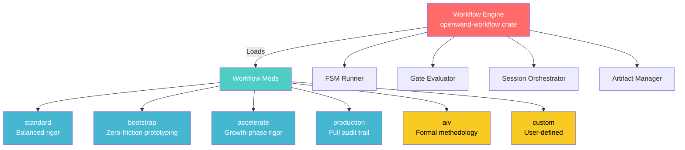
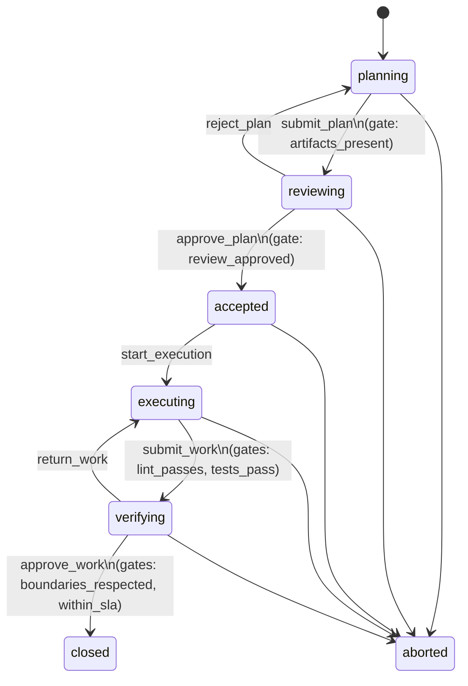
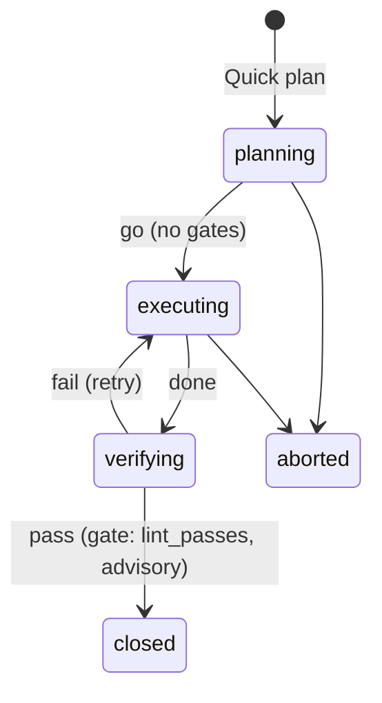
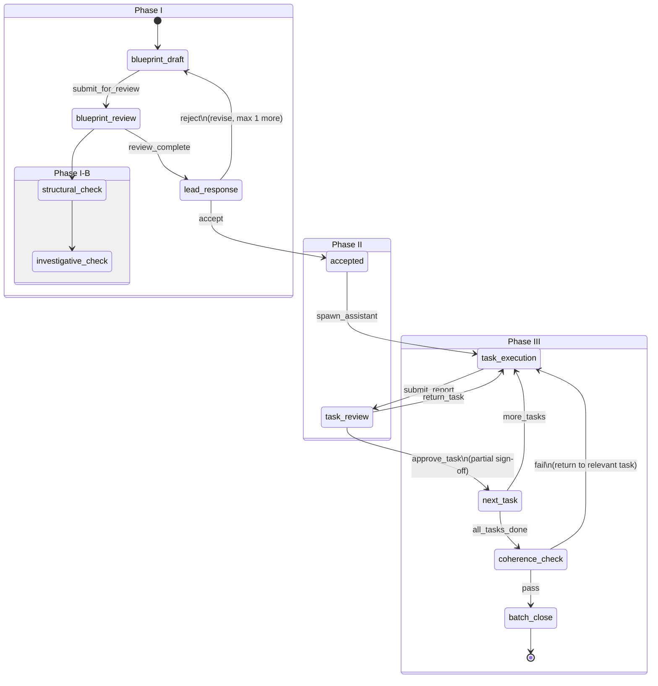
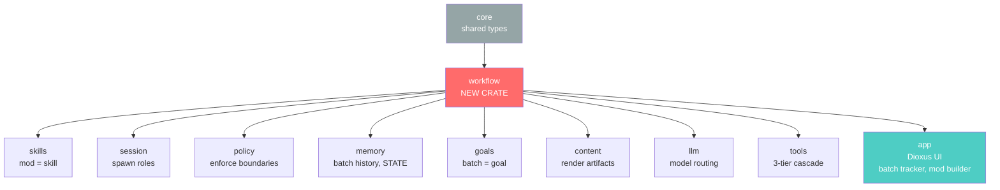

# OpenWand Workflow Framework — Design Document

**Date:** 2026-05-26  
**Status:** Draft  
**Scope:** New crate `openwand-workflow` + integration with existing 11-crate workspace

---

## 1. Core Insight

AIV is not the framework. AIV is **one mod** in a generalized workflow engine.

The framework is the **engine** — a finite state machine that:
- Defines what a workflow mod IS (schema, required parts)
- Runs any compliant mod through its phases
- Enforces gates between phases
- Manages multi-agent session lifecycle
- Produces artifacts (documents) at each phase boundary

A **mod** is a **workflow methodology** — a declarative recipe that tells the engine:
- What phases exist
- What gates guard each transition
- What roles are needed (and which model tier each role uses)
- What artifacts each phase produces/consumes
- What the state machine looks like



---

## 2. New Crate: `openwand-workflow`

### 2.1 Why a New Crate?

The workflow engine is a **cross-cutting concern** that orchestrates multiple existing crates but isn't owned by any of them. It belongs between `core/` (types) and `app/` (UI):

```
Dependency flow:

  core → workflow → app
         ↑     ↑
    ┌────┘     └────┐
    ↓               ↓
  skills         goals
  session        policy
  llm            content
  memory         tools
```

### 2.2 Cargo.toml

```toml
[package]
name = "openwand-workflow"
version.workspace = true
edition.workspace = true

[dependencies]
tokio = { workspace = true }
serde = { workspace = true }
serde_json = { workspace = true }
serde_yaml = "0.9"
anyhow = { workspace = true }
thiserror = { workspace = true }
tracing = { workspace = true }
chrono = { workspace = true }
uuid = { workspace = true }

# Internal crates
openwand-core = { workspace = true }
openwand-session = { workspace = true }
openwand-memory = { workspace = true }
openwand-tools = { workspace = true }
openwand-policy = { workspace = true }
openwand-llm = { workspace = true }
openwand-skills = { workspace = true }
openwand-goals = { workspace = true }
openwand-content = { workspace = true }
```

---

## 3. Core Types

### 3.1 Workflow Mod Definition

```rust
// crates/workflow/src/mods/types.rs

use serde::{Deserialize, Serialize};
use std::time::Duration;

/// A workflow mod — a complete development methodology.
/// Declared in YAML/TOML, loaded at runtime.
#[derive(Debug, Clone, Serialize, Deserialize)]
pub struct WorkflowMod {
    /// Unique identifier: "standard", "bootstrap", "aiv", "custom::my-mod"
    pub id: ModId,
    
    /// Human-readable name
    pub name: String,
    
    /// Semantic version of the mod definition
    pub version: String,
    
    /// One-line description
    pub description: String,
    
    /// Which development stage this mod targets
    pub stage: DevelopmentStage,
    
    /// The state machine definition
    pub machine: StateMachine,
    
    /// Roles required by this mod
    pub roles: Vec<RoleDef>,
    
    /// Artifacts produced/consumed
    pub artifacts: Vec<ArtifactDef>,
    
    /// Gate definitions (conditions between phases)
    pub gates: Vec<GateDef>,
    
    /// Default SLA durations
    pub defaults: ModDefaults,
    
    /// Custom metadata (mod-specific config)
    pub metadata: serde_json::Value,
}

#[derive(Debug, Clone, Serialize, Deserialize, PartialEq, Eq, Hash)]
pub struct ModId(pub String);

#[derive(Debug, Clone, Copy, Serialize, Deserialize, PartialEq, Eq)]
pub enum DevelopmentStage {
    /// Day 1 — get something working, anything
    Bootstrap,
    /// Months 1-3 — building foundation, minimal process
    Foundation,
    /// Months 3-6 — growing complexity, needs rigor
    Growth,
    /// Months 6+ — stability, audit, regression safety
    Production,
    /// Formal methodology (AIV, etc.)
    Formal,
    /// User-defined stage
    Custom,
}

#[derive(Debug, Clone, Serialize, Deserialize)]
pub struct ModDefaults {
    pub review_sla: Duration,
    pub execution_sla: Duration,
    pub sign_off_sla: Duration,
    pub max_tasks_per_batch: usize,
    pub max_deferred_test_ratio: f64,
    pub auto_trigger_threshold: Option<AutoTrigger>,
}

#[derive(Debug, Clone, Serialize, Deserialize)]
pub struct AutoTrigger {
    /// Auto-activate this mod when task complexity exceeds threshold
    pub min_files_changed: usize,
    pub min_lines_changed: usize,
    pub new_crate_creation: bool,
    pub keywords: Vec<String>,
}
```

### 3.2 State Machine

```rust
// crates/workflow/src/mods/machine.rs

#[derive(Debug, Clone, Serialize, Deserialize)]
pub struct StateMachine {
    /// All states in this workflow
    pub states: Vec<StateDef>,
    
    /// All transitions (edges)
    pub transitions: Vec<TransitionDef>,
    
    /// Which state to start from
    pub initial_state: StateId,
    
    /// Which states are terminal
    pub terminal_states: Vec<StateId>,
}

#[derive(Debug, Clone, Serialize, Deserialize, PartialEq, Eq, Hash)]
pub struct StateId(pub String);

#[derive(Debug, Clone, Serialize, Deserialize)]
pub struct StateDef {
    pub id: StateId,
    pub name: String,
    pub description: String,
    
    /// Who is active in this state
    pub active_role: RoleId,
    
    /// What happens when entering this state
    pub on_enter: Vec<Action>,
    
    /// What happens when exiting this state
    pub on_exit: Vec<Action>,
    
    /// Maximum time allowed in this state (None = no limit)
    pub timeout: Option<Duration>,
}

#[derive(Debug, Clone, Serialize, Deserialize)]
pub struct TransitionDef {
    pub id: TransitionId,
    pub name: String,
    pub from: StateId,
    pub to: StateId,
    
    /// Guard conditions that must ALL pass
    pub gates: Vec<GateId>,
    
    /// Who triggers this transition
    pub triggered_by: RoleId,
    
    /// Artifacts produced on this transition
    pub produces: Vec<ArtifactKind>,
    
    /// Artifacts consumed (must exist) on this transition
    pub consumes: Vec<ArtifactKind>,
}

#[derive(Debug, Clone, Serialize, Deserialize, PartialEq, Eq, Hash)]
pub struct TransitionId(pub String);
```

### 3.3 Gates

```rust
// crates/workflow/src/mods/gate.rs

#[derive(Debug, Clone, Serialize, Deserialize)]
pub struct GateDef {
    pub id: GateId,
    pub name: String,
    pub description: String,
    pub condition: GateCondition,
    pub severity: GateSeverity,
}

#[derive(Debug, Clone, Serialize, Deserialize, PartialEq, Eq, Hash)]
pub struct GateId(pub String);

#[derive(Debug, Clone, Copy, Serialize, Deserialize)]
pub enum GateSeverity {
    /// Must pass — blocks transition
    Blocking,
    /// Warning — allows transition but logs
    Advisory,
    /// Recommended — blocks only if configured strict
    Recommended,
}

#[derive(Debug, Clone, Serialize, Deserialize)]
#[serde(tag = "type")]
pub enum GateCondition {
    /// Lint/format check passes with zero warnings
    LintPasses {
        command: String,
    },
    
    /// All tests pass (optionally with coverage threshold)
    TestsPass {
        coverage_threshold: Option<f64>,
        include_deferred: bool,
    },
    
    /// A reviewer session has approved
    ReviewApproved {
        checklist_items: usize,
        min_pass_ratio: f64,
    },
    
    /// Required artifacts exist on disk
    ArtifactsPresent {
        artifacts: Vec<ArtifactKind>,
    },
    
    /// No scope violations detected
    BoundariesRespected {
        check_unscoped_files: bool,
    },
    
    /// SLA not exceeded
    WithinSla {
        max_duration: Duration,
    },
    
    /// Custom condition evaluated by the engine
    Custom {
        evaluator: String, // references a registered evaluator function
        params: serde_json::Value,
    },
    
    /// Compound — all conditions must pass
    All {
        conditions: Vec<GateCondition>,
    },
    
    /// Compound — any condition passes
    Any {
        conditions: Vec<GateCondition>,
    },
}
```

### 3.4 Roles

```rust
// crates/workflow/src/mods/role.rs

#[derive(Debug, Clone, Serialize, Deserialize)]
pub struct RoleDef {
    pub id: RoleId,
    pub name: String,
    pub description: String,
    
    /// Which entity fills this role
    pub filled_by: RoleEntity,
    
    /// LLM model requirements (if AI role)
    pub model_requirements: Option<ModelRequirements>,
    
    /// Permissions this role has
    pub permissions: Vec<Permission>,
    
    /// Tools this role can access
    pub tool_access: ToolAccess,
}

#[derive(Debug, Clone, Serialize, Deserialize, PartialEq, Eq, Hash)]
pub struct RoleId(pub String);

#[derive(Debug, Clone, Serialize, Deserialize)]
pub enum RoleEntity {
    /// The human user
    User,
    /// The main OpenWand agent
    LeadAgent,
    /// A spawned assistant session
    AssistantSession,
    /// A spawned reviewer session
    ReviewerSession,
    /// The system/engine itself
    System,
}

#[derive(Debug, Clone, Serialize, Deserialize)]
pub struct ModelRequirements {
    /// Minimum model tier (cheapest acceptable)
    pub min_tier: ModelTier,
    /// Recommended tier for best results
    pub recommended_tier: ModelTier,
    /// Maximum tokens for this role
    pub max_context_tokens: usize,
}

#[derive(Debug, Clone, Copy, Serialize, Deserialize, PartialEq, Eq, PartialOrd, Ord)]
pub enum ModelTier {
    /// Small/fast (e.g. Haiku, flash)
    Light,
    /// Medium (e.g. Sonnet, GPT-4o-mini)
    Medium,
    /// Heavy (e.g. Opus, GPT-4, Claude 3.5)
    Heavy,
}

#[derive(Debug, Clone, Serialize, Deserialize)]
pub enum ToolAccess {
    /// Full access to all tools
    All,
    /// Only these specific tools
    Whitelist(Vec<String>),
    /// All tools except these
    Blacklist(Vec<String>),
    /// Read-only tools only
    ReadOnly,
}
```

### 3.5 Artifacts

```rust
// crates/workflow/src/mods/artifact.rs

#[derive(Debug, Clone, Serialize, Deserialize)]
pub struct ArtifactDef {
    pub kind: ArtifactKind,
    pub name: String,
    pub description: String,
    pub template: Option<String>,
    pub required: bool,
    pub format: ArtifactFormat,
}

#[derive(Debug, Clone, Serialize, Deserialize, PartialEq, Eq, Hash)]
pub struct ArtifactKind(pub String);

#[derive(Debug, Clone, Copy, Serialize, Deserialize)]
pub enum ArtifactFormat {
    Markdown,
    Json,
    Yaml,
    Toml,
    PlainText,
}
```

### 3.6 Actions

```rust
// crates/workflow/src/mods/action.rs

#[derive(Debug, Clone, Serialize, Deserialize)]
#[serde(tag = "type")]
pub enum Action {
    /// Spawn a new session for a role
    SpawnSession {
        role: RoleId,
        model_tier: ModelTier,
    },
    
    /// Send a message to a session
    SendMessage {
        role: RoleId,
        template: String,
    },
    
    /// Update the workflow state in memory
    UpdateMemory {
        section: String,
        operation: MemoryOp,
    },
    
    /// Run a tool
    RunTool {
        tool: String,
        args: serde_json::Value,
    },
    
    /// Notify the user
    NotifyUser {
        message_template: String,
        level: NotifyLevel,
    },
    
    /// Create an artifact from a template
    CreateArtifact {
        artifact: ArtifactKind,
        template: String,
    },
    
    /// Evaluate a custom action
    Custom {
        handler: String,
        params: serde_json::Value,
    },
}

#[derive(Debug, Clone, Serialize, Deserialize)]
pub enum MemoryOp {
    Set { key: String, value: serde_json::Value },
    Append { key: String, value: serde_json::Value },
    Increment { key: String },
}

#[derive(Debug, Clone, Copy, Serialize, Deserialize)]
pub enum NotifyLevel {
    Info,
    Warning,
    Error,
}
```

---

## 4. The Engine

### 4.1 Workflow Runner

```rust
// crates/workflow/src/engine/runner.rs

use crate::mods::*;
use crate::engine::*;

/// The workflow engine — runs any compliant mod.
pub struct WorkflowEngine {
    /// The loaded mod
    mod_def: WorkflowMod,
    
    /// Current state machine instance
    state: WorkflowState,
    
    /// Active sessions keyed by role
    sessions: HashMap<RoleId, SessionHandle>,
    
    /// Produced artifacts
    artifacts: HashMap<ArtifactKind, ArtifactRecord>,
    
    /// Gate evaluator
    gate_evaluator: GateEvaluator,
    
    /// Action executor
    action_executor: ActionExecutor,
    
    /// Event sink (for UI, logging, memory)
    event_sink: Box<dyn EventSink>,
}

#[derive(Debug, Clone)]
pub struct WorkflowState {
    /// Current state ID
    current: StateId,
    
    /// When we entered this state
    entered_at: chrono::DateTime<chrono::Utc>,
    
    /// History of transitions
    history: Vec<TransitionRecord>,
    
    /// Batch-level metadata
    batch_id: BatchId,
    batch_goal: String,
    
    /// Task tracking (for multi-task mods)
    tasks: Vec<TaskState>,
    current_task: Option<usize>,
}

#[derive(Debug, Clone)]
pub struct TransitionRecord {
    transition: TransitionId,
    from: StateId,
    to: StateId,
    timestamp: chrono::DateTime<chrono::Utc>,
    gate_results: Vec<GateResult>,
}

#[derive(Debug, Clone)]
pub struct TaskState {
    pub id: TaskId,
    pub description: String,
    pub status: TaskStatus,
    pub artifacts: Vec<ArtifactKind>,
    pub started_at: Option<chrono::DateTime<chrono::Utc>>,
    pub completed_at: Option<chrono::DateTime<chrono::Utc>>,
}

#[derive(Debug, Clone, Copy, PartialEq, Eq)]
pub enum TaskStatus {
    Pending,
    InProgress,
    Submitted,
    Approved,
    Returned,
    Deferred,
}
```

### 4.2 Engine API

```rust
impl WorkflowEngine {
    /// Load a mod from its definition
    pub fn load_mod(mod_def: WorkflowMod) -> Result<Self>;
    
    /// Start a new workflow run
    pub fn start(&mut self, batch_goal: String, context: WorkflowContext) -> Result<()>;
    
    /// Attempt a transition (checks gates first)
    pub async fn transition(&mut self, transition_id: TransitionId) -> Result<TransitionOutcome>;
    
    /// Get current state
    pub fn current_state(&self) -> &WorkflowState;
    
    /// Query available transitions from current state
    pub fn available_transitions(&self) -> Vec<&TransitionDef>;
    
    /// Evaluate a specific gate
    pub async fn evaluate_gate(&self, gate_id: &GateId) -> Result<GateResult>;
    
    /// Get artifact by kind
    pub fn get_artifact(&self, kind: &ArtifactKind) -> Option<&ArtifactRecord>;
    
    /// Abort the workflow
    pub fn abort(&mut self, reason: String) -> Result<()>;
    
    /// Get full audit trail
    pub fn audit_trail(&self) -> &[TransitionRecord];
}
```

### 4.3 Gate Evaluator

```rust
// crates/workflow/src/engine/gates.rs

pub struct GateEvaluator {
    /// Registered custom evaluators
    custom_evaluators: HashMap<String, Box<dyn CustomGateEvaluator>>,
}

impl GateEvaluator {
    pub async fn evaluate(&self, condition: &GateCondition, ctx: &EvaluationContext) -> Result<GateResult> {
        match condition {
            GateCondition::LintPasses { command } => {
                let output = ctx.run_command(command).await?;
                Ok(GateResult {
                    passed: !output.contains("error") && !output.contains("warning"),
                    evidence: output,
                })
            }
            
            GateCondition::TestsPass { coverage_threshold, .. } => {
                let result = ctx.run_tests().await?;
                let passed = result.all_pass()
                    && coverage_threshold.map_or(true, |t| result.coverage() >= t);
                Ok(GateResult { passed, evidence: result.summary() })
            }
            
            GateCondition::ReviewApproved { checklist_items, min_pass_ratio } => {
                let review = ctx.get_latest_review().await?;
                let passed_count = review.passed_count();
                let ratio = passed_count as f64 / *checklist_items as f64;
                Ok(GateResult {
                    passed: ratio >= *min_pass_ratio,
                    evidence: review.summary(),
                })
            }
            
            GateCondition::ArtifactsPresent { artifacts } => {
                let mut missing = Vec::new();
                for kind in artifacts {
                    if !ctx.artifact_exists(kind) {
                        missing.push(kind.clone());
                    }
                }
                Ok(GateResult {
                    passed: missing.is_empty(),
                    evidence: if missing.is_empty() {
                        "All artifacts present".into()
                    } else {
                        format!("Missing: {:?}", missing)
                    },
                })
            }
            
            GateCondition::BoundariesRespected { check_unscoped_files } => {
                // Query policy crate for scope violations
                let violations = ctx.check_scope_violations(*check_unscoped_files).await?;
                Ok(GateResult {
                    passed: violations.is_empty(),
                    evidence: if violations.is_empty() {
                        "No boundary violations".into()
                    } else {
                        format!("Violations: {:?}", violations)
                    },
                })
            }
            
            GateCondition::WithinSla { max_duration } => {
                let elapsed = ctx.time_in_current_state()?;
                Ok(GateResult {
                    passed: elapsed < *max_duration,
                    evidence: format!("Elapsed: {:?}, Max: {:?}", elapsed, max_duration),
                })
            }
            
            GateCondition::Custom { evaluator, params } => {
                let eval = self.custom_evaluators.get(evaluator)
                    .ok_or_else(|| anyhow::anyhow!("Unknown evaluator: {}", evaluator))?;
                eval.evaluate(params, ctx).await
            }
            
            GateCondition::All { conditions } => {
                let mut results = Vec::new();
                for cond in conditions {
                    let r = self.evaluate(cond, ctx).await?;
                    if !r.passed { return Ok(r); } // short-circuit
                    results.push(r);
                }
                Ok(GateResult {
                    passed: true,
                    evidence: results.iter().map(|r| r.evidence.clone()).collect::<Vec<_>>().join("; "),
                })
            }
            
            GateCondition::Any { conditions } => {
                let mut evidence = Vec::new();
                for cond in conditions {
                    let r = self.evaluate(cond, ctx).await?;
                    if r.passed { return Ok(r); }
                    evidence.push(r.evidence);
                }
                Ok(GateResult {
                    passed: false,
                    evidence: evidence.join("; "),
                })
            }
        }
    }
}
```

---

## 5. The Mods

### 5.1 File Structure

```
crates/workflow/
├── src/
│   ├── lib.rs
│   ├── engine/
│   │   ├── mod.rs
│   │   ├── runner.rs
│   │   ├── gates.rs
│   │   ├── actions.rs
│   │   └── orchestrator.rs
│   ├── mods/
│   │   ├── mod.rs           ← trait: WorkflowModProvider
│   │   ├── types.rs
│   │   ├── machine.rs
│   │   ├── gate.rs
│   │   ├── role.rs
│   │   ├── artifact.rs
│   │   └── action.rs
│   ├── builtins/
│   │   ├── mod.rs
│   │   ├── standard.rs      ← Standard mod
│   │   ├── bootstrap.rs     ← Bootstrap mod
│   │   ├── accelerate.rs    ← Accelerate mod
│   │   ├── production.rs    ← Production mod
│   │   ├── aiv.rs           ← AIV mod (formal)
│   │   └── builder.rs       ← Custom mod builder
│   └── persistence.rs       ← Serialize/deserialize workflow state
└── Cargo.toml
```

### 5.2 Standard Mod

The balanced default. Not too heavy, not too light. Suitable for most development work.

```yaml
# Built-in: standard
id: standard
name: "Standard Workflow"
version: "1.0.0"
description: "Balanced Plan→Execute→Verify cycle. Review before execution, sign-off after."
stage: Foundation

machine:
  initial_state: planning
  terminal_states: [closed, aborted]
  
  states:
    - id: planning
      name: "Planning"
      description: "Define what to build"
      active_role: lead
      on_enter:
        - type: NotifyUser
          message_template: "Planning batch: {{batch_goal}}"
          level: info
      
    - id: reviewing
      name: "Reviewing"
      description: "Review plan for gaps"
      active_role: reviewer
      on_enter:
        - type: SpawnSession
          role: reviewer
          model_tier: light
        - type: SendMessage
          role: reviewer
          template: "review_request"
      
    - id: accepted
      name: "Accepted"
      description: "Plan approved, ready to execute"
      active_role: lead
      on_enter:
        - type: NotifyUser
          message_template: "Plan approved. Starting execution."
          level: info
    
    - id: executing
      name: "Executing"
      description: "Implement the tasks"
      active_role: assistant
      on_enter:
        - type: SpawnSession
          role: assistant
          model_tier: medium
        - type: SendMessage
          role: assistant
          template: "execution_request"
    
    - id: verifying
      name: "Verifying"
      description: "Verify implementation matches plan"
      active_role: lead
      on_enter:
        - type: RunTool
          tool: "test_runner"
          args: {}
    
    - id: closed
      name: "Closed"
      description: "Batch complete"
      active_role: system
      on_enter:
        - type: UpdateMemory
          section: "completed_batches"
          operation:
            Append:
              key: "history"
              value: "{{batch_summary}}"
        - type: NotifyUser
          message_template: "Batch {{batch_id}} closed successfully."
          level: info
    
    - id: aborted
      name: "Aborted"
      description: "Batch cancelled"
      active_role: system
  
  transitions:
    - id: submit_plan
      from: planning
      to: reviewing
      gates: [artifacts_present]
      triggered_by: lead
      produces: [blueprint]
    
    - id: approve_plan
      from: reviewing
      to: accepted
      gates: [review_approved]
      triggered_by: lead
      produces: [review_report]
    
    - id: reject_plan
      from: reviewing
      to: planning
      gates: []
      triggered_by: lead
    
    - id: start_execution
      from: accepted
      to: executing
      gates: []
      triggered_by: lead
    
    - id: submit_work
      from: executing
      to: verifying
      gates: [lint_passes, tests_pass]
      triggered_by: assistant
      produces: [implementation_report]
    
    - id: approve_work
      from: verifying
      to: closed
      gates: [boundaries_respected, within_sla]
      triggered_by: lead
      produces: [sign_off_certificate]
    
    - id: return_work
      from: verifying
      to: executing
      gates: []
      triggered_by: lead

roles:
  - id: lead
    name: "Lead Agent"
    filled_by: LeadAgent
    model_requirements:
      min_tier: medium
      recommended_tier: heavy
    tool_access: All
    
  - id: reviewer
    name: "Reviewer"
    filled_by: ReviewerSession
    model_requirements:
      min_tier: light
      recommended_tier: light
    tool_access: ReadOnly
    
  - id: assistant
    name: "Assistant"
    filled_by: AssistantSession
    model_requirements:
      min_tier: medium
      recommended_tier: medium
    tool_access: All

artifacts:
  - kind: blueprint
    name: "Batch Blueprint"
    format: markdown
    required: true
    template: "standard_blueprint.md"
  
  - kind: review_report
    name: "Review Report"
    format: markdown
    required: true
    template: "standard_review.md"
  
  - kind: implementation_report
    name: "Implementation Report"
    format: markdown
    required: true
    template: "standard_report.md"
  
  - kind: sign_off_certificate
    name: "Sign-Off"
    format: markdown
    required: true
    template: "standard_signoff.md"

gates:
  - id: artifacts_present
    condition:
      type: ArtifactsPresent
      artifacts: [blueprint]
    severity: blocking
  
  - id: review_approved
    condition:
      type: ReviewApproved
      checklist_items: 10
      min_pass_ratio: 0.8
    severity: blocking
  
  - id: lint_passes
    condition:
      type: LintPasses
      command: "cargo clippy --workspace -- -D warnings"
    severity: blocking
  
  - id: tests_pass
    condition:
      type: TestsPass
      coverage_threshold: null
      include_deferred: false
    severity: blocking
  
  - id: boundaries_respected
    condition:
      type: BoundariesRespected
      check_unscoped_files: true
    severity: blocking
  
  - id: within_sla
    condition:
      type: WithinSla
      max_duration: "3600s"
    severity: advisory

defaults:
  review_sla: "1800s"     # 30 min
  execution_sla: "3600s"  # 60 min
  sign_off_sla: "900s"    # 15 min
  max_tasks_per_batch: 8
  max_deferred_test_ratio: 0.2
  auto_trigger_threshold: null  # Manual only
```

**State diagram:**



---

### 5.3 Bootstrap Mod

Zero-friction. For prototyping, hacking, day-1 "get it working." No review, no formal artifacts — just execute and verify.

```yaml
id: bootstrap
name: "Bootstrap"
version: "1.0.0"
description: "Zero-friction prototyping. Plan, execute, quick verify. No review cycle."
stage: Bootstrap

machine:
  initial_state: planning
  terminal_states: [closed, aborted]
  
  states:
    - id: planning
      name: "Quick Plan"
      active_role: lead
      timeout: "300s"  # 5 min max
      
    - id: executing
      name: "Build It"
      active_role: assistant
      on_enter:
        - type: SpawnSession
          role: assistant
          model_tier: medium
    
    - id: verifying
      name: "Quick Check"
      active_role: system  # automated
      on_enter:
        - type: RunTool
          tool: "test_runner"
          args: {}
    
    - id: closed
      name: "Done"
      active_role: system
      on_enter:
        - type: UpdateMemory
          section: "bootstrap_log"
          operation:
            Append:
              key: "history"
              value: "{{batch_summary}}"
    
    - id: aborted
      name: "Aborted"
      active_role: system
  
  transitions:
    - id: go
      from: planning
      to: executing
      gates: []
      triggered_by: lead
      produces: [plan_note]
    
    - id: done
      from: executing
      to: verifying
      gates: []
      triggered_by: assistant
    
    - id: pass
      from: verifying
      to: closed
      gates: [lint_passes]
      triggered_by: system
    
    - id: fail
      from: verifying
      to: executing
      gates: []
      triggered_by: system

roles:
  - id: lead
    filled_by: LeadAgent
    model_requirements:
      min_tier: medium
    tool_access: All
  
  - id: assistant
    filled_by: AssistantSession
    model_requirements:
      min_tier: medium
    tool_access: All

artifacts:
  - kind: plan_note
    name: "Plan Note"
    format: markdown
    required: false
    template: null  # freeform

gates:
  - id: lint_passes
    condition:
      type: LintPasses
      command: "cargo check --workspace"
    severity: advisory  # warnings OK in bootstrap

defaults:
  review_sla: "0s"
  execution_sla: "1800s"
  sign_off_sla: "0s"
  max_tasks_per_batch: 3
  max_deferred_test_ratio: 1.0  # all tests can be deferred
  auto_trigger_threshold:
    min_files_changed: 1
    min_lines_changed: 0
    new_crate_creation: false
    keywords: ["prototype", "hack", "bootstrap", "quick"]
```

**State diagram:**



---

### 5.4 Accelerate Mod

For the growth phase — code is getting complex, needs structure but not full ceremony. Adds review back but keeps it lightweight.

```yaml
id: accelerate
name: "Accelerate"
version: "1.0.0"
description: "Growth-phase rigor. Structured review, task tracking, but reduced ceremony."
stage: Growth

machine:
  initial_state: planning
  terminal_states: [closed, aborted]
  
  states:
    - id: planning
      name: "Blueprint"
      active_role: lead
      timeout: "600s"
      
    - id: reviewing
      name: "Quick Review"
      active_role: reviewer
      on_enter:
        - type: SpawnSession
          role: reviewer
          model_tier: light
        - type: SendMessage
          role: reviewer
          template: "accelerated_review"
    
    - id: executing
      name: "Execute Tasks"
      active_role: assistant
      on_enter:
        - type: SpawnSession
          role: assistant
          model_tier: medium
    
    - id: verifying
      name: "Verify"
      active_role: system  # auto-verify
      on_enter:
        - type: RunTool
          tool: "test_runner"
          args: {}
    
    - id: signing_off
      name: "Sign Off"
      active_role: lead
    
    - id: closed
      name: "Closed"
      active_role: system
      on_enter:
        - type: UpdateMemory
          section: "batch_history"
          operation:
            Append:
              key: "history"
              value: "{{batch_summary}}"
    
    - id: aborted
      name: "Aborted"
      active_role: system
  
  transitions:
    - id: submit_plan
      from: planning
      to: reviewing
      gates: [artifacts_present]
      triggered_by: lead
      produces: [blueprint]
    
    - id: approve
      from: reviewing
      to: executing
      gates: [review_approved]
      triggered_by: lead
      produces: [review_report]
    
    - id: revise
      from: reviewing
      to: planning
      gates: []
      triggered_by: lead
    
    - id: submit_work
      from: executing
      to: verifying
      gates: [lint_passes, tests_pass]
      triggered_by: assistant
      produces: [implementation_summary]
    
    - id: verify_pass
      from: verifying
      to: signing_off
      gates: [boundaries_respected]
      triggered_by: system
    
    - id: verify_fail
      from: verifying
      to: executing
      gates: []
      triggered_by: system
    
    - id: sign_off
      from: signing_off
      to: closed
      gates: []
      triggered_by: lead
      produces: [sign_off_certificate]

roles:
  - id: lead
    filled_by: LeadAgent
    model_requirements:
      min_tier: medium
    tool_access: All
  
  - id: reviewer
    filled_by: ReviewerSession
    model_requirements:
      min_tier: light
    tool_access: ReadOnly
  
  - id: assistant
    filled_by: AssistantSession
    model_requirements:
      min_tier: medium
    tool_access: All

artifacts:
  - kind: blueprint
    name: "Blueprint"
    format: markdown
    required: true
  - kind: review_report
    name: "Review"
    format: markdown
    required: true
  - kind: implementation_summary
    name: "Implementation Summary"
    format: markdown
    required: false  # less strict
  - kind: sign_off_certificate
    name: "Sign-Off"
    format: markdown
    required: true

gates:
  - id: artifacts_present
    condition:
      type: ArtifactsPresent
      artifacts: [blueprint]
    severity: blocking
  
  - id: review_approved
    condition:
      type: ReviewApproved
      checklist_items: 8
      min_pass_ratio: 0.75  # slightly relaxed
    severity: blocking
  
  - id: lint_passes
    condition:
      type: LintPasses
      command: "cargo clippy --workspace -- -D warnings"
    severity: blocking
  
  - id: tests_pass
    condition:
      type: TestsPass
      coverage_threshold: null
      include_deferred: false
    severity: blocking
  
  - id: boundaries_respected
    condition:
      type: BoundariesRespected
      check_unscoped_files: true
    severity: blocking

defaults:
  review_sla: "900s"     # 15 min
  execution_sla: "3600s"
  sign_off_sla: "600s"   # 10 min
  max_tasks_per_batch: 6
  max_deferred_test_ratio: 0.3
  auto_trigger_threshold:
    min_files_changed: 5
    min_lines_changed: 100
    new_crate_creation: false
    keywords: ["feature", "implement", "build", "add"]
```

---

### 5.5 Production Mod

Full rigor. Audit trail, falsifiable tests, carry-forward obligations, STATE.md updates. For mature codebases where mistakes are expensive.

```yaml
id: production
name: "Production"
version: "1.0.0"
description: "Full production rigor. Formal review, falsifiable tests, audit trail, state tracking."
stage: Production

machine:
  initial_state: planning
  terminal_states: [closed, aborted]
  
  states:
    - id: planning
      name: "Batch Blueprint"
      active_role: lead
      timeout: "1200s"
      
    - id: reviewing
      name: "Formal Review"
      active_role: reviewer
      on_enter:
        - type: SpawnSession
          role: reviewer
          model_tier: medium  # needs more thinking for production
        - type: SendMessage
          role: reviewer
          template: "production_review"
    
    - id: accepted
      name: "Accepted"
      active_role: lead
    
    - id: executing
      name: "Task Execution"
      active_role: assistant
      on_enter:
        - type: SpawnSession
          role: assistant
          model_tier: heavy  # production needs the best
    
    - id: task_review
      name: "Task Review"
      active_role: lead
    
    - id: integration_check
      name: "Integration Check"
      active_role: system
      on_enter:
        - type: RunTool
          tool: "integration_test_runner"
          args: {}
    
    - id: signing_off
      name: "Batch Sign-Off"
      active_role: lead
    
    - id: closed
      name: "Closed"
      active_role: system
      on_enter:
        - type: UpdateMemory
          section: "production_batches"
          operation:
            Append:
              key: "history"
              value: "{{batch_summary}}"
        - type: RunTool
          tool: "state_updater"
          args: { update_state_md: true }
    
    - id: aborted
      name: "Aborted"
      active_role: system
  
  transitions:
    - id: submit_blueprint
      from: planning
      to: reviewing
      gates: [blueprint_complete, hard_boundaries_defined, test_table_present]
      triggered_by: lead
      produces: [blueprint]
    
    - id: first_approve
      from: reviewing
      to: accepted
      gates: [review_approved, no_structural_flags]
      triggered_by: lead
      produces: [review_report]
    
    - id: first_reject
      from: reviewing
      to: planning
      gates: []
      triggered_by: lead
    
    - id: start_tasks
      from: accepted
      to: executing
      gates: []
      triggered_by: lead
    
    - id: submit_task
      from: executing
      to: task_review
      gates: [lint_passes, tests_pass, falsification_done, all_artifacts_present]
      triggered_by: assistant
      produces: [task_report]
    
    - id: approve_task
      from: task_review
      to: executing
      gates: [boundaries_respected, within_sla, deferred_within_limit]
      triggered_by: lead
      produces: [partial_sign_off]
    
    - id: return_task
      from: task_review
      to: executing
      gates: []
      triggered_by: lead
    
    - id: all_tasks_done
      from: executing
      to: integration_check
      gates: [all_tasks_approved]
      triggered_by: system
    
    - id: integration_pass
      from: integration_check
      to: signing_off
      gates: [integration_tests_pass, coherence_check]
      triggered_by: system
    
    - id: integration_fail
      from: integration_check
      to: executing
      gates: []
      triggered_by: system
    
    - id: batch_close
      from: signing_off
      to: closed
      gates: [all_acs_met, state_updated, changelog_updated, audit_complete]
      triggered_by: lead
      produces: [sign_off_certificate]

roles:
  - id: lead
    filled_by: LeadAgent
    model_requirements:
      min_tier: heavy
      recommended_tier: heavy
    tool_access: All
  
  - id: reviewer
    filled_by: ReviewerSession
    model_requirements:
      min_tier: medium
      recommended_tier: medium
    tool_access: ReadOnly
  
  - id: assistant
    filled_by: AssistantSession
    model_requirements:
      min_tier: medium
      recommended_tier: heavy
    tool_access: All

artifacts:
  - kind: blueprint
    format: markdown
    required: true
  - kind: review_report
    format: markdown
    required: true
  - kind: task_report
    format: markdown
    required: true
  - kind: partial_sign_off
    format: markdown
    required: true
  - kind: sign_off_certificate
    format: markdown
    required: true
  - kind: state_update
    format: markdown
    required: true
  - kind: changelog
    format: markdown
    required: true

gates:
  - id: blueprint_complete
    condition: { type: ArtifactsPresent, artifacts: [blueprint] }
    severity: blocking
  
  - id: hard_boundaries_defined
    condition: { type: Custom, evaluator: "check_hard_boundaries", params: {} }
    severity: blocking
  
  - id: test_table_present
    condition: { type: Custom, evaluator: "check_test_table", params: {} }
    severity: blocking
  
  - id: review_approved
    condition: { type: ReviewApproved, checklist_items: 24, min_pass_ratio: 0.9 }
    severity: blocking
  
  - id: no_structural_flags
    condition: { type: Custom, evaluator: "no_structural_flags", params: {} }
    severity: blocking
  
  - id: lint_passes
    condition: { type: LintPasses, command: "cargo clippy --workspace -- -D warnings" }
    severity: blocking
  
  - id: tests_pass
    condition: { type: TestsPass, coverage_threshold: null, include_deferred: false }
    severity: blocking
  
  - id: falsification_done
    condition: { type: Custom, evaluator: "falsification_check", params: {} }
    severity: blocking
  
  - id: all_artifacts_present
    condition: { type: ArtifactsPresent, artifacts: [task_report] }
    severity: blocking
  
  - id: boundaries_respected
    condition: { type: BoundariesRespected, check_unscoped_files: true }
    severity: blocking
  
  - id: within_sla
    condition: { type: WithinSla, max_duration: "7200s" }
    severity: advisory
  
  - id: deferred_within_limit
    condition: { type: Custom, evaluator: "deferred_ratio_check", params: { max: 0.2 } }
    severity: blocking
  
  - id: all_tasks_approved
    condition: { type: Custom, evaluator: "all_tasks_approved", params: {} }
    severity: blocking
  
  - id: integration_tests_pass
    condition: { type: TestsPass, coverage_threshold: null, include_deferred: true }
    severity: blocking
  
  - id: coherence_check
    condition: { type: Custom, evaluator: "coherence_check", params: {} }
    severity: blocking
  
  - id: all_acs_met
    condition: { type: Custom, evaluator: "all_acs_met", params: {} }
    severity: blocking
  
  - id: state_updated
    condition: { type: Custom, evaluator: "state_md_updated", params: {} }
    severity: blocking
  
  - id: changelog_updated
    condition: { type: Custom, evaluator: "changelog_updated", params: {} }
    severity: blocking
  
  - id: audit_complete
    condition: { type: ArtifactsPresent, artifacts: [sign_off_certificate] }
    severity: blocking

defaults:
  review_sla: "1800s"
  execution_sla: "7200s"
  sign_off_sla: "900s"
  max_tasks_per_batch: 8
  max_deferred_test_ratio: 0.2
  auto_trigger_threshold:
    min_files_changed: 10
    min_lines_changed: 500
    new_crate_creation: true
    keywords: ["release", "production", "deploy", "hotfix"]
```

---

### 5.6 AIV Mod

The full AIV v5.3 methodology as a mod. This is the most complex mod — the formal process with all ceremony. Every field from the framework document is represented.

**State diagram:**



The AIV mod is essentially the production mod with additional constraints:
- Mandatory investigative review layer
- Partial sign-offs per task
- Falsification required for all tasks (not just Critical/High)
- STATE.md mandatory updates
- Document count formula: `3 + (2 × N) + 1`
- Two cycle modes: Standard and Simplified
- Session liveness protocol (§8.4.1)

I won't duplicate the full YAML here — it follows the same schema with more states, more gates, and stricter severity levels. The AIV mod definition is ~400 lines of YAML compared to ~120 for standard.

---

## 6. Custom Mod Builder

### 6.1 Builder API

Users create custom mods through a guided process — either via UI or via a YAML builder that validates against the mod schema.

```rust
// crates/workflow/src/builtins/builder.rs

/// Build a custom workflow mod step-by-step
pub struct ModBuilder {
    id: Option<ModId>,
    name: Option<String>,
    stage: Option<DevelopmentStage>,
    states: Vec<StateDef>,
    transitions: Vec<TransitionDef>,
    roles: Vec<RoleDef>,
    artifacts: Vec<ArtifactDef>,
    gates: Vec<GateDef>,
    defaults: Option<ModDefaults>,
}

impl ModBuilder {
    pub fn new() -> Self;
    
    // Step 1: Identity
    pub fn id(mut self, id: &str) -> Self;
    pub fn name(mut self, name: &str) -> Self;
    pub fn stage(mut self, stage: DevelopmentStage) -> Self;
    
    // Step 2: Roles
    pub fn add_role(mut self, role: RoleDef) -> Self;
    
    // Step 3: States (added in order)
    pub fn add_state(mut self, state: StateDef) -> Self;
    pub fn set_initial_state(mut self, id: &str) -> Self;
    
    // Step 4: Transitions
    pub fn add_transition(mut self, transition: TransitionDef) -> Self;
    
    // Step 5: Gates
    pub fn add_gate(mut self, gate: GateDef) -> Self;
    
    // Step 6: Artifacts
    pub fn add_artifact(mut self, artifact: ArtifactDef) -> Self;
    
    // Step 7: Defaults
    pub fn defaults(mut self, defaults: ModDefaults) -> Self;
    
    // Validate and build
    pub fn validate(&self) -> Result<Vec<ValidationIssue>>;
    pub fn build(self) -> Result<WorkflowMod>;
}

#[derive(Debug)]
pub struct ValidationIssue {
    pub severity: ValidationSeverity,
    pub field: String,
    pub message: String,
    pub suggestion: Option<String>,
}

#[derive(Debug, Copy, Clone)]
pub enum ValidationSeverity {
    Error,    // Cannot build
    Warning,  // Can build but may not work well
    Info,     // Suggestion
}
```

### 6.2 Validation Rules

The builder enforces these invariants:

1. **DAG check**: The state machine must be a valid directed graph — no orphan states, at least one path from initial to terminal
2. **Transition consistency**: Every `from`/`to` references existing states
3. **Gate references**: Every gate ID in transitions exists in the gates list
4. **Role references**: Every `active_role`/`triggered_by` references an existing role
5. **Artifact flow**: Every artifact produced by a transition has a corresponding `ArtifactDef`
6. **Terminal reachability**: Every terminal state is reachable from the initial state
7. **No dead states**: Every state has at least one incoming or outgoing transition (except initial/terminal)
8. **Role-entity uniqueness**: At most one role per `RoleEntity` variant
9. **Timeout sanity**: If a state has a timeout, there must be a transition out triggered by `System`

### 6.3 UI Builder (Future)

The Dioxus UI will provide a visual mod builder:

```
┌─────────────────────────────────────────────────────────┐
│  OpenWand — Workflow Mod Builder                        │
│                                                         │
│  Step 1 of 7: Identity                                 │
│  ┌───────────────────────────────────────────────────┐  │
│  │ Mod ID:    [my-custom-workflow          ]         │  │
│  │ Name:      [My Custom Workflow          ]         │  │
│  │ Stage:     [Foundation ▼]                         │  │
│  │ Description: [A workflow for my specific   ]      │  │
│  │              [development style             ]      │  │
│  └───────────────────────────────────────────────────┘  │
│                                                         │
│  Step 2 of 7: States                                   │
│  ┌───────────────────────────────────────────────────┐  │
│  │  ○ planning (initial) → lead                      │  │
│  │  ○ reviewing          → reviewer                  │  │
│  │  ○ executing          → assistant                 │  │
│  │  ○ closed (terminal)  → system                    │  │
│  │  [+ Add State]                                    │  │
│  │                                                    │  │
│  │  ┌─── State Diagram Preview ───┐                  │  │
│  │  │ planning → reviewing →      │                  │  │
│  │  │   executing → closed        │                  │  │
│  │  └─────────────────────────────┘                  │  │
│  └───────────────────────────────────────────────────┘  │
│                                                         │
│  Step 3 of 7: Transitions   [Back] [Next]              │
│  Step 4 of 7: Gates                                    │
│  Step 5 of 7: Roles                                    │
│  Step 6 of 7: Artifacts                                │
│  Step 7 of 7: Defaults & Validation                    │
│                                                         │
│                              [Validate] [Save Mod]     │
└─────────────────────────────────────────────────────────┘
```

---

## 7. Mod Comparison Matrix

| Feature | bootstrap | standard | accelerate | production | aiv |
|---|---|---|---|---|---|
| **States** | 4 | 6 | 6 | 8 | 12+ |
| **Review cycle** | ❌ | ✅ (light) | ✅ (quick) | ✅ (formal) | ✅ (structural + investigative) |
| **Roles** | 2 (lead, assistant) | 3 (+ reviewer) | 3 | 3 | 3 + system |
| **Gate severity** | Advisory only | Blocking | Blocking | All blocking | All blocking + falsification |
| **Artifacts** | 1 (optional) | 4 | 4 | 7 | 10+ (formula-based) |
| **Lint gate** | `cargo check` (advisory) | `cargo clippy` | `cargo clippy` | `cargo clippy -D warnings` | `cargo clippy -D warnings` |
| **Test gate** | ❌ | Pass | Pass | Pass + falsification | Pass + falsification + traceability |
| **SLA enforcement** | ❌ | Advisory | Yes | Strict | Strict + liveness protocol |
| **STATE.md update** | Log only | Summary | Summary | Full update | Full update + reconciliation |
| **Max tasks/batch** | 3 | 8 | 6 | 8 | 12 |
| **Model tier** | Medium | Medium/Light | Medium/Light | Heavy/Medium | Heavy/Medium |
| **Auto-trigger** | Low threshold | Manual | Medium threshold | High threshold | Manual or explicit |
| **Document count** | 1 | 4 | 4 | 7 | 3 + 2N + 1 |

---

## 8. Mod Selection Logic

How OpenWand decides which mod to use:

```rust
// crates/workflow/src/engine/selector.rs

pub struct ModSelector {
    available_mods: Vec<WorkflowMod>,
    user_preferences: ModPreferences,
}

#[derive(Debug, Clone, Serialize, Deserialize)]
pub struct ModPreferences {
    /// Default mod for unspecified tasks
    pub default_mod: ModId,
    
    /// Auto-selection rules (evaluated in order, first match wins)
    pub auto_select_rules: Vec<AutoSelectRule>,
    
    /// Whether to ask the user when auto-selection is ambiguous
    pub ask_on_ambiguity: bool,
}

#[derive(Debug, Clone, Serialize, Deserialize)]
pub struct AutoSelectRule {
    pub condition: AutoSelectCondition,
    pub mod_id: ModId,
}

#[derive(Debug, Clone, Serialize, Deserialize)]
#[serde(tag = "type")]
pub enum AutoSelectCondition {
    /// User explicitly requested this mod
    ExplicitRequest { mod_id: ModId },
    
    /// Keyword in user prompt matches
    KeywordMatch { keywords: Vec<String> },
    
    /// Project stage detected from codebase analysis
    ProjectStage { stage: DevelopmentStage },
    
    /// Task complexity exceeds threshold
    ComplexityExceeds {
        min_files: usize,
        min_lines: usize,
        new_crates: bool,
    },
    
    /// Always use this mod (catch-all)
    Always,
}

impl ModSelector {
    pub fn select(&self, context: &SelectionContext) -> ModSelection {
        // 1. Check explicit user request (prefix like [aiv], [bootstrap])
        // 2. Evaluate auto-select rules in order
        // 3. Fall back to default_mod
        // 4. If ambiguous and ask_on_ambiguity, return AskUser
    }
}
```

---

## 9. Integration Points

### 9.1 With `skills/`

Each mod is **also a skill**. The skill system provides:
- Discovery (list available mods)
- Loading (parse YAML mod definitions)
- Execution hooks (before/after each phase)

```rust
// crates/skills/src/skill.rs (extended)

pub enum SkillKind {
    /// A workflow mod skill
    WorkflowMod(WorkflowMod),
    /// A traditional instruction-set skill
    InstructionSet(InstructionSkill),
}
```

### 9.2 With `session/`

The engine uses `session/` to spawn reviewer and assistant sessions:

```rust
// Engine delegates to session crate
let reviewer_session = session_manager.spawn( SpawnConfig {
    role: RoleEntity::ReviewerSession,
    model_tier: mod_def.model_requirements_for_role("reviewer")?,
    system_prompt: templates.render("reviewer_system", &context)?,
    tools: mod_def.tool_access_for_role("reviewer")?,
    working_directory: batch_dir.clone(),
}).await?;
```

### 9.3 With `policy/`

Hard boundaries from the mod become policy rules:

```rust
// Policy crate enforces boundaries declared in mod
policy_engine.add_boundary(BoundaryRule {
    id: format!("batch-{}-scope", batch_id),
    description: boundary.text,
    allowed_paths: boundary.allowed_files.iter().map(PathBuf::from).collect(),
    blocked_paths: boundary.blocked_files.iter().map(PathBuf::from).collect(),
    severity: BoundarySeverity::Blocking,
});
```

### 9.4 With `memory/`

Batch history, STATE.md equivalents, carry-forward obligations:

```rust
// After batch close
memory.store_batch_record(BatchRecord {
    id: batch_id,
    mod_used: mod_def.id,
    goal: batch_goal,
    started_at,
    closed_at,
    tasks: task_summaries,
    artifacts_produced,
    adaptations,
    deferred_tests,
    audit_trail: engine.audit_trail().to_vec(),
}).await?;
```

### 9.5 With `content/`

Artifact rendering:

```rust
// Render blueprint from template
let blueprint_html = content_renderer.render_artifact(
    &mod_def.artifact_template("blueprint")?,
    &blueprint_data,
).await?;
```

### 9.6 With `goals/`

The batch goal is a goal. Tasks are sub-goals:

```rust
// goals/ crate already has the structure
let goal = Goal::new(batch_goal)
    .with_sub_goals(tasks.iter().map(|t| Goal::new(&t.description)))
    .with_constraints(hard_boundaries)
    .with_acceptance_criteria(acceptance_criteria);
```

---

## 10. File Format

Mods are stored as YAML files in the project's `.openwand/workflows/` directory:

```
.openwand/
├── workflows/
│   ├── standard.yaml       # Built-in, can be overridden
│   ├── bootstrap.yaml
│   ├── accelerate.yaml
│   ├── production.yaml
│   ├── aiv.yaml
│   └── custom/
│       ├── my-workflow.yaml
│       └── team-process.yaml
├── config.yaml              # User preferences
└── state/                   # Workflow state persistence
    ├── batch-001.yaml
    └── batch-002.yaml
```

Built-in mods are compiled into the binary (via `include_str!`) but can be overridden by placing a same-named file in `.openwand/workflows/`.

---

## 11. Summary

### What We're Building

| Component | Description | Complexity |
|---|---|---|
| **Engine** | FSM runner, gate evaluator, action executor, orchestrator | High |
| **Mod schema** | Declarative YAML format for workflow definitions | Medium |
| **5 built-in mods** | bootstrap, standard, accelerate, production, aiv | Medium (each) |
| **Custom mod builder** | API + validation + future UI | Medium |
| **Mod selector** | Auto-selection based on context + user preference | Low |
| **Integration** | Wire into existing 11 crates | Medium |
| **Persistence** | Serialize workflow state to disk, resume on restart | Low |

### Crate Dependency Graph



### Updated Workspace Cargo.toml

```toml
[workspace]
resolver = "2"
members = [
    "crates/core",
    "crates/session",
    "crates/memory",
    "crates/tools",
    "crates/mcp-pool",
    "crates/policy",
    "crates/llm",
    "crates/skills",
    "crates/goals",
    "crates/content",
    "crates/workflow",   # NEW
    "crates/app",
]
```
