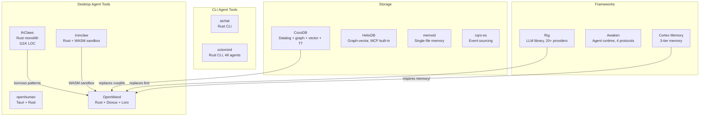

# New Additions Deep Analysis for OpenWand

**Source:** `C:\Next AI\ref` (15 new projects added 2026-05-26)
**Total ref count:** 698 (was 683)

---

## 📊 Summary Matrix

| Project | Language | Purpose | LOC | Maturity | OpenWand Relevance |
|---|---|---|---|---|---|
| **thClaws** | Rust | AI agent workspace (desktop + CLI + web) | ~111K | High | 🔴 DIRECT COMPETITOR |
| **openhuman** | Rust + TS (Tauri) | Agentic desktop assistant | Large | Medium | 🔴 DIRECT COMPETITOR |
| **ironclaw** | Rust | Secure personal AI assistant | Large | Medium | 🟡 Competitor + Security patterns |
| **aichat** | Rust | All-in-one LLM CLI | Medium | High | 🟡 Competitor (CLI only) |
| **awaken** | Rust + TS | Agent runtime (multi-protocol) | Large | Medium | 🟢 Framework — use as dependency |
| **rig** | Rust | LLM app library | Large | High | 🟢 Framework — use as dependency |
| **cortex-mem** | Rust | Agent memory system | Medium | Medium | 🟢 Framework — use as dependency |
| **cozo** | Rust | Datalog graph DB with time-travel | Large | High | 🟢 Storage backend candidate |
| **helix-db** | Rust | Graph-vector database | Large | Medium (YC) | 🟢 Storage backend candidate |
| **memvid** | Rust | Single-file agent memory | Medium | Medium | 🟢 Memory layer candidate |
| **cqrs** | Rust | CQRS + event sourcing | Small | High | 🟢 Session store candidate |
| **deepwiki-rs** | Rust | AI doc generator | Medium | Medium | 🔵 Tooling reference |
| **cli** | TypeScript | CLI scaffold | Small | Low | ⚪ Not relevant |

---

## 🔴 Direct Competitor Dissection

### 1. thClaws — The Most Complete Competitor

**What it is:** Native Rust AI agent workspace. One binary, four surfaces (Desktop GUI, CLI REPL, non-interactive, webapp).

**Scale:** 153 source files, ~111K LOC in `crates/core` alone. Single workspace crate.

**Architecture:** Monolithic `core` crate with modules:
- `agent.rs` — Agent loop (stream events, tool execution, max iterations cap)
- `session.rs` — JSONL-based append-only sessions (Claude Code style)
- `memory.rs` — Markdown file-based memory with frontmatter
- `kms.rs` — Knowledge Management System (Karpathy wiki pattern)
- `tools/` — 30+ built-in tools (Bash, Read, Write, Edit, Grep, PDF/DOCX/PPTX/XLSX, KMS, Memory, Plan, Todo, Web...)
- `providers/` — 10+ LLM providers (Anthropic, OpenAI, Gemini, DashScope, DeepSeek, Z.ai, Ollama, LMStudio...)
- `mcp.rs` — MCP server support (stdio + HTTP)
- `hooks.rs` — Lifecycle event hooks (pre/post tool use, session start, etc.)
- `skills.rs` — SKILL.md-based skill system
- `plugins.rs` — Plugin packaging (skills + commands + agents + MCP)
- `permissions.rs` — Approval workflow
- `subagent.rs` — Task-driven subagents
- `side_channel.rs` — User-driven concurrent agents
- `team.rs` — Multi-process agent teams via shared mailbox
- `compaction.rs` — Context compaction
- `schedule.rs` — Cron scheduling + daemon mode
- `goal_state.rs` — Goal-driven autonomous execution
- `plan.rs` — Plan mode (propose → approve → execute steps)
- `auto_learn.rs` — Auto-learning from sessions
- `sso/` — OAuth 2.1 + PKCE support
- `api_v1/` — HTTP/WebSocket server mode
- `telegram/` — Telegram bot integration

**Key Design Decisions:**
- Session = append-only JSONL (NOT CRDT, NOT branching)
- Memory = markdown files with frontmatter (NOT vector search, NOT graph)
- KMS = grep + read wiki pattern (NOT embeddings)
- Single monolithic crate (NOT workspace with separate crates)
- GUI = Tauri/webview (NOT native Dioxus)

**What OpenWand does BETTER:**
- ✅ Loro CRDT for session branching/merge/time-travel
- ✅ Temporal knowledge graph memory (vs flat markdown files)
- ✅ Dioxus native rendering (vs Tauri webview)
- ✅ Multi-crate architecture (better separation of concerns)

**What OpenWand should BORROW:**
- 🔧 Plan mode (propose → approve → execute) — elegant UX
- 🔧 Agent team orchestration (shared mailbox + task queue)
- 🔧 Hook system (8 lifecycle events)
- 🔧 KMS Karpathy wiki pattern as lightweight fallback
- 🔧 Goal-driven autonomous execution (`/goal` with audit completion)
- 🔧 Schedule/daemon mode
- 🔧 Auto-learn from sessions (`/dream` side-channel)

---

### 2. openhuman — Tauri-Based Competitor

**What it is:** Open-source agentic assistant with desktop UI, built with Tauri + Rust.

**Key features:**
- 118+ OAuth integrations
- Local-first memory tree
- Obsidian-compatible wiki
- Native voice
- TokenJuice compression
- Multi-language README (5 languages)

**Architecture:** Tauri (Rust backend + web frontend), pnpm monorepo, remotion for video.

**Assessment:** More focused on integrations than agent architecture. Different market position — more of a "personal life assistant" than a "developer agent workspace."

---

### 3. ironclaw — Security-Focused Competitor

**What it is:** Secure personal AI assistant. NEAR AI ecosystem.

**Key innovations:**
- **WASM sandbox** for untrusted tools — capability-based permissions
- **Credential protection** — secrets never exposed to tools, injected at host boundary
- **Prompt injection defense** — pattern detection, content sanitization
- **Self-expanding tools** — describe what you need, IronClaw builds WASM tools dynamically
- **Parallel jobs** with isolated contexts
- **Heartbeat system** for proactive monitoring

**What OpenWand should BORROW:**
- 🔧 WASM sandbox for tool execution — defense in depth
- 🔧 Credential protection pattern — never expose secrets to tool context
- 🔧 Dynamic tool building from natural language descriptions

---

## 🟢 Framework Candidates (Potential Dependencies)

### 4. Rig — LLM Application Library (v0.37)

**What it is:** Opinionated Rust library for building LLM-powered apps.

**Key features:**
- 20+ model providers under unified interface
- 10+ vector store integrations
- Agentic workflows with multi-turn streaming
- Full GenAI Semantic Convention compatibility
- WASM compatible (core)
- Used by: St Jude, Coral Protocol, Dria, Nethermind, Neon, ilert

**OpenWand verdict:** **STRONG candidate for `llm` crate replacement.**
- Replaces our custom provider abstraction
- Gives us 20+ providers instantly
- Mature, well-documented, actively maintained
- WASM compatible for future portability

---

### 5. Awaken — Agent Runtime (v0.5)

**What it is:** Rust agent runtime that serves AI SDK, CopilotKit, A2A, and MCP from one backend.

**Key innovations:**
- **One backend, four protocols** (AI SDK v6, AG-UI, A2A, MCP)
- **Streaming failure recovery** — 4 typed recovery plans for mid-stream LLM failures
- **Type-safe state** — `StateKey`s with merge strategies
- **9-phase execution** per round with `ToolGate`
- **Hot-swappable config** — providers/models/agents/skills via API at runtime
- `unsafe_code = "forbid"` workspace-wide

**OpenWand verdict:** **Study patterns, possibly use for session execution engine.**
- The streaming recovery mechanism is excellent
- The 9-phase execution model is more rigorous than thClaws's simple loop
- Config-as-control-plane is a powerful pattern
- But: it's a framework with its own opinions — may conflict with Loro CRDT session model

---

### 6. Cortex Memory — Agent Memory System

**What it is:** Production-ready AI memory framework with hierarchical 3-tier architecture.

**Key features:**
- **3-tier memory:** L0 Abstract → L1 Overview → L2 Detail
- **Virtual filesystem** with `cortex://` URI scheme
- **4 dimensions:** session/, user/, agent/, resources/
- **Hybrid storage:** virtual-filesystem durability + vector-based semantic search
- **Auto-optimization:** extraction, dedup, summarization
- **REST API, MCP server, CLI, insights dashboard**

**Architecture:** Built on Rig (same author — sopaco). Rust core.

**OpenWand verdict:** **Strong candidate for `memory` crate.**
- Maps to our planned 3-level memory (user/session/agent)
- The cortex:// URI scheme is elegant
- BUT: No temporal knowledge graph — it's hierarchical, not graph-based
- We'd need to ADD temporal edges on top

---

### 7. CozoDB — Datalog Graph Database

**What it is:** General-purpose, transactional, relational database using Datalog. Embeddable. Focus on graph data.

**Key features:**
- **Datalog queries** (more powerful than SQL for graph traversal)
- **HNSW vector search** integrated in Datalog
- **MinHash-LSH** for near-duplicate detection
- **Full-text search** built-in
- **Time travel** — query historical states
- **MVCC** for concurrent writes
- **Embedded mode** (SQLite-like) or server mode
- **Multi-language bindings** (Python, Node, Java, Clojure, Swift, Go, C, WASM)

**OpenWand verdict:** **TOP CANDIDATE for knowledge graph backend.**
- Datalog + graph + vector + full-text + time-travel in ONE embedded database
- Replaces: rusqlite + separate vector store + separate FTS
- Pure Rust core, C FFI for bindings
- Time-travel synergizes with Loro CRDT session branching

**Concerns:**
- Learning curve for Datalog (vs SQL)
- Smaller community than SQLite
- Need to evaluate performance at scale

---

### 8. HelixDB — Graph-Vector Database

**What it is:** Open-source graph-vector database built in Rust. Y Combinator backed.

**Key features:**
- **Built-in MCP tools** — agents can discover data and walk the graph
- **Built-in embeddings** — no separate embedding step
- **LMDB storage engine** — ultra-low latency
- **Dynamic JSON queries** — no compile/deploy cycle for dev
- **Built for RAG** — vector search + keyword search + graph traversal

**OpenWand verdict:** **Alternative to CozoDB.**
- More RAG-focused, less general-purpose
- MCP built-in is convenient
- Younger project (YC), less battle-tested
- No time-travel feature

---

### 9. memvid — Single-File Agent Memory

**What it is:** Portable AI memory system. Packs data, embeddings, search structure, and metadata into a single file.

**Key innovations:**
- **Video-encoding inspired:** Smart Frames — append-only, immutable, checksummed
- **Timeline inspection:** Query past memory states, see how knowledge evolves
- **Ultra-low latency:** 0.025ms P50, 0.075ms P99
- **+35% SOTA on LoCoMo** benchmark vs other memory systems
- **No database required** — just a file

**OpenWand verdict:** **Novel approach for portable memory.**
- Could serve as a lightweight memory layer for MVP
- The "memory timeline" concept aligns with temporal knowledge graphs
- Single-file portability is excellent for privacy/backup
- BUT: Not a graph database — flat retrieval, no relationships

---

### 10. cqrs-es — Event Sourcing Framework

**What it is:** Lightweight CQRS + event sourcing framework for Rust.

**Key features:**
- Command/Query separation
- Event-sourced aggregates
- PostgreSQL, MySQL, DynamoDB, SQLite backends
- Axum demo included
- Well-documented with user guide

**OpenWand verdict:** **Use for `session` crate event sourcing.**
- Battle-tested CQRS patterns
- SQLite backend fits our embedded approach
- BUT: We need to evaluate if Loro CRDT already provides sufficient event sourcing
- If we use Loro for session state, cqrs-es may be redundant

---

## 🎯 Updated Architecture Implications

### Before This Study:
```
OpenWand Stack:
├── llm/        → Custom provider abstraction
├── session/    → Loro CRDT + custom event sourcing
├── memory/     → Custom 3-level (user/session/agent) on rusqlite
├── tools/      → Custom tool registry + rmcp
├── content/    → Custom knowledge graph on rusqlite
└── app/        → Dioxus native UI
```

### After This Study (Revised Options):
```
OpenWand Stack (Option A — Conservative):
├── llm/        → Rig (20+ providers, unified API)
├── session/    → Loro CRDT (branching) + cqrs-es patterns
├── memory/     → Cortex Memory (3-tier, cortex:// URIs)
├── tools/      → Custom + rmcp (MCP pool)
├── content/    → CozoDB (Datalog + graph + vector + time-travel)
└── app/        → Dioxus native UI

OpenWand Stack (Option B — Maximum Differentiation):
├── llm/        → Rig
├── session/    → Loro CRDT (branching, merge, time-travel)
├── memory/     → Custom temporal knowledge graph on CozoDB
├── tools/      → Custom + rmcp + WASM sandbox (from ironclaw)
├── content/    → CozoDB (Datalog + graph + vector + FTS + time-travel)
├── policy/     → WASM sandbox + credential protection (from ironclaw)
└── app/        → Dioxus native UI
```

### Key Decisions Made:
1. **Rig** should replace our custom LLM crate — saves months of work
2. **CozoDB** should replace rusqlite for knowledge graph — Datalog + vector + time-travel in one
3. **WASM sandbox** (from ironclaw) should be added to the policy crate
4. **thClaws's plan mode** and **hook system** should be borrowed for UX
5. **Loro CRDT remains** our biggest differentiator — no competitor has it

### Key Decisions STILL OPEN:
1. Cortex Memory vs custom temporal KG on CozoDB?
2. cqrs-es or Loro-only for event sourcing?
3. HelixDB vs CozoDB for storage backend?
4. Awaken's 9-phase execution vs custom agent loop?

---

## 📊 Competitor Landscape


