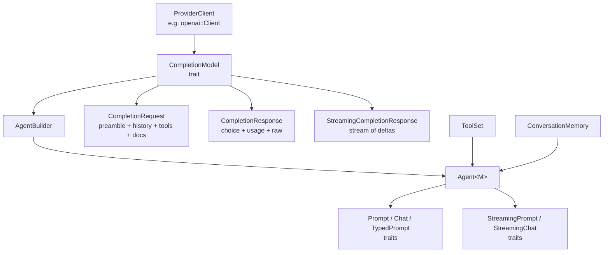
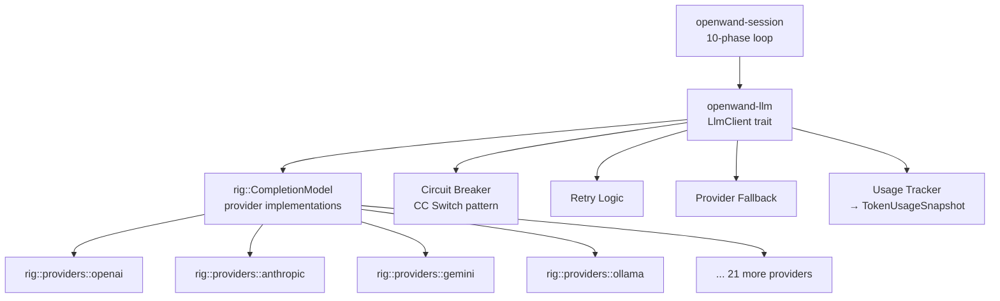

# Rig Deep-Dive for openwand-llm

**Date:** 2026-05-26  
**Status:** Analysis complete  
**Source:** `rig` v0.37.0, `rig-core` crate  
**Purpose:** Inform `openwand-llm` crate design  

---

## 1. What Rig Is

Rig is a **high-level LLM application framework** — not a thin HTTP client. It provides:

- **Provider abstraction**: One trait (`CompletionModel`) implemented by 25+ providers (OpenAI, Anthropic, Gemini, Cohere, Ollama, DeepSeek, xAI, etc.)
- **Agent abstraction**: `Agent<M>` wraps a completion model with preamble, tools, context documents, conversation memory
- **Streaming**: Built-in streaming via `StreamingCompletionResponse<R>` with pause/resume/cancel
- **Tool calling**: `Tool` trait, `ToolSet`, `ToolServer`, and `ToolDefinition` for function calling
- **Structured output**: `TypedPrompt` with JSON Schema generation via `schemars`
- **Embeddings**: `EmbeddingModel` trait with 10+ providers
- **Vector stores**: `VectorStoreIndex` trait with 12+ backends (MongoDB, LanceDB, SQLite, SurrealDB, etc.)
- **MCP support**: `rmcp` integration via `rig-core/rmcp` feature
- **Conversation memory**: `ConversationMemory` trait with in-memory default
- **Multi-turn agent loop**: `Agent::chat()` handles tool calling loops automatically

## 2. Rig's Architecture (What Matters for OpenWand)



### Key Traits

| Trait | Purpose | What OpenWand needs |
|---|---|---|
| `CompletionModel` | Provider-facing: `completion()` and `stream()` methods | **Use directly** — this is how we call providers |
| `Prompt` | High-level: prompt → string response | **Don't use** — too simple, no tool handling control |
| `Chat` | High-level: prompt + history → string, handles multi-turn | **Study** — has the tool loop, but OpenWand runs its own |
| `StreamingChat` | Streaming variant of Chat | **Study** — streaming pattern is useful |
| `Completion<M>` | Low-level: request builder customization | **Possibly use** — fine-grained control |

### Key Types

| Type | What it carries | OpenWand mapping |
|---|---|---|
| `Message` | `System{content}`, `User{content}`, `Assistant{id, content}` | Convert to/from OpenWand `Message` |
| `UserContent` | Text, ToolResult, Image, Audio, Video, Document | Mostly Text + ToolResult for Batch 1 |
| `AssistantContent` | Text, ToolCall, Reasoning, Image | **All three needed** — text, tool calls, reasoning |
| `ToolCall` | `{id, call_id, function{name, arguments}, signature}` | Maps to OpenWand `ToolCall` |
| `ToolResult` | `{id, call_id, content}` | Maps to OpenWand tool result messages |
| `Usage` | input/output/total/cached/reasoning tokens | Maps to `TokenUsageSnapshot` |
| `ToolDefinition` | `{name, description, parameters}` | Maps from OpenWand tool descriptors |
| `CompletionRequest` | preamble, chat_history, tools, temperature, max_tokens | OpenWand constructs this |
| `CompletionResponse` | choice (OneOrMany<AssistantContent>), usage, raw_response | OpenWand consumes this |
| `StreamingCompletionResponse` | Stream of `StreamedAssistantContent<R>` | OpenWand streams to UI |

### Reasoning Support

Rig has **first-class reasoning/thinking support**:

```rust
pub enum AssistantContent {
    Text(Text),
    ToolCall(ToolCall),
    Reasoning(Reasoning),  // ← first-class
    Image(Image),
}

pub struct Reasoning {
    pub id: Option<String>,
    pub content: Vec<ReasoningContent>,
}

pub enum ReasoningContent {
    Text { text, signature },
    Encrypted(String),
    Redacted { data },
    Summary(String),
}
```

This maps directly to our `AgentEvent::ReasoningDelta` and `ThinkingBudgetSnapshot`.

## 3. What Rig Gives Us (Use As-Is)

### Provider Clients — 25+ providers, zero work

```rust
// We get these for free:
rig::providers::openai::Client
rig::providers::anthropic::Client
rig::providers::gemini::Client
rig::providers::cohere::Client
rig::providers::ollama::Client
rig::providers::deepseek::Client
rig::providers::xai::Client
rig::providers::together::Client
rig::providers::groq::Client
rig::providers::mistral::Client
// ... and more
```

Each client implements `CompletionModel` with `completion()` and `stream()`. We don't write HTTP code.

### Streaming — built-in, pause/resume/cancel

```rust
let response = model.stream(request).await?;
// response implements Stream<Item = Result<StreamedAssistantContent<R>, CompletionError>>
// response.cancel() — stop streaming
// response.pause() / response.resume() — flow control
```

### Tool Calling — provider-agnostic

```rust
// Define tools
let tools = vec![
    ToolDefinition {
        name: "read_file".into(),
        description: "Read a file".into(),
        parameters: json_schema,
    },
];

// Tools are part of CompletionRequest
let request = model.completion_request("Read main.rs")
    .tools(tools)
    .build();

// Response includes ToolCall in AssistantContent
// Tool results go back as UserContent::ToolResult
```

### Usage Tracking — comprehensive

```rust
pub struct Usage {
    pub input_tokens: u64,
    pub output_tokens: u64,
    pub total_tokens: u64,
    pub cached_input_tokens: u64,
    pub cache_creation_input_tokens: u64,
    pub tool_use_prompt_tokens: u64,
    pub reasoning_tokens: u64,  // ← thinking models
}
```

Maps directly to `TokenUsageSnapshot` in core.

### MCP Support — via `rmcp` feature

Rig already integrates `rmcp` v1.7:

```rust
// rig-core has rmcp integration
// tools from MCP servers can be added to agents
```

This means our `openwand-mcp-pool` can leverage Rig's rmcp integration rather than building from scratch.

## 4. What Rig Does NOT Give Us (OpenWand Must Build)

### 1. OpenWand's Agent Loop

Rig's `Agent::chat()` runs its own multi-turn loop with tool calling. But OpenWand's 10-phase loop is fundamentally different:

- Rig: prompt → model → tool call → tool result → model → ... → done
- OpenWand: RunStart → StepStart → BeforeInference → **Inference** → AfterInference → **ToolGate** → BeforeToolExecute → AfterToolExecute → StepEnd → ...

Rig doesn't have: policy gates, trace recording, Loro projection, memory ingestion, approval/suspension, injection queue.

**Decision: OpenWand runs its own loop. Rig provides the LLM call, not the loop.**

### 2. Model Hot-Swap

Rig's `Agent<M>` is generic over `M: CompletionModel`. Switching models means creating a new agent. OpenWand needs hot-swap within a session (thClaws pattern).

**Decision: OpenWand's `LlmClient` trait hides the model type. Internally it holds a boxed/dynamic provider.**

### 3. Thinking Budget Control

Rig passes `additional_params` through to providers but doesn't have a typed thinking budget API. Different providers handle this differently:

- Anthropic: `thinking.budget_tokens` in `additional_params`
- OpenAI: `reasoning_effort` parameter
- Gemini: `thinkingConfig.thinkingBudget`

**Decision: OpenWand maps `ThinkingBudgetSnapshot` to provider-specific params.**

### 4. Context Window Management

Rig doesn't manage context windows. It sends whatever you give it. If the context exceeds the model's limit, the provider returns an error.

**Decision: OpenWand must implement context window tracking and truncation.**

### 5. Circuit Breaker / Retry

Rig has basic HTTP retry via `reqwest-middleware` feature but no circuit breaker. CC Switch's patterns (circuit breaker, thinking budget rectifier) are not in Rig.

**Decision: OpenWand adds circuit breaker and retry on top of Rig.**

### 6. Provider Fallback

Rig doesn't support "try OpenAI, fall back to Anthropic." Each agent is bound to one provider.

**Decision: OpenWand's `LlmClient` can implement fallback routing internally.**

## 5. The Integration Point



OpenWand doesn't wrap `Agent<M>`. It wraps `CompletionModel` — the low-level provider trait.

## 6. API Shape for openwand-llm

### LlmClient Trait (Updated from Session Design)

```rust
#[async_trait]
pub trait LlmClient: Send + Sync {
    /// Stream a completion request.
    /// Returns a stream of LlmDelta items.
    async fn chat_stream(
        &self,
        request: LlmRequest,
    ) -> Result<LlmStream, LlmError>;

    /// Check provider health.
    async fn health_check(&self) -> Result<(), LlmError>;

    /// Get the current model name.
    fn model_name(&self) -> &str;

    /// Get the current provider name.
    fn provider_name(&self) -> &str;

    /// Get model context window size.
    fn context_window(&self) -> Option<u64>;

    /// Hot-swap the model mid-session.
    fn swap_model(&self, model: &str) -> Result<(), LlmError>;
}
```

### LlmRequest

```rust
pub struct LlmRequest {
    pub system_prompt: String,
    pub messages: Vec<LlmMessage>,
    pub tools: Vec<LlmToolDef>,
    pub thinking_budget: Option<ThinkingBudgetSnapshot>,
    pub max_tokens: Option<u64>,
    pub temperature: Option<f64>,
    pub tool_choice: Option<LlmToolChoice>,
}

pub enum LlmToolChoice {
    Auto,
    None,
    Required,
}
```

### LlmMessage (OpenWand's Internal Type)

```rust
pub enum LlmMessage {
    System { content: String },
    User { content: String },
    Assistant {
        content: Option<String>,
        tool_calls: Vec<LlmToolCall>,
    },
    ToolResult {
        tool_call_id: String,
        tool_name: String,
        result: String,
        is_error: bool,
    },
}

pub struct LlmToolCall {
    pub id: String,
    pub name: String,
    pub arguments: serde_json::Value,
}
```

### LlmStream and LlmDelta

```rust
pub type LlmStream = Pin<Box<dyn Stream<Item = Result<LlmDelta>> + Send>>;

pub enum LlmDelta {
    /// Text content delta
    Text(String),
    
    /// Reasoning/thinking delta
    Reasoning(String),
    
    /// Tool call started
    ToolCallStart { id: String, name: String },
    
    /// Tool call argument delta (streaming JSON)
    ToolCallDelta { id: String, args_delta: String },
    
    /// Stream completed with usage
    Done {
        stop_reason: LlmStopReason,
        usage: TokenUsageSnapshot,
    },
    
    /// Provider error during stream
    Error(String),
}

pub enum LlmStopReason {
    Stop,           // Natural end
    ToolCall,       // Model wants to call tools
    Length,         // Hit max_tokens
    ContentFilter,  // Blocked by provider
}
```

### LlmToolDef

```rust
pub struct LlmToolDef {
    pub name: String,
    pub description: String,
    pub parameters: serde_json::Value,  // JSON Schema
}
```

## 7. Conversion Layer

OpenWand types ↔ Rig types:

```rust
impl LlmMessage {
    pub fn to_rig_messages(&self) -> Vec<rig::completion::Message> {
        // Convert OpenWand messages to Rig Message enum
    }
}

impl LlmToolDef {
    pub fn to_rig_tool_def(&self) -> rig::completion::ToolDefinition {
        ToolDefinition {
            name: self.name.clone(),
            description: self.description.clone(),
            parameters: self.parameters.clone(),
        }
    }
}

// From Rig response to OpenWand types
impl From<rig::completion::Usage> for TokenUsageSnapshot {
    fn from(usage: rig::completion::Usage) -> Self {
        Self {
            input: usage.input_tokens,
            output: usage.output_tokens,
            reasoning: Some(usage.reasoning_tokens),
            cache_read: Some(usage.cached_input_tokens),
            cache_write: Some(usage.cache_creation_input_tokens),
        }
    }
}
```

## 8. What the Conversion Looks Like

Session calls `LlmClient::chat_stream()`:

```rust
// Inside openwand-llm implementation

async fn chat_stream(&self, request: LlmRequest) -> Result<LlmStream, LlmError> {
    // 1. Convert OpenWand request to Rig request
    let rig_model = self.get_rig_model()?;
    
    let mut builder = rig_model.completion_request("");
    
    // System prompt → Message::System
    builder = builder.preamble(request.system_prompt);
    
    // Chat history → Messages
    for msg in &request.messages {
        builder = builder.message(msg.to_rig_message());
    }
    
    // Tools → ToolDefinitions
    let tool_defs: Vec<ToolDefinition> = request.tools.iter()
        .map(|t| t.to_rig_tool_def())
        .collect();
    builder = builder.tools(tool_defs);
    
    // Thinking budget → additional_params (provider-specific)
    if let Some(budget) = &request.thinking_budget {
        builder = builder.additional_params(self.thinking_budget_params(budget));
    }
    
    // Temperature, max_tokens
    if let Some(t) = request.temperature { builder = builder.temperature(t); }
    if let Some(m) = request.max_tokens { builder = builder.max_tokens(m); }
    
    let rig_request = builder.build();
    
    // 2. Call Rig streaming
    let mut rig_stream = rig_model.stream(rig_request).await
        .map_err(|e| LlmError::ProviderError(e.to_string()))?;
    
    // 3. Convert Rig stream to OpenWand stream
    Ok(Box::pin(async_stream::stream! {
        while let Some(chunk) = rig_stream.next().await {
            match chunk {
                Ok(StreamedAssistantContent::Text(text)) => {
                    yield Ok(LlmDelta::Text(text.text));
                }
                Ok(StreamedAssistantContent::Reasoning(reasoning)) => {
                    yield Ok(LlmDelta::Reasoning(reasoning.display_text()));
                }
                Ok(StreamedAssistantContent::ToolCall { tool_call, .. }) => {
                    yield Ok(LlmDelta::ToolCallStart {
                        id: tool_call.id,
                        name: tool_call.function.name,
                    });
                    yield Ok(LlmDelta::Done {
                        stop_reason: LlmStopReason::ToolCall,
                        usage: TokenUsageSnapshot::default(),
                    });
                }
                Ok(StreamedAssistantContent::ToolCallDelta { content, .. }) => {
                    match content {
                        ToolCallDeltaContent::Name(name) => {
                            // Name is typically already in ToolCallStart
                        }
                        ToolCallDeltaContent::Delta(delta) => {
                            yield Ok(LlmDelta::ToolCallDelta {
                                id: String::new(),
                                args_delta: delta,
                            });
                        }
                    }
                }
                Ok(StreamedAssistantContent::Final(response)) => {
                    if let Some(usage) = response.token_usage() {
                        yield Ok(LlmDelta::Done {
                            stop_reason: LlmStopReason::Stop,
                            usage: usage.into(),
                        });
                    }
                }
                Err(e) => {
                    yield Err(LlmError::ProviderError(e.to_string()));
                }
                _ => {}
            }
        }
    }))
}
```

## 9. Provider Configuration

```rust
pub struct LlmProviderConfig {
    pub provider: LlmProvider,
    pub api_key: Option<String>,
    pub base_url: Option<String>,
    pub model: String,
    pub context_window: Option<u64>,
}

pub enum LlmProvider {
    OpenAI,
    Anthropic,
    Gemini,
    Cohere,
    Ollama,
    DeepSeek,
    XAI,
    Groq,
    Together,
    OpenRouter,
    Custom { name: String },
}
```

Construction:

```rust
let config = LlmProviderConfig {
    provider: LlmProvider::OpenAI,
    api_key: Some("sk-...".into()),
    model: "gpt-4o".into(),
    context_window: Some(128000),
    ..Default::default()
};

let client = RigLlmClient::new(config)?;
```

Internally:

```rust
struct RigLlmClient {
    provider: LlmProvider,
    model_name: RwLock<String>,
    context_window: Option<u64>,
    // The actual Rig model — boxed because CompletionModel is generic
    // We use the provider client's completion_model() method
    provider_client: Box<dyn ProviderClientAccess>,
}

// Internal trait for provider-agnostic access
trait ProviderClientAccess: Send + Sync {
    fn create_model(&self, model: &str) -> Box<dyn CompletionModelAccess>;
}

// Implemented per provider
impl ProviderClientAccess for rig::providers::openai::Client {
    fn create_model(&self, model: &str) -> Box<dyn CompletionModelAccess> {
        Box::new(self.completion_model(model))
    }
}
```

Actually, this boxing is complex because `CompletionModel` has associated types. Let me reconsider.

### Alternative: Enum-based dispatch

```rust
enum InnerModel {
    OpenAI(rig::providers::openai::CompletionModel),
    Anthropic(rig::providers::anthropic::CompletionModel),
    Gemini(rig::providers::gemini::CompletionModel),
    Ollama(rig::providers::ollama::CompletionModel),
    // ...
}

impl RigLlmClient {
    async fn stream_with_model(&self, request: CompletionRequest) -> Result<...> {
        match &self.inner {
            InnerModel::OpenAI(m) => m.stream(request).await,
            InnerModel::Anthropic(m) => m.stream(request).await,
            // ...
        }
    }
}
```

This avoids boxing but requires listing all supported providers. Acceptable — OpenWand controls which providers it supports.

## 10. What NOT to Use from Rig

| Rig Feature | Why Not |
|---|---|
| `Agent<M>` | OpenWand has its own agent loop |
| `Prompt` / `Chat` traits | Too high-level, no tool gate control |
| `AgentBuilder` | OpenWand constructs its own config |
| `ConversationMemory` | OpenWand has Loro + trace-based memory |
| `VectorStoreIndex` | OpenWand has its own memory store |
| `Extractor` | OpenWand uses its own extraction pipeline |
| `Pipeline` | OpenWand has workflow framework |

What OpenWand **does** use:

| Rig Feature | Why |
|---|---|
| `CompletionModel::stream()` | Streaming inference — the core value |
| `CompletionModel::completion()` | Non-streaming fallback |
| `CompletionRequest` / builder | Constructing requests |
| `Message` / `AssistantContent` | Response parsing |
| `Usage` | Token tracking |
| `ToolDefinition` | Tool manifest format |
| Provider clients | HTTP, auth, provider-specific quirks |
| `rmcp` integration | MCP tool discovery |

## 11. Dependencies

```toml
[package]
name = "openwand-llm"
version.workspace = true
edition.workspace = true

[dependencies]
openwand-core = { path = "../core" }

rig = { version = "0.37", default-features = false, features = [
    "rustls",      # TLS
    "derive",      # Optional: for tool derive macros
] }

async-trait = { workspace = true }
serde = { workspace = true, features = ["derive"] }
serde_json = { workspace = true }
tokio = { workspace = true, features = ["sync", "macros"] }
tracing = { workspace = true }
thiserror = { workspace = true }
chrono = { workspace = true, features = ["serde"] }
async-stream = "0.3"
futures = "0.3"
```

## 12. Summary

**Rig gives OpenWand:**
- 25+ LLM providers with zero HTTP code
- Streaming with pause/resume/cancel
- Tool calling (provider-agnostic)
- Reasoning/thinking support
- Usage tracking
- MCP integration via rmcp

**OpenWand builds on top:**
- Its own 10-phase agent loop
- Policy gates (Rig has none)
- Trace recording (Rig has none)
- Loro projection (Rig has none)
- Memory ingestion (Rig has none)
- Circuit breaker / retry / fallback
- Thinking budget mapping
- Context window management
- Model hot-swap

**The boundary:**
```
OpenWand calls Rig's CompletionModel trait directly.
OpenWand does NOT use Rig's Agent, Chat, or Prompt abstractions.
Rig is the transport layer. OpenWand is the application.
```

**Estimated effort:**
- Conversion layer (OpenWand types ↔ Rig types): ~400 LOC
- `RigLlmClient` implementation: ~600 LOC
- Circuit breaker / retry / fallback: ~300 LOC
- Thinking budget mapping: ~200 LOC
- Tests: ~400 LOC
- **Total: ~1,900 LOC**
