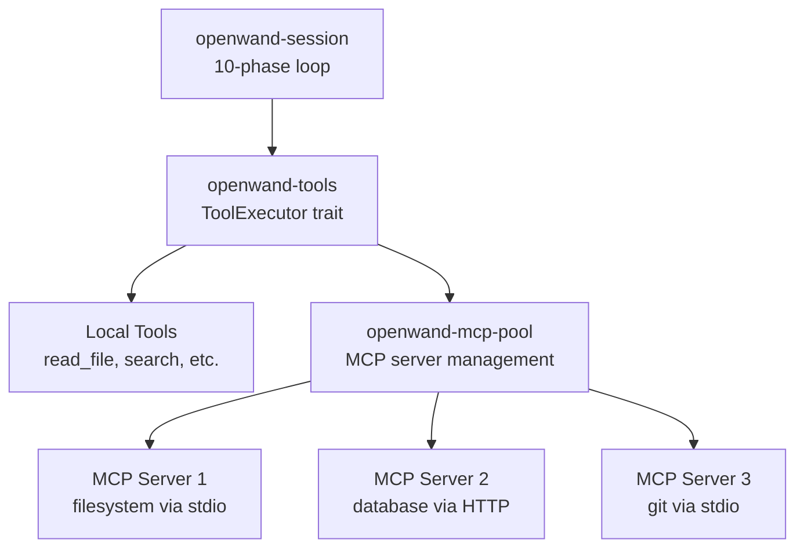
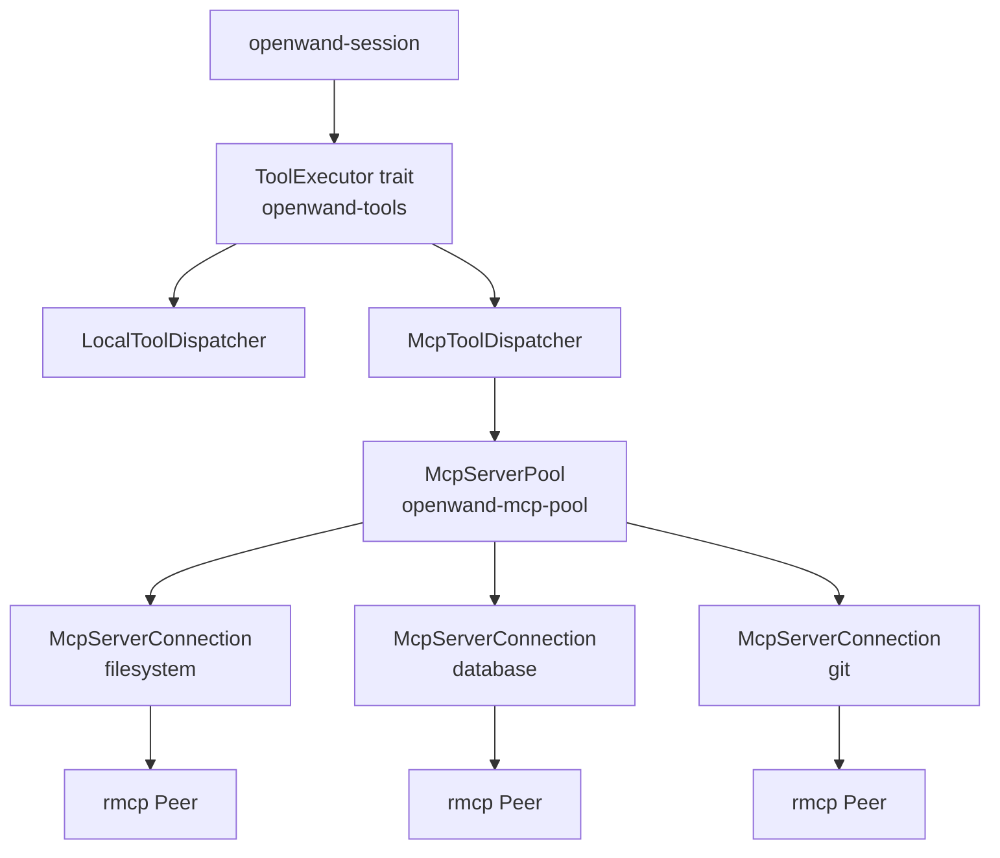

# rmcp Deep-Dive for openwand-tools + openwand-mcp-pool

**Date:** 2026-05-26  
**Status:** Analysis complete  
**Source:** `rmcp` v1.7.0  
**Purpose:** Inform `openwand-tools` and `openwand-mcp-pool` crate designs  

---

## 1. What rmcp Is

rmcp is a **Rust MCP (Model Context Protocol) client+server library** implementing the MCP specification. It provides:

- **Client role**: Connect to MCP servers, discover tools, call tools, read resources, list prompts
- **Server role**: Expose tools, resources, prompts to MCP clients
- **Transport**: stdio (child processes), Streamable HTTP, WebSocket, TCP, async read/write
- **Auth**: OAuth 2.0 client credentials, authorization manager
- **Notifications**: tool list changes, resource updates, progress, cancellation, logging
- **Annotations**: ToolAnnotations with readOnlyHint, destructiveHint, idempotentHint, openWorldHint
- **Macros**: `#[tool_router]`, `#[tool_handler]`, `#[tool]` for server-side tool definitions

## 2. Architecture (What Matters for OpenWand)

OpenWand is an MCP **client**, not a server. It connects to external MCP servers (filesystem, git, database, etc.) to discover and execute tools.



### Key rmcp Client API

```rust
// Connect to an MCP server
let transport = TokioChildProcess::new(command);  // stdio
// or
let transport = StreamableHttpClientTransport::from_uri("http://...");  // HTTP

let service = serve_client(client_handler, transport).await?;
let peer: Peer<RoleClient> = service.peer();

// Discover tools
let tools: Vec<rmcp::model::Tool> = peer.list_all_tools().await?;

// Call a tool
let result: CallToolResult = peer.call_tool(CallToolRequestParams {
    name: "read_file".into(),
    arguments: Some(json!({"path": "/tmp/test.txt"})),
    ..Default::default()
}).await?;

// Read a resource
let resource: ReadResourceResult = peer.read_resource(ReadResourceRequestParams {
    uri: "file:///tmp/test.txt".into(),
    ..Default::default()
}).await?;
```

### Tool Model

```rust
pub struct Tool {
    pub name: Cow<'static, str>,
    pub title: Option<String>,
    pub description: Option<Cow<'static, str>>,
    pub input_schema: Arc<JsonObject>,     // JSON Schema
    pub output_schema: Option<Arc<JsonObject>>,
    pub annotations: Option<ToolAnnotations>,
    pub execution: Option<ToolExecution>,
    pub icons: Option<Vec<Icon>>,
    pub meta: Option<Meta>,
}

pub struct ToolAnnotations {
    pub read_only_hint: Option<bool>,
    pub destructive_hint: Option<bool>,
    pub idempotent_hint: Option<bool>,
    pub open_world_hint: Option<bool>,
}
```

### CallToolResult

```rust
pub struct CallToolResult {
    pub content: Vec<Content>,      // text, image, resource, audio
    pub is_error: Option<bool>,
}

pub enum RawContent {
    Text(RawTextContent),           // { text: String }
    Image(RawImageContent),         // { data: String, mime_type: String }
    Resource(RawEmbeddedResource),  // { resource: ResourceContents }
    Audio(RawAudioContent),
}
```

### Transport Options

| Transport | Use case | rmcp type |
|---|---|---|
| **Stdio** | Local MCP servers (filesystem, git, etc.) | `TokioChildProcess` |
| **Streamable HTTP** | Remote MCP servers | `StreamableHttpClientTransport` |
| **TCP** | Custom servers | `AsyncRwTransport` from TcpStream |
| **WebSocket** | Browser-based servers | Via `sink_stream` |

### Server-to-Client Notifications

```rust
// ClientHandler trait — OpenWand implements this to receive server notifications
trait ClientHandler {
    fn on_tool_list_changed(...)    // → re-fetch tools from server
    fn on_resource_updated(...)     // → invalidate cache
    fn on_progress(...)             // → forward to user
    fn on_logging_message(...)      // → forward to trace
    fn on_cancelled(...)            // → cancel tool execution
}
```

## 3. What rmcp Gives Us

### MCP Protocol Implementation — Zero Work

rmcp handles the entire MCP JSON-RPC protocol:
- Initialize/initialized handshake
- Request/response serialization
- Pagination for list operations
- Notification dispatch
- Auth negotiation
- Error mapping

### Tool Discovery — With Pagination

```rust
peer.list_all_tools().await  // handles pagination automatically
```

### Tool Execution — Asynchronous

```rust
peer.call_tool(params).await  // returns CallToolResult
```

### Tool Annotations — Maps to Policy

```rust
tool.annotations.read_only_hint     → ToolEffect::Read
tool.annotations.destructive_hint   → ToolEffect::Delete
tool.annotations.open_world_hint    → ToolEffect::Network
```

This maps directly to our `openwand-policy` crate's risk assessment.

### Dynamic Tool Refresh

Servers can notify clients when their tool list changes. rmcp's `ClientHandler::on_tool_list_changed` handles this.

### Rig Integration Already Exists

Rig's `McpClientHandler` bridges rmcp tools into Rig's `ToolServer`/`ToolDyn` system. But OpenWand doesn't use Rig's tool execution — it routes through its own policy gate.

## 4. What rmcp Does NOT Give Us

### 1. Tool Registration with Policy

rmcp discovers tools. It doesn't register them with a policy engine. OpenWand must:
1. Discover tools via rmcp
2. Convert to `PolicyToolDescriptor` for policy
3. Convert to `LlmToolDef` for the LLM
4. Route execution through policy gates

### 2. Local Tool Execution

rmcp is for MCP servers. Local tools (read_file, search_files, etc.) are not MCP. OpenWand needs its own local tool dispatch.

### 3. Server Health and Lifecycle

rmcp connects and calls tools. It doesn't manage:
- Server startup/shutdown
- Health checks / heartbeats
- Reconnection on failure
- Server config persistence
- Multiple server coordination

### 4. Tool Result Normalization

rmcp returns `CallToolResult` with `Vec<Content>`. OpenWand needs to normalize this to `String` for the LLM (with truncation for large outputs, per thClaws pattern).

### 5. Cancellation Integration

rmcp has `CancellationToken` support, but OpenWand needs to integrate it with the session's cancellation token and the agent loop's cancellation semantics.

## 5. The Two-Crate Split

### openwand-tools

Owns the **ToolExecutor** trait that session calls. Dispatches to local tools or MCP tools.

### openwand-mcp-pool

Owns **MCP server lifecycle** — connecting, discovering, health-checking, reconnecting. Exposes discovered tools to openwand-tools.



## 6. How This Maps to Rig

Rig's `McpClientHandler` bridges rmcp → Rig's ToolServer. OpenWand doesn't use Rig's tool execution, but we can learn from the bridge pattern:

| Rig's approach | OpenWand's approach |
|---|---|
| `McpTool` wraps rmcp Tool + Peer | `McpToolDispatcher` wraps rmcp connections |
| `ToolServer` manages tool registry | `McpServerPool` manages server connections |
| `ToolServerHandle` shared with Agent | `ToolExecutor` shared with Session |
| Auto-refresh on `tool_list_changed` | Same — with policy re-registration |

OpenWand's key difference: **every tool call goes through policy first**. Rig doesn't have this step.

## 7. rmcp's ToolAnnotations → Policy Mapping

This is the bridge between MCP metadata and OpenWand's risk assessment:

```rust
fn annotations_to_effect(annotations: &Option<ToolAnnotations>) -> ToolEffect {
    match annotations {
        Some(a) if a.read_only_hint.unwrap_or(false) => ToolEffect::Read,
        Some(a) if a.destructive_hint.unwrap_or(true) => ToolEffect::Delete,
        Some(a) if a.open_world_hint.unwrap_or(true) => ToolEffect::Network,
        _ => ToolEffect::Unknown,
    }
}
```

Not all MCP servers provide annotations. When absent, default to `Unknown` → policy treats as highest risk.

## 8. Transport Selection for Batch 1

| Transport | Batch 1 | Why |
|---|---|---|
| **Stdio** (child process) | ✅ Yes | Primary transport for local MCP servers (filesystem, git) |
| **Streamable HTTP** | ✅ Yes | Remote MCP servers (future-proofing) |
| **TCP** | ❌ No | Niche |
| **WebSocket** | ❌ No | Niche |

## 9. Session Integration Pattern

```
Session calls:
  tools.available_tools()
    → local tools + MCP pool tools
    → each has PolicyToolDescriptor with declared_effect
  
  tools.execute(call, context)
    → local dispatch OR mcp dispatch
    → returns ToolResult
  
  tools.refresh_mcp_tools()
    → re-discover from MCP servers
    → re-register with policy
```

## 10. Summary

| What rmcp gives | What OpenWand builds |
|---|---|
| MCP JSON-RPC protocol | Tool discovery → policy registration |
| Tool discovery (`list_all_tools`) | Local tool dispatch alongside MCP |
| Tool execution (`call_tool`) | Tool result normalization + truncation |
| Resource reading (`read_resource`) | Resource caching (v2) |
| Tool annotations | Risk assessment mapping |
| `tool_list_changed` notifications | Dynamic tool refresh with policy re-registration |
| Transport: stdio + HTTP | Server lifecycle management |
| Auth support | Config-driven auth per server |
| Pagination handling | Transparent to OpenWand |
